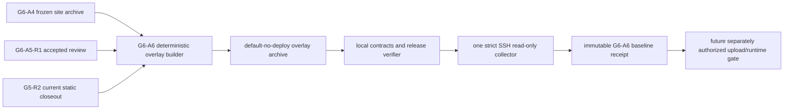

# G6-A6 438e 部署准备与只读基线设计

## 目标与证据上限

G6-A6 为已经完成精确候选评审的 `mkd-m1c-438e6ae583fc952d` 创建一套平行、可审计、默认不可部署的本地覆盖层，并通过一次严格主机密钥校验的 SSH 会话冻结远端只读基线。

本门禁最高产生 L3 production-read-only readiness evidence。它不代表候选已上传、容器已创建、edge 已切换、公网已包含 Agent Lab、真实 provider 已验证或 production/live Agent 已启用。

## 方案选择

采用方案 A：创建新的 `mkd_distill_438e` Compose project，不原位修改 88d4，不复用 88d4 的 project 或 networks。

- release：`mkd-m1c-438e6ae583fc952d`
- release path：`/opt/mkd-distill/releases/mkd-m1c-438e6ae583fc952d/site`
- compose path：`/opt/mkd-distill/compose/438e6ae5`
- upstream：`172.20.0.1:18922`
- internal network：`mkd_distill_438e_internal` / `192.168.224.32/28`
- ingress network：`mkd_distill_438e_ingress` / `192.168.224.48/28`

拒绝原位修改 88d4，因为它会混淆当前公网运行态与新候选；拒绝复用 88d4 networks，因为无法做到按候选精确回滚和独立取证。

## 组件边界

本地覆盖层只含 Compose、固定 IPAM、static/ingress Nginx、候选 edge snippet、release verifier、preflight、部署目标、默认禁用锁、README 和非执行式回滚计划。它不含 SSH 私钥、上传器、远端执行器、证书材料或 live edge 写入脚本。

## 只读基线硬门禁

唯一一次 SSH 会话必须使用 `BatchMode=yes`、`IdentitiesOnly=yes`、`StrictHostKeyChecking=yes`、`UpdateHostKeys=no`。远端只允许读取：主机身份与容量、Docker/Compose 版本、现行 edge identity、88d4 双容器和双网络、18921/18922 listener、候选命名空间/路径 absence、全部 Docker IPv4 subnet、宿主路由、证书文件摘要、renewal timer/unit 摘要。

以下任一项失败即 `blocked`，且 mutation journal 保持为零：

1. 88d4 edge/runtime/health/hardening/TLS/timer 相对冻结基线发生漂移；
2. `18922` 已被占用；
3. 438e project、container、network、release path 或 compose path 已存在；
4. 两个固定 `/28` 与任一 Docker subnet 或宿主路由重叠；
5. 磁盘、内存、Docker/Compose 或 pinned image 不满足未来候选运行先决条件；
6. 本地 archive、manifest、评审接受回执或覆盖层摘要不匹配。

## 回滚边界

本门禁不执行回滚。回滚计划仅允许未来在独立授权下删除精确 `mkd_distill_438e` project、两个 438e networks、438e release/compose paths 和 18922 listener；不得触碰 88d4、a2fe、共享 edge、证书、timer、Docker daemon 或其他应用。若未来已发生 edge switch，必须使用该未来门禁单独冻结的 exact backup 与 same-inode restore 事务，不能从本计划推导权限。

## 验收条件

- 本地合同、release verifier、preflight 与确定性 archive 全绿；
- archive checksum、payload manifest、source locks 和 secret scan 完整；
- 单次 SSH 只读回执所有 hard checks 通过；
- effect ledger 明确：SSH=1，public read=0，upload=0，remote mutation=0，Docker action=0，edge/cert/timer action=0；
- 本地 Docker 调用、provider、production/live Agent、commit、push 全为零。

