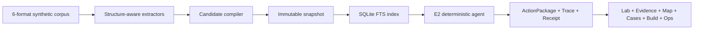

# M1-B 本地参考实现回执

> 状态：`candidate-complete`；证据上限：`L2-fixture-or-dry-run`。这不是领域验收、canonical 晋升、真实广告账户结果或腾讯云部署回执。

## 交付结果

M1-B 把 M1-A 的合同与高保真原型贯通为一条真实、可重复执行的本地流水线：



| 层 | 已实现 | 机器回执 |
|---|---|---|
| P3 语料与提取 | XLSX、PDF、PPTX、DOCX、Markdown、JSON；4 个负例；稳定 locator | 6 格式、6 个正常源、88 个 StructuralElement |
| P4 编译与知识库 | 138 对象、7 条类型化关系、review packet、canonical dry-run、不可变 snapshot、SQLite FTS | JSON/SQLite snapshot hash parity 通过；canonical writes=0 |
| P5 Agent | `TASK-AMZ-ADS-DIAGNOSIS-V1`、8 个无副作用工具、CLI、stdio MCP、Docker Compose、5 类导出 | 20/20 golden；external calls=0；side effects=0 |
| P6 内容网站 | Lab/Result 读取真实本地导出；Evidence/Map/Cases/Build/Ops 五页 | 390–1440px、多页无溢出、critical/serious axe=0 |

固定 snapshot 为 `SNAPSHOT-AMZ-ADS-M1B@0.2.0`，manifest hash 为 `sha256:cfa7d24c4116807a3a885ee0f860bf33720de494c50e934a5e23f6fb5a6b4240`。

## 确定性与停止条件

- Agent 不调用模型，以固定规则引擎运行；相同输入、相同 snapshot 生成 byte-stable 结果。
- 只有 read、calculate、draft 三种工具模式，8 个工具均声明 `sideEffect=false`。
- 缺失指标、窗口不可比、证据过期、证据冲突、未知 Case、平台写入诱导与非白名单工具都会阻断。
- `validatePromotion({ apply: true })` 固定抛出 `CANONICAL_APPLY_DISABLED`。
- 公开站点只读取构建后的 JSON；没有文件上传、自由文本或公网执行 API。

## 运行入口

```bash
npm run reference:qa
node reference/runtime/cli.mjs inspect
node reference/runtime/cli.mjs run '{"caseId":"CASE-AMZ-ACOS-SYNTHETIC","comparisonWindow":"7d-vs-7d"}'
node reference/runtime/cli.mjs mcp
docker compose -f compose.m1b.yaml run --rm mkd evaluate
```

Docker 基础镜像锁定到 `node:22-bookworm-slim@sha256:d649c27…c6436`；本次通过评测的本地镜像为 `sha256:661e64a3…b7dc`。

## 安全与依赖审计

- `npm audit --omit=dev`：0 个生产依赖漏洞。
- 已把可直接修复的 `dompurify` 升至 3.4.13、`nanoid` 升至 3.3.18。
- 开发依赖仍有 Vite/VitePress/esbuild 相关的 1 high + 2 moderate，当前依赖树没有可用修复。风险被限制在开发服务器：生产形态仅发布静态构建，项目 preview 强制 loopback、拒绝 POST，并有隔离测试。任何公网 dev server 都仍然禁止。
- Node 22 的 `node:sqlite` 仍打印 experimental warning；schema、hash parity 和容器回放已通过，但 M1-C 前应评估固定 Node 版本或替换稳定 SQLite 驱动。

## 未授权与未完成

- 未进行真实 provider 或 Amazon Ads 平台调用。
- 未执行 canonical apply、外部发送、账户写入或自动晋升。
- 四个验收角色仍未具名，领域批准为 pending。
- 未连接或修改腾讯云轻量服务器，未发布镜像，未部署站点。
- 未 git commit、push 或发布包。

这些项目不是 M1-B 缺陷，而是下一门禁必须重新授权并独立举证的事项。
