# 第零章：导论 —— 2026 年知识库全景与十个反直觉洞察

:::info 本章能给你什么
**读完本章，你能做到**：判断你的项目是否真的需要知识库、哪些数据不该入库、以及为什么知识库是治理基础设施而不只是技术选型。

**本章在全书中的角色**：它是一道筛子。让该建库的项目有信心动手，让不该建库的项目提前止损。如果你读完后仍不确定要不要建，说明你需要先回答「谁为知识质量负责」这个组织问题。

**三种读者的起点**：工程师 → 可跳到第三章直接看 SOP；分析师/决策者 → 线性读完本章再继续；CTO → 重点看「反模式」和「劣化机制」两节。
:::

:::info 核心概念起点

**Knowledge System（知识体系）是一条受治理的知识流水线**，负责采集、结构化、检索、应用、评估与可追溯演进，而不是某一种数据库。

**Agent（智能体）是在显式权限、证据与控制边界内选择工具并产生行动的执行单元**；它不是知识真实性的来源。

**Evidence Maturity（证据成熟度）描述内容从原理、方案、可复现运行到明确验收回执的本地进展**，不代表生产部署状态。
:::

在 2026 年谈知识库，最容易犯的错，是把它理解成"长上下文出现之前的过渡技术"。这恰恰反了。模型上下文窗口越来越长，推理能力越来越强，确实让很多过去必须预处理的工作变得"可以临时现读"；但只要你的信息存在版本差异、权限边界、跨模态转换、事实校验、成本约束和可追溯责任，知识库就不会消失。长上下文擅长一次性吞入、即时推理；知识库擅长持续整理、稳定复用、权限隔离和可审计演化。两者的边界正在变模糊：一部分低频知识可以不入库直接全文加载，另一部分高价值知识必须被结构化、被索引、被治理。真正的问题不再是"要不要做知识库"，而是"哪些知识该蒸馏，哪些知识该原样保留，哪些知识根本不该入库"。

---

## 2026 年技术全景图

```mermaid
flowchart LR
    subgraph Input[输入层]
        I1[网页]
        I2[PDF]
        I3[视频]
        I4[音频]
        I5[数据库]
        I6[API]
    end

    subgraph Process[处理层]
        P1[采集]
        P2[提取]
        P3[结构化提取]
    end

    subgraph Security[安全层]
        S1[数据分级]
        S2[PII 脱敏]
        S3[权限控制]
    end

    subgraph Storage[存储层]
        K1[(向量库)]
        K2[(知识图谱)]
        K3[(关系库)]
    end

    subgraph MCP[MCP 协议层]
        M1[统一接入]
    end

    subgraph Consume[消费层]
        C1[Agent]
        C2[RAG 查询]
        C3[Dashboard]
    end

    subgraph Evolve[进化层]
        E1[自进化]
        E2[评估]
        E3[验证]
    end

    Input --> Process --> Security --> Storage --> MCP --> Consume
    Consume -->|使用反馈| Evolve
    Evolve -->|回流优化| Process

    classDef input fill:#e3f2fd,stroke:#1d4ed8,stroke-width:1.5px,color:#1e3a8a;
    classDef process fill:#fff7ed,stroke:#ea580c,stroke-width:1.5px,color:#9a3412;
    classDef security fill:#ffcdd2,stroke:#dc2626,stroke-width:1.5px,color:#991b1b;
    classDef storage fill:#e0f2f1,stroke:#0f766e,stroke-width:1.5px,color:#134e4a;
    classDef mcp fill:#e1bee7,stroke:#9333ea,stroke-width:1.5px,color:#581c87;
    classDef consume fill:#c8e6c9,stroke:#16a34a,stroke-width:1.5px,color:#14532d;
    classDef evolve fill:#fef3c7,stroke:#d97706,stroke-width:1.5px,color:#92400e;

    class I1,I2,I3,I4,I5,I6 input;
    class P1,P2,P3 process;
    class S1,S2,S3 security;
    class K1,K2,K3 storage;
    class M1 mcp;
    class C1,C2,C3 consume;
    class E1,E2,E3 evolve;
```

:::tip 一个现实判断
今天真正有竞争力的系统，不是“只有向量库”，也不是“只有超长上下文”，而是把采集、治理、接入、消费和进化连成闭环。知识库从来不是一个库，而是一条流水线。
:::

---

## 三种读者路径

| 读者类型 | 建议起点 | 为什么这样读 |
| :--- | :--- | :--- |
| 工程师 | 直接从 [第 3 章 SOP](03-scene-sops.md) 开始 | 先拿到可运行路径，再回看第 0、1、2 章补世界观，效率最高 |
| 数据分析师 / 决策者 | 从第 0 章开始线性阅读 | 需要先建立边界感：什么该入库、什么不该入库、怎么衡量 ROI |
| CTO / 架构师 | 直接看 [第 5 章安全合规](05-security-compliance.md) + [第 10 章成本模型](10-cost-model.md) | 先把红线和预算模型看清，再决定是否值得大规模铺开 |

---

## 十个反直觉洞察

### 1. [RAG](02-decision-matrix.md#concept-rag) 不是万能药

:::warning 关键点
**直觉思维**：有文档就做 RAG。  
**真实情况**：当规则稳定、输出形态固定、错误成本高时，Fine-tuning 或规则引擎通常比 RAG 更稳。RAG 每次都在“重新理解”，而规则系统是在“重复执行”。  
**为什么重要**：把本该固化的业务规则交给 RAG，会把确定性问题变成概率问题。  
**验证方法**：挑一类高频、低变化、强约束任务，分别用 RAG、规则引擎、微调做 A/B，对比错误率、延迟和人工复核成本。
:::

### 2. 知识库越多，不等于检索越好

:::tip 关键点
**直觉思维**：语料越全，召回越强。  
**真实情况**：库越大，噪音越多；Top-K 会把“语义相近但业务无关”的片段一起抬上来。没有重排、多样性约束和分层路由，海量知识反而稀释答案。  
**为什么重要**：很多系统不是缺知识，而是缺“检索排序纪律”。  
**验证方法**：在同一问题集上，对比普通 Top-K 与 MMR 多样性检索、rerank、分层索引的命中率与上下文污染率。
:::

### 3. 实时数据不应该入知识库

:::danger 关键点
**直觉思维**：竞品价格、库存、广告花费也统一入库，查询更方便。  
**真实情况**：这类数据一入库就开始腐烂。知识库适合沉淀相对稳定的知识，不适合承载分钟级变化的运营事实。实时数据应走 API、缓存或查询层。  
**为什么重要**：把时效性数据做成“知识”，会让 Agent 用过期事实自信作答。  
**验证方法**：统计一周内字段变更频率；凡是变更周期短于你的重建周期，默认不入知识库，只保留指针和查询接口。
:::

### 4. 结构化提取成本，可能高于 Fine-tuning

:::warning 关键点
**直觉思维**：先把所有东西都做成结构化，一定更高级。  
**真实情况**：复杂 schema、人工抽样校验、反复重跑提取链路，会迅速抬高成本。对于某些窄任务，直接整理训练样本做微调，反而更便宜。  
**为什么重要**：结构化提取是持续性工程成本，不只是一次性模型调用费。  
**验证方法**：把总成本拆成解析、抽取、校验、重跑、维护五段，再和微调的数据制作+训练+上线成本做同口径比较。
:::

### 5. 推理模型正在降低预处理的必要性

:::tip 关键点
**直觉思维**：原始文本必须先切干净、标好标签、整理成标准块。  
**真实情况**：像 DeepSeek-R1 这类强推理模型，已经能直接从较脏的原文里抽出结构和因果链。预处理仍重要，但不再总是必须做到“极致洁癖”。  
**为什么重要**：这改变了系统边界——一部分低频任务可以把复杂预处理后移到推理时。  
**验证方法**：拿同一批原始文本，比较“重预处理 + 普通模型”与“轻预处理 + 强推理模型”的整体效果和总成本。
:::

### 6. 自进化系统，真的可能自我毁灭

:::danger 关键点
**直觉思维**：让 Agent 自动总结、自动修正、自动扩库，系统会越来越聪明。  
**真实情况**：如果没有成本熔断、版本回滚、人工抽检和负反馈抑制，自进化会把低质量结论批量写回系统，形成“幻觉复利”。  
**为什么重要**：坏知识一旦进入高权重层，会污染后续评估与检索。  
**验证方法**：为自进化链路设置预算上限、写回阈值、黄金集回归测试；任何一次大规模写回前，都先过离线评测。
:::

### 7. Top-K 检索有系统性偏见

:::warning 关键点
**直觉思维**：最相似的前 K 条，就是最好的上下文。  
**真实情况**：Top-K 天生偏爱高频概念、热门主题和表述规范的文档，长尾但关键的片段容易被淹没。它不是中立机制，而是一种统计偏见。  
**为什么重要**：你以为模型“没学会”，其实是检索器一直喂给它最主流、最安全、最没用的材料。  
**验证方法**：按来源、主题、时间、业务线分桶评估召回分布；若头部桶长期垄断上下文，就引入 MMR、分桶采样或混合检索。
:::

### 8. 内部经营数据绝不发给公网 LLM API

:::danger 关键点
**直觉思维**：只要签了企业协议、关掉日志，就可以放心上传经营数据。  
**真实情况**：内部财务、客户、利润、供应链、人员绩效数据属于 P0 安全红线。是否能发，不取决于模型能力，而取决于法律责任、合规边界和组织承受力。  
**为什么重要**：这不是“谨慎一点”的建议，而是架构级禁区。  
**验证方法**：先做数据分级；凡是落入 P0/P1 且无法完全脱敏的数据，只能走私有化模型、VPC、专线或本地推理。
:::

### 9. Embedding 不是越新越好

:::tip 关键点
**直觉思维**：新发布的 embedding 模型一定全面领先。  
**真实情况**：向量模型是否好，取决于你的语料分布、语言混杂程度、术语密度和查询形态。通用榜单高分，不等于在你的数据上最优。  
**为什么重要**：embedding 一旦选定，重建代价很高；盲目追新，会把索引体系绑到不断迁移上。  
**验证方法**：建立小型检索基准集，用你自己的问题、文档和评估标准跑 Recall@K、MRR、重排后准确率，再决定是否切换。
:::

### 10. 长上下文是 RAG 的竞争对手

:::tip 关键点
**直觉思维**：有了 RAG，就不需要再考虑全文加载。  
**真实情况**：对于低频任务、短文档集、强上下文依赖问题，直接把全文塞进模型，往往比“切块→召回→拼接”更简单、更准。长上下文不是 RAG 的补丁，而是在蚕食它的适用边界。  
**为什么重要**：这决定你是否在不该复杂化的地方过度建设。  
**验证方法**：把问题按文档长度、调用频率、事实密度分层；低频 + 短文档 + 单任务闭环的场景，优先试全文直读基线。
:::

---

:::warning 术语说明
本指南中的“结构化提取”（Structured Extraction）指通过 LLM 将非结构化文本转化为结构化数据，与机器学习领域的“知识蒸馏”（Knowledge Distillation，模型压缩技术）完全不同。
:::

---

## 知识库的反模式：什么情况下做比不做更糟

做知识库是有成本的——工程成本、维护成本、**决策委托成本**。以下五种场景，做知识库的综合代价通常高于直接用原始文档或API。

### 反模式 1：把规则系统做成 RAG

如果你的业务规则清晰、边界固定、输出可枚举（比如退款政策、产品资质、合规检查清单），直接维护规则引擎 + 结构化数据库，比 RAG 更稳、更快、更可审计。RAG 每次都在"重新理解"，规则引擎是在"重复执行"。把确定性问题交给概率系统，是引入不必要风险。

**信号**：你发现自己在给 RAG 写大量带有 `if-else` 逻辑的 prompt，说明你在用 LLM 仿真规则引擎。

### 反模式 2：把实时运营数据入库

竞品价格、库存水位、广告 ROI、当日销售——这类数据的价值在于时效性，而知识库的价值在于稳定性。把分钟级变化的数据做成知识库，会让 Agent 拿着昨天的事实自信作答。正确的路径是保留查询接口（API/NL2SQL），让 Agent 在需要时实时查询，而不是从库中调取。

**信号**：你的知识库里有大量 `updated_at` 距今不到 48 小时的条目。

### 反模式 3：为了"感觉先进"而建库

当团队把"做了 RAG"当成技术进步的标志时，往往会在低频、小规模、单文档场景强行建库。实际上，10 个文档直接做长上下文，比建索引 + 维护向量库的整体成本低一个数量级。

**信号**：你的知识库查询量每天不足 50 次，但你在维护一套完整的索引管道。

### 反模式 4：让自进化系统在无监督状态下运行

自进化是高风险特性。没有黄金集回归测试、没有写回阈值、没有人工抽检的自进化，等同于让系统在无人驾驶状态下高速行驶。第一次幻觉复利循环可能需要几周才被发现，届时污染的范围已经难以回溯。

**信号**：你的自进化 pipeline 上次触发人工干预是三周前。

### 反模式 5：知识库成为组织的信息孤岛

当知识库的维护责任没有明确负责人，当"谁能写"的权限过于宽松，当没有定期复审机制，知识库会在六个月内演化成一个没人信任、但每个人还在查询的数据垃圾场。**知识库的组织设计比技术架构更重要。**

**信号**：团队成员在查询知识库之前，会先发消息问同事"这个库里的内容还准吗？"

---

:::danger 自检题
在动手之前，问自己：三个月后，谁负责这个知识库的质量？如果没有明确答案，停下来先解决这个问题。
:::

---

## 知识劣化的生产机制：为什么低质量知识会持续产生

反模式章节告诉你"什么情况下不要建库"，但没有回答一个更根本的问题：**就算决策正确、架构合理，知识库为什么还是会随时间变坏？**

答案不在技术层面，而在知识生产的激励结构里。

### 机制一：写作者与使用者的责任分离

在大多数组织里，往知识库写东西的人（工程师、分析师、产品经理）和最终依赖它做决策的人（Agent、业务负责人、新成员）是不同的人。写作者没有动力精确，因为他们不承担读者使用错误信息的后果。这种责任分离是知识库持续产生低质量内容的结构性原因。

**对策**：为每条关键知识指定"知识负责人"（Knowledge Owner），出了问题第一个被追责的是负责人，而不是系统。没有负责人，就没有质量激励。

### 机制二：新鲜感偏见

知识库里新写进去的内容会被优先使用，因为 embedding 相似度往往略高于旧内容，Agent 也倾向引用最近写入的材料。这给写入者一种激励：快速写进去比写对更有"可见收益"。结果是库里充满了新鲜但不严谨的内容，而经过时间检验的高质量旧内容被逐渐边缘化。

**对策**：用"使用次数 × 正向反馈率 × 作者信誉"的综合权重替代纯时间衰减权重，让经过验证的知识保持高权重。

### 机制三：沉默的低质量知识没有成本

一条在知识库里静静躺着从未被查询的低质量条目，不会让任何人付代价。它不触发告警、不消耗预算、不影响系统指标——直到某一天被 Agent 查出来用于关键决策，造成真实损失。"零查询=安全"是假安全。

**对策**：定期运行受控退化（参见第十三章），把"从未被查询且置信度低"的内容移出活跃索引。

### 机制四：语言磨损（Linguistic Drift）

同一个概念，随着时间推移，组织内部的表述方式会悄悄漂移。一年前写的知识用旧命名法，今天写的用新命名法，向量检索时两套命名各自形成孤岛，互不召回。这不是知识内容变坏，而是知识的**语言锚点漂移**了。

**对策**：维护一份"术语变更日志"，记录每次重要业务术语的变更，并在变更时触发知识库的同步更新标注。

---

:::info 核心洞察
知识库质量管理的本质，不是技术问题，而是**激励设计问题**：谁为正确性负责？谁为错误付代价？谁有动力维护旧内容？在回答这三个问题之前，任何技术层面的"质量保障"都是在治标。
:::

---

## 本章小结：动手前必须先确认的三个决策

:::tip 决策 1：你的问题到底是“知识问题”还是“实时查询问题”？
稳定知识才值得蒸馏；高频变化的数据应保留在 API、数据库或 Dashboard 查询层。
:::

:::tip 决策 2：你的主路径是“即时推理”，还是“长期复用”？
低频、短文档、探索性任务，可以优先靠长上下文；高频、可复用、需审计的任务，必须建设知识库。
:::

:::tip 决策 3：你的系统最先要优化的是精度、成本，还是安全？
这三者决定你后面选 RAG、[GraphRAG](02-decision-matrix.md#concept-graphrag)、[Skill 蒸馏](01-framework.md#concept-skill-distillation)、私有化部署还是混合架构，顺序一旦错，后面整条链路都会返工。
:::

---

:::info 全书统一验证框架
本章的所有判断——"该不该建库""建哪种库""怎么评估好坏"——最终都可以用**[VTRCE 五维框架](12-evaluation.md#concept-vtrce)**（Validity/Timeliness/Relevance/Cost/Error Cost）做统一裁决。当章节间出现决策冲突时，VTRCE 是全书的最高裁决层。→ [查看附录 A](appendix-validation.md)
:::

---

:::tip → 下一章
建立认知框架后，进入信息/知识/智慧的本质辨析 → [01-framework](01-framework.md)
:::

## 来源与复核

- **复核状态**：待复核。任何易漂移的版本、价格、法律或性能结论，采用前都必须回到一手来源再次确认。
- **代码状态**：示意代码。未被本地 smoke test 覆盖的片段不得解释为生产可运行。
- **证据边界**：本页成熟度只描述内容形态，不代表部署、上线或生产验收已经完成。
- **下一验收动作**：按仓库根目录 `content-audit.md` 中本模块的证据缺口补齐来源、fixture 与验收回执。
