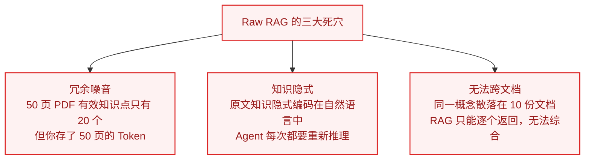
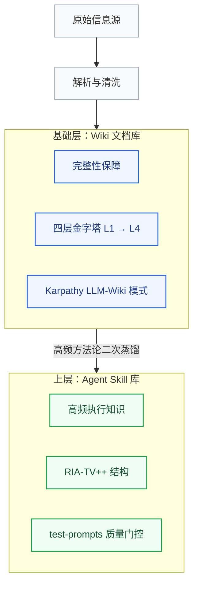
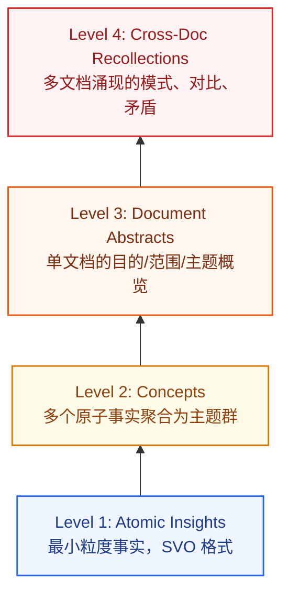

# 第一章：认知框架——信息、知识与智慧的本质差异

> **本章目标**：在动手之前，先建立正确的世界观。从第一性原理出发，回答三个根本问题：知识库是什么、为什么必须做、整个系统长什么样。

:::warning 术语说明：结构化提取 ≠ 知识蒸馏
本指南中的**「结构化提取」**（Structured Extraction / Knowledge Refinement）指通过 LLM 将非结构化文本转化为结构化、可检索的知识单元。

这与机器学习领域的**「知识蒸馏」**（Knowledge Distillation）完全不同——后者是将大模型能力迁移到小模型的模型压缩技术。

中文习惯将前者也称为"蒸馏"，但这是语义借用，请勿混淆。
:::

:::tip 动手前三个判断
1. **我的数据是否适合向量检索？** 若为规则稳定的评分标准 → 用规则引擎，不要 [RAG](02-decision-matrix.md#concept-rag)
2. **数据是否实时变化？** 竞品价格每分钟更新 → 直接调 API，不要入库
3. **查询是否为精确计算？** 月销售额汇总 → NL2SQL，不要 RAG

**只有当数据是非结构化文本 + 语义匹配 + 多源关联时，才真正需要向量知识库。**
:::

---

## 本指南的完整地图

<a id="concept-use-agent-001"></a>

在这条闭环里，Agent 是受控的知识消费者和行动执行者，不是知识真实性的来源。

整个"信息源 → Agent 知识体系"的全局闭环：

```mermaid
flowchart LR
    subgraph Source [信息源]
        S1[PDF / 书籍]
        S2[视频 / 播客]
        S3[代码仓库]
        S4[专家经验]
        S5[结构化数据]
        S6[图像 / 图表]
    end

    subgraph Distill [蒸馏层]
        D1[解析清洗]
        D2[结构化提取]
        D3[质量验证]
    end

    subgraph KB [知识库层]
        K1[(向量库)]
        K2[(知识图谱)]
        K3[(Skill 库)]
        K4[(记忆层)]
    end

    subgraph Agent [Agent 调用层]
        A1[意图路由]
        A2[检索/导航/执行]
        A3[回答生成]
    end

    subgraph Evolve [进化层]
        E1[健康度监控]
        E2[Skill 迭代]
        E3[冲突仲裁]
    end

    Source --> Distill --> KB --> Agent
    Agent -->|使用反馈| Evolve
    Evolve -->|补充蒸馏| Distill

    classDef src  fill:#eff6ff,stroke:#2563eb,stroke-width:1.5px,color:#1e3a8a;
    classDef mid  fill:#f0fdf4,stroke:#16a34a,stroke-width:1.5px,color:#14532d;
    classDef kb   fill:#fefce8,stroke:#d97706,stroke-width:1.5px,color:#92400e;
    classDef agt  fill:#fdf4ff,stroke:#9333ea,stroke-width:1.5px,color:#581c87;
    classDef evo  fill:#fef2f2,stroke:#dc2626,stroke-width:1.5px,color:#991b1b;
    class S1,S2,S3,S4,S5,S6 src;
    class D1,D2,D3 mid;
    class K1,K2,K3,K4 kb;
    class A1,A2,A3 agt;
    class E1,E2,E3 evo;
```



**读完本指南，你将能理解并拆解整条链路；正文代码默认是示意实现，只有标注 smoke evidence 的 fixture 才代表本地跑通。**

---

<a id="concept-dikw"></a>

## 1.1 为什么知识需要蒸馏——DIKW 四层递进

**DIKW 是本指南区分原始观察、语境化信息、可复用知识与面向决策智慧的认知层级**，不是工程加工步骤表。

大多数人在没有想清楚这个问题之前就开始动手了：**你存进知识库的，到底是什么？**

```txt
数据 (Data)：尚未被赋予问题语境的原始观察
  例：一本 300 页 PDF 的字符、页码、图像与版面坐标

信息 (Information)：经过语境化、可被描述和定位的数据
  例：一本 300 页的《精益创业》PDF
      → 包含 80,000 字，约 1,500 个句子

知识 (Knowledge)：经过结构化处理、可被检索和引用的信息
  例：《精益创业》中关于"MVP 验证"的 12 条可执行原则
      → 从 80,000 字中提炼，信噪比提升 100 倍

智慧 (Wisdom)：可指导 Agent 行动的可执行判断框架
  例：一个 SKILL.md
      触发条件："当用户问我的产品/功能该不该做时"
      执行步骤：先问这三个验证问题...
      禁忌：不要在未验证假设前就开始开发
      → Agent 收到问题时直接调用，无需二次推理
```

::: warning 核心误区
直接把原始 PDF 放进向量库，是把"信息"当成了"智慧"——中间缺失了两个等级的转化。这就是为什么简单的 RAG 系统经常给出"感觉对但执行不了"的答案。
:::

---

### 三种存储方式的本质差异

<a id="concept-skill-distillation"></a>

**Skill Distillation（技能蒸馏）是把可复用的推理或操作模式转化为有触发条件、步骤、边界与验证方法的执行契约**。

| 做法 | 你存的是什么 | Agent 每次调用代价 | 答案质量 |
| :--- | :--- | :--- | :--- |
| **Raw RAG**（原文切块）| 信息碎片 | 每次重新推理理解 | 不稳定，易幻觉 |
| **知识库蒸馏**（结构化提炼）| 知识命题 | 理解成本低，检索精准 | 稳定，可追溯 |
| **Skill 蒸馏**（可执行契约）| 行动指令 | 零推理，直接执行 | 最高，有边界 |

::: tip 选层原则
对知识的加工越彻底，Agent 运行时的推理成本越低，答案质量越高——但蒸馏的前期投入越大。正确的架构是**分层**：高频使用的知识做 Skill 蒸馏，低频全量的知识做知识库蒸馏，归档型内容做 Raw 存储。
:::

---

### 为什么不能只用 RAG？



**核心比喻**：把 PDF 直接扔进向量库，就像让厨师用原矿石烹饪——你需要先把铁矿石炼成钢，把钢打成刀，才能用来切菜。蒸馏就是"炼矿"的过程。

---

<a id="concept-lod"></a>

## 1.2 五级蒸馏阶梯（L0–L4）

**LoD（Level of Distillation）是项目对材料加工深度的选择模型**，用来决定内容应停留在原文、结构化知识、关系网络还是可执行契约。

| 层级 | 形态 | 核心操作 | 典型工具 | Agent 效果 |
| :--- | :--- | :--- | :--- | :--- |
| **L0 平铺** | 文本 Chunks | 滑动窗口切片 + 向量化 | LangChain | 单跳 60%，多跳 <10% |
| **L1 实体增强** | 富化 Chunks | LLM 抽实体附着在 Chunk 尾 | UnWeaver | 零图谱成本，超早期 [GraphRAG](02-decision-matrix.md#concept-graphrag) |
| **L2 层级导航** | 目录树 | 分层聚类 → INDEX.md | Corpus2Skill | F1 超 Dense 检索 27% |
| **L3 知识图谱** | 实体关系网络 | 提取三元组 → 图谱 + 社区摘要 | LightRAG | 全局主题综合霸主 |
| **L4 可执行契约** | SKILL.md | 方法论提炼为触发→执行→边界 | cangjie-skill | qsv 成功率 98.85% |

---

## 1.3 建设路径与数据结构



::: info 为什么要分两层？
- **基础层**是"完整性"——确保知识没有遗漏，供检索和人类阅读
- **Skill 层**是"效率"——把最常用的方法论编译成 Agent 零推理就能执行的指令

只有 Skill 层：覆盖率不够，遇到新问题无法处理。只有基础层：每次 Agent 重新推理，速度慢且不稳定。
:::

---

### 四层金字塔：知识库的核心数据结构



**压缩比**：每页约 13 个 Atomic Insight → 1 个 Concept（13:1 压缩）

检索路由：精确事实查询 → L1；探索性理解 → L2–L3；跨文档对比 → L4

---

### Karpathy LLM-Wiki：让知识产生复利

核心思想：**LLM 不只在查询时检索文档，而是持续编译维护一个活的 Wiki。**

```text
knowledge-base/
├── raw/                    ← 只读原始资料，永不删除
│   ├── books/
│   ├── transcripts/
│   └── images/
│
└── wiki/                   ← LLM 持续更新的编译结果
    ├── index.md            # 总目录，每次 ingest 自动更新
    ├── log.md              # 时序操作日志（可审计）
    ├── entity_pages/       # 实体页：人物/组织/产品/工具
    ├── concept_pages/      # 概念页：技术术语/领域方法论
    └── summaries/          # 每个 source 的摘要页
```

每次 Ingest 固定五步：解析 → 写摘要页 → 更新总目录 → 合并实体/概念页 → 追加日志。

::: tip 为什么比直接向量检索更强？
矛盾已被标注、跨文档关联已建立、知识编译一次查询直接用、随内容增加而不断丰富——这就是**复利效应**的来源。
:::

---

## 1.4 反蒸馏：哪些知识不该被结构化

蒸馏的本质是**有损压缩**——你在用结构换取可检索性，必然丢失原始语境。以下四类知识，蒸馏的损失大于收益，应保持原始形态存储。

### 类型一：情境依赖型知识

某些判断只在特定上下文中成立，抽离语境后会产生误导。典型例子：法律合同中的条款解释、医学案例中的临床推理过程、产品设计中的取舍背景（ADR）。

强行结构化这类知识，会让 Agent 拿着"脱离语境的正确结论"在错误场景下应用。

**正确处理**：保留全文原始存储 + 语义索引，让 Agent 在检索到后自行在上下文中推理，而不是消费一个预提炼的命题。

### 类型二：负向知识（知道什么不能做）

失败经验、踩坑记录、被否决的方案——这类知识的价值在于**完整叙事**，而不是结论。把"我们试过 A 方案，在 B 场景下失败了，因为 C 原因"压缩成"不要用 A 方案"，会让后来者无法判断自己的场景是否适用。

**正确处理**：用 ADR（Architecture Decision Record）格式原文保存，包含：背景 → 决策 → 被否决的选项 → 后果。可以建索引，但不要摘要化。

### 类型三：高度个人化的隐性知识

专家的直觉判断、老手的"感觉"——这类知识本质上是**身体记忆和模式识别**，无法被完全外显化。试图把它们蒸馏成 SKILL.md 的操作步骤，往往只能捕获显性部分，遗漏最有价值的判断边界。

`ex-skill` 和 `yourself-skill` 的上限正在于此：它们能复现表达风格，但无法复现判断背后的经历积累。

**正确处理**：用访谈录音 + 逐字稿原文存储，AI 辅助生成"提问引导词"供人类查阅，而不是生成"可供 Agent 直接调用的决策函数"。

### 类型四：快速迭代的操作性知识

当知识的更新周期短于维护周期，结构化反而会制造一个"看起来权威但已经过期"的陷阱。CLI 工具的参数、SDK 的 API 签名、三方平台的限制条款——这类知识应该指向源头（官方文档 URL），而不是被复制到知识库里。

**正确处理**：只存储"指针"（URL + 访问时间戳 + 摘要），不存储内容本身。让 Agent 在需要时实时获取。

---

:::warning 蒸馏前的灵魂三问
1. 这条知识六个月后还准确吗？
2. 它离开完整语境后，还能被正确理解吗？
3. 有没有人会因为 Agent 拿它做决策而承担现实后果？

三个问题有任何一个答案是"不确定"，先不要蒸馏。
:::

---

## 1.5 L4 纠错链路：从错误回滚到根因

DIKW 阶梯的"向上蒸馏"讲得很清楚，但"向下纠错"是被忽视的另一半。当 L4 Skill 产生错误时，错误会以最高复用效率扩散——因为所有调用这个 Skill 的 Agent 都会受到影响。

### 错误信号检测

L4 Skill 的错误通常不会触发明显的系统告警，而是通过以下信号间接暴露：

- 用户反馈"Agent 给出了很像对的、但方向不对的建议"
- 下游业务指标（转化率、决策准确率）无法解释的下降
- 同类任务的 Skill 执行成功率从 95%+ 悄悄降到 85%
- 某类查询开始产生"正确但无用"的输出（结构完整但逻辑空洞）

### 五步回滚流程

当检测到 L4 Skill 可能出错时，按以下路径溯源：

```text
L4 Skill 错误
  ↓ 步骤1：隔离受影响的 Skill 版本，暂停 darwin 迭代
  ↓ 步骤2：找到最近一次"业务验证通过"的 Skill 版本，回滚
  ↓ 步骤3：从 Skill 回退到 L3 层——检查支撑该 Skill 的知识图谱/社区摘要
  ↓ 步骤4：从 L3 回退到 L1/L0——找到原始来源文档，验证其是否仍然有效
  ↓ 步骤5：确认根因后，从正确的 LoD 层重新蒸馏
```

### 每个 Skill 必须记录的纠错锚点

```yaml
skill: pdf-complex-parse
version: v2.3
created_from:                    # 向下追溯的锚点
  source_docs:
    - "MinerU官方文档 v2.1"
    - "内部经验总结 2025-Q3"
  knowledge_layer: L2            # 该Skill基于的知识层级
  raw_cases:                     # L0原始案例，出错时可回看
    - "cases/pdf-parse-failures-2025.jsonl"
rollback_to: v2.1                # 上一个验证版本
last_validated: "2026-06-01"
validated_by: "张工"
```

:::info 关键原则
每次 Skill 版本迭代，必须保留上一个"业务验证通过"的版本作为回滚点。不允许在没有前一版本锚点的情况下覆盖入库。这条原则成本极低（只是保存一个版本快照），但可以将 L4 错误的平均修复时间从"数天"缩短到"数小时"。
:::

---

## 1.6 框架映射总表：本章所有概念的统一坐标系

本章引入了多个分层框架，它们描述的是**同一个系统的不同切面**，而非并列的独立体系。

| DIKW 层 | L0-L4 蒸馏层 | 存储形态 | 建设工具 | 检索方式 | 最适合的场景 |
|---------|-------------|---------|---------|---------|------------|
| Data（数据） | L0 平铺 | 文本 Chunks | LangChain / LlamaIndex | 向量相似度 | 快速 PoC，低预算 |
| Information（信息） | L1 实体增强 | 富化 Chunks + 实体标注 | UnWeaver | 向量 + 元数据过滤 | 低成本超越早期 GraphRAG |
| Knowledge（知识） | L2 层级导航 | INDEX.md 目录树 | Corpus2Skill | 导航 + 精确检索 | 单域文档，Agent 主动导航 |
| Knowledge Network | L3 知识图谱 | 实体关系网络 | LightRAG / GraphRAG | 图遍历 + 社区摘要 | 跨文档推理，全局主题综合 |
| Wisdom（智慧） | L4 可执行契约 | SKILL.md | cangjie-skill / R2S | 直接执行，无检索 | 高频决策流程，零推理 |

**四层金字塔**（Atomic / Concept / Abstract / Index）是 L1–L2 层的**内部数据结构**，不是独立框架。

**Karpathy LLM-Wiki** 是 L2 层级导航的一种实现范式：以 INDEX.md 为根节点，知识以 Markdown 页面树生长，支持 Agent 主动导航。

**反蒸馏框架**是 L4 的使用边界：它告诉你哪些知识**不该升到 L4**，必须停留在 L0/L1/原文层。

**Skill 反向纠错链路**是 L4 的安全机制：当 L4 Skill 出错时，沿着血缘链路向下回滚到 L0 原始案例定位根因。

---

## 本章小结：动手前的三个决策

::: info 决策 1：主要用途？
- 高频执行（流程/操作/决策）→ 优先建 L4 Skill 层
- 查询问答（事实/概念/参考）→ 优先建 L1–L3 基础层
- 全局分析（趋势/对比/综合）→ 优先建 L3 知识图谱层
:::

::: info 决策 2：愿意投入多少成本？
- 快速起步，成本敏感 → L1 实体增强 + Docling
- 生产级，追求精度 → L4 全链路 + MinerU / Unlimited-OCR
- 中间路线 → L2 层级导航 + Corpus2Skill
:::

::: info 决策 3：知识会持续更新吗？
- 静态语料（一次性）→ Microsoft GraphRAG 重量级方案
- 动态增长（持续更新）→ LightRAG 或 LLM-Wiki 增量方案
- Agent 实时学习 → 必须接入 Graphiti 时态记忆
:::

---

:::tip → 下一章
认知到位后，根据输入类型和产品形态做技术选型 → [02-decision-matrix](02-decision-matrix.md)
:::

## 来源与复核

- **复核状态**：待复核。任何易漂移的版本、价格、法律或性能结论，采用前都必须回到一手来源再次确认。
- **代码状态**：示意代码。未被本地 smoke test 覆盖的片段不得解释为生产可运行。
- **证据边界**：本页成熟度只描述内容形态，不代表部署、上线或生产验收已经完成。
- **下一验收动作**：按仓库根目录 `content-audit.md` 中本模块的证据缺口补齐来源、fixture 与验收回执。
