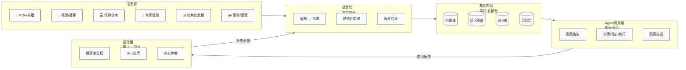
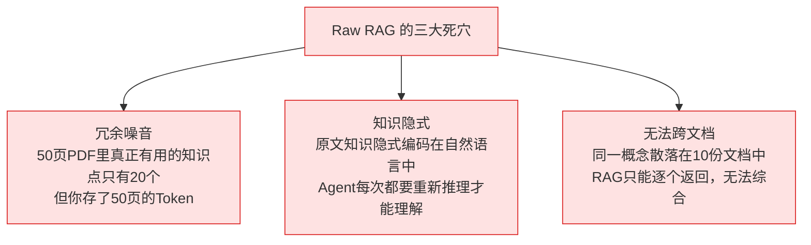
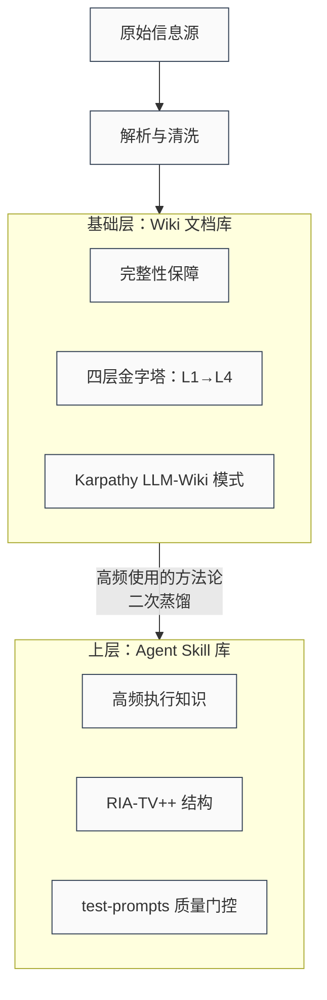
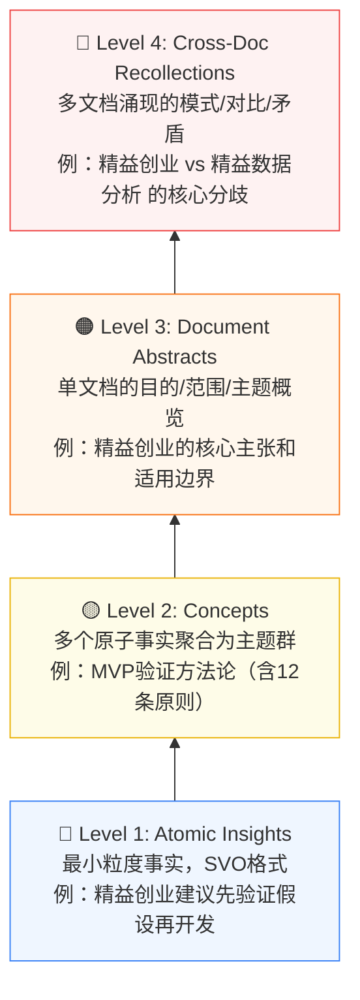

# 第一部分：认知框架——为什么要做知识蒸馏？

> **本章目标**：在你动手之前，先建立正确的世界观。我们会从第一性原理出发，回答三个根本问题：知识蒸馏是什么、为什么必须做、整个系统长什么样。

---

## 1.0 本指南的完整地图

在开始之前，先看清楚你将要建设的是什么。这是整个"信息源 → Agent 知识体系"的全局闭环：



**读完本指南，你将能够构建这整条链路，且每个环节都有可运行代码支撑。**

---

## 1.1 第一性原理推导：信息、知识、智慧的本质差异

大多数人在没有想清楚这个问题之前就开始动手了：**你存进知识库的，到底是什么？**

让我们从第一性原理出发：

```
信息 (Information)：原始的、未经处理的数据
  例：一本 300 页的《精益创业》PDF
      → 包含 80,000 字，约 1500 个句子

知识 (Knowledge)：经过结构化处理、可被检索和引用的信息
  例：《精益创业》中关于"MVP 验证"的 12 条可执行原则
      → 从 80,000 字中提炼，信噪比提升 100 倍

智慧 (Wisdom)：可指导 Agent 行动的可执行判断框架
  例：一个 SKILL.md：
      触发条件："当用户问我的产品/功能该不该做时"
      执行步骤：先问这三个验证问题...
      禁忌：不要在未验证假设前就开始开发
      → Agent 收到问题时直接调用，无需二次推理
```

**直接把原始 PDF 放进向量库，是把"信息"当成了"智慧"——中间缺失了两个等级的转化**。

这就解释了为什么简单的 RAG 系统经常给出"感觉对但执行不了"的答案——它检索到了信息，但没有智慧。

---

## 1.2 三种"存法"的本质差异

目前市场上有三种主流做法，它们的本质差异远比表面看起来大：

| 做法 | 你存的是什么 | Agent 每次调用的代价 | 答案质量 |
| :--- | :--- | :--- | :--- |
| **Raw RAG**（原文切块）| 信息碎片 | 每次都要重新推理理解 | 不稳定，易幻觉 |
| **知识库蒸馏**（结构化提炼）| 知识命题 | 理解成本低，检索精准 | 稳定，可追溯 |
| **Skill 蒸馏**（可执行契约）| 行动指令 | 零推理，直接执行 | 最高，有边界 |

**第一性原理的结论**：你对知识的加工越彻底，Agent 运行时的推理成本越低，答案质量越高——但蒸馏的前期投入越大。正确的架构是**分层**：高频使用的知识做深度蒸馏（Skill），低频但全量的知识做知识库蒸馏，归档型内容做 Raw 存储。

---

## 1.3 为什么不能只用 RAG？Raw 存储的三个根本缺陷



**核心比喻**：把 PDF 直接扔进向量库，就像让厨师在生产线上用原矿石烹饪——你需要先把铁矿石炼成钢，再把钢打成刀，才能用来切菜。蒸馏就是"炼矿"的过程。

---

## 1.4 蒸馏的五个层级（DIKW 阶梯）

根据加工深度，知识蒸馏可以分为五个层级，每个层级的 Agent 调用效果截然不同：

| 层级 | 形态 | 核心操作 | 典型工具 | Agent 效果 |
| :--- | :--- | :--- | :--- | :--- |
| **L0 平铺（原文切块）** | 文本 Chunks | 滑动窗口切片 + 向量化 | LangChain, LlamaIndex | 单跳60%，多跳<10% |
| **L1 实体增强** | 富化 Chunks | LLM 抽实体附着在 Chunk 尾 | UnWeaver | 零图谱成本，超早期 GraphRAG |
| **L2 层级导航** | 目录树 | 分层聚类 → INDEX.md + SKILL.md | Corpus2Skill | F1 超 Dense 检索 27% |
| **L3 知识图谱** | 实体关系网络 | 提取三元组 → 图谱 + 社区摘要 | LightRAG, GraphRAG | 全局主题综合霸主 |
| **L4 可执行契约** | SKILL.md | 方法论/行为提炼为触发→执行→边界 | cangjie-skill, nuwa-skill | qsv 任务成功率 98.85% |

**选层原则**：并非越高越好，而是匹配使用场景：
- 高频且有明确执行路径的知识 → L4
- 需要全库综合分析的知识 → L3
- 大量同域文档的知识库 → L2
- 快速启动、成本敏感 → L1

---

## 1.5 两条必须同时走的路径

知识蒸馏不是"文档" VS "Skill"的二选一，而是**先后关系**：



**为什么要分两层？**
- 基础层是"完整性"——确保知识没有遗漏，供检索和人类阅读
- Skill 层是"效率"——把最常用的方法论编译成 Agent 零推理就能执行的指令

如果只有 Skill 层：覆盖率不够，遇到新问题无法处理
如果只有基础层：每次 Agent 都要重新推理，速度慢且不稳定

---

## 1.6 四层金字塔：知识库的核心数据结构

这是 Kudra.ai 2026 年提出的生产级蒸馏架构，也是本指南基础层的核心数据模型：



**压缩比**：每页约 13 个 Atomic Insight → 1 个 Concept（13:1 压缩）

**检索路由**：
- 用户问精确事实 → 检索 L1（Atomic Insights）
- 用户做探索性理解 → 检索 L2-L3（Concepts + Abstracts）
- 用户需要跨书对比 → 检索 L4（Cross-Doc Recollections）

---

## 1.7 Karpathy LLM-Wiki：让知识产生复利的持续维护机制

这是 Andrej Karpathy 2026 年提出的知识库运营范式，核心思想：**LLM 不只在查询时检索文档，而是持续编译维护一个活的 Wiki**。

**目录结构：**
```
knowledge-base/
├── raw/                    ← 只读原始资料，永不删除
│   ├── books/
│   ├── transcripts/
│   └── images/
│
└── wiki/                   ← LLM 持续更新的编译结果
    ├── index.md            # 总目录，每次 ingest 自动更新
    ├── log.md              # 时序操作日志（可审计）
    ├── entity_pages/       # 实体页：人物/组织/产品/工具
    ├── concept_pages/      # 概念页：技术术语/领域方法论
    └── summaries/          # 每个 source 的摘要页
```

**每次 Ingest 新内容时（5步固定流程）：**

```python
# 伪代码，展示 Ingest 的核心逻辑
def ingest(source_path: str):
    # Step 1: 读取并解析原始内容
    content = parse(source_path)

    # Step 2: 写入摘要页
    summary = llm_summarize(content)
    write(f"wiki/summaries/{source_id}.md", summary)

    # Step 3: 更新总目录
    append_to_index(source_id, summary.title, summary.topics)

    # Step 4: 更新实体/概念页（跨文档合并）
    entities = extract_entities(content)
    for entity in entities:
        merge_into_entity_page(entity)  # 合并而非覆盖

    # Step 5: 追加操作日志
    append_log(source_id, action="ingest", timestamp=now())
```

**为什么这比"直接向量检索"更强？**
- 矛盾已被标注（A 书说 3，B 书说 5 → 标记冲突等待仲裁）
- 跨文档关联已建立（不需要检索时再推理）
- 知识编译一次，查询时直接用（不是每次从原文重新推理）
- 随内容增加而不断丰富（复利效应）

---

## 1.8 本章小结：开始之前的三个决策

在动手前，你需要先明确这三个问题：

**决策 1：你的知识库主要用于什么场景？**
- 高频执行（流程/操作/决策）→ 优先建 L4 Skill 层
- 查询问答（事实/概念/参考）→ 优先建 L1-L3 基础层
- 全局分析（趋势/对比/综合）→ 优先建 L3 知识图谱层

**决策 2：你愿意投入多少蒸馏成本？**
- 快速起步，成本敏感 → L1 实体增强 + Docling
- 生产级，追求精度 → L4 全链路 + MinerU/Unlimited-OCR
- 中间路线 → L2 层级导航 + Corpus2Skill

**决策 3：你的知识会持续更新吗？**
- 静态语料（一次性） → 可以用 Microsoft GraphRAG 重量级方案
- 动态增长（持续更新）→ 必须用 LightRAG 或 LLM-Wiki 增量方案
- Agent 实时学习 → 必须接入 Graphiti 时态记忆
