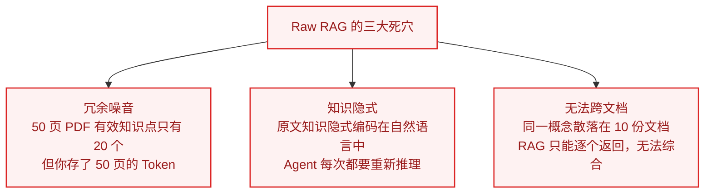
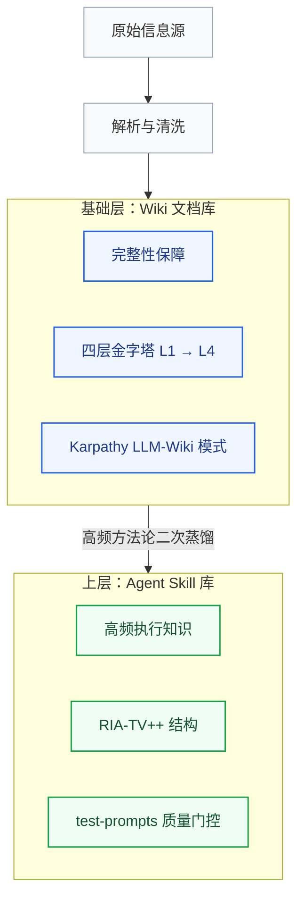
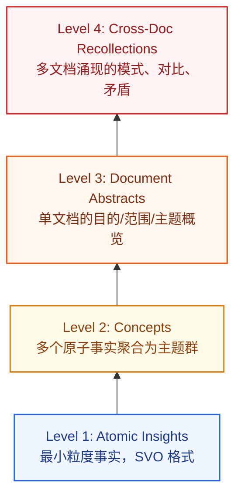

# 第一章：认知框架——信息、知识与智慧的本质差异

> **本章目标**：在动手之前，先建立正确的世界观。从第一性原理出发，回答三个根本问题：知识库是什么、为什么必须做、整个系统长什么样。

:::warning 术语说明：结构化提取 ≠ 知识蒸馏
本指南中的**「结构化提取」**（Structured Extraction / Knowledge Refinement）指通过 LLM 将非结构化文本转化为结构化、可检索的知识单元。

这与机器学习领域的**「知识蒸馏」**（Knowledge Distillation）完全不同——后者是将大模型能力迁移到小模型的模型压缩技术。

中文习惯将前者也称为"蒸馏"，但这是语义借用，请勿混淆。
:::

:::tip 动手前三个判断
1. **我的数据是否适合向量检索？** 若为规则稳定的评分标准 → 用规则引擎，不要 RAG
2. **数据是否实时变化？** 竞品价格每分钟更新 → 直接调 API，不要入库
3. **查询是否为精确计算？** 月销售额汇总 → NL2SQL，不要 RAG

**只有当数据是非结构化文本 + 语义匹配 + 多源关联时，才真正需要向量知识库。**
:::

---

## 本指南的完整地图

整个"信息源 → Agent 知识体系"的全局闭环：

```mermaid
flowchart LR
    subgraph Source [信息源]
        S1[PDF / 书籍]
        S2[视频 / 播客]
        S3[代码仓库]
        S4[专家经验]
        S5[结构化数据]
        S6[图像 / 图表]
    end

    subgraph Distill [蒸馏层]
        D1[解析清洗]
        D2[结构化提取]
        D3[质量验证]
    end

    subgraph KB [知识库层]
        K1[(向量库)]
        K2[(知识图谱)]
        K3[(Skill 库)]
        K4[(记忆层)]
    end

    subgraph Agent [Agent 调用层]
        A1[意图路由]
        A2[检索/导航/执行]
        A3[回答生成]
    end

    subgraph Evolve [进化层]
        E1[健康度监控]
        E2[Skill 迭代]
        E3[冲突仲裁]
    end

    Source --> Distill --> KB --> Agent
    Agent -->|使用反馈| Evolve
    Evolve -->|补充蒸馏| Distill

    classDef src  fill:#eff6ff,stroke:#2563eb,stroke-width:1.5px,color:#1e3a8a;
    classDef mid  fill:#f0fdf4,stroke:#16a34a,stroke-width:1.5px,color:#14532d;
    classDef kb   fill:#fefce8,stroke:#d97706,stroke-width:1.5px,color:#92400e;
    classDef agt  fill:#fdf4ff,stroke:#9333ea,stroke-width:1.5px,color:#581c87;
    classDef evo  fill:#fef2f2,stroke:#dc2626,stroke-width:1.5px,color:#991b1b;
    class S1,S2,S3,S4,S5,S6 src;
    class D1,D2,D3 mid;
    class K1,K2,K3,K4 kb;
    class A1,A2,A3 agt;
    class E1,E2,E3 evo;
```



**读完本指南，你将能构建这整条链路，每个环节都有可运行代码支撑。**

---

## 第一性原理推导：信息、知识、智慧的本质差异

大多数人在没有想清楚这个问题之前就开始动手了：**你存进知识库的，到底是什么？**

```txt
信息 (Information)：原始的、未经处理的数据
  例：一本 300 页的《精益创业》PDF
      → 包含 80,000 字，约 1,500 个句子

知识 (Knowledge)：经过结构化处理、可被检索和引用的信息
  例：《精益创业》中关于"MVP 验证"的 12 条可执行原则
      → 从 80,000 字中提炼，信噪比提升 100 倍

智慧 (Wisdom)：可指导 Agent 行动的可执行判断框架
  例：一个 SKILL.md
      触发条件："当用户问我的产品/功能该不该做时"
      执行步骤：先问这三个验证问题...
      禁忌：不要在未验证假设前就开始开发
      → Agent 收到问题时直接调用，无需二次推理
```

::: warning 核心误区
直接把原始 PDF 放进向量库，是把"信息"当成了"智慧"——中间缺失了两个等级的转化。这就是为什么简单的 RAG 系统经常给出"感觉对但执行不了"的答案。
:::

---

## 三种"存法"的本质差异

| 做法 | 你存的是什么 | Agent 每次调用代价 | 答案质量 |
| :--- | :--- | :--- | :--- |
| **Raw RAG**（原文切块）| 信息碎片 | 每次重新推理理解 | 不稳定，易幻觉 |
| **知识库蒸馏**（结构化提炼）| 知识命题 | 理解成本低，检索精准 | 稳定，可追溯 |
| **Skill 蒸馏**（可执行契约）| 行动指令 | 零推理，直接执行 | 最高，有边界 |

::: tip 选层原则
对知识的加工越彻底，Agent 运行时的推理成本越低，答案质量越高——但蒸馏的前期投入越大。正确的架构是**分层**：高频使用的知识做 Skill 蒸馏，低频全量的知识做知识库蒸馏，归档型内容做 Raw 存储。
:::

---

## 为什么不能只用 RAG？



**核心比喻**：把 PDF 直接扔进向量库，就像让厨师用原矿石烹饪——你需要先把铁矿石炼成钢，把钢打成刀，才能用来切菜。蒸馏就是"炼矿"的过程。

---

## 蒸馏的五个层级（DIKW 阶梯）

| 层级 | 形态 | 核心操作 | 典型工具 | Agent 效果 |
| :--- | :--- | :--- | :--- | :--- |
| **L0 平铺** | 文本 Chunks | 滑动窗口切片 + 向量化 | LangChain | 单跳 60%，多跳 <10% |
| **L1 实体增强** | 富化 Chunks | LLM 抽实体附着在 Chunk 尾 | UnWeaver | 零图谱成本，超早期 GraphRAG |
| **L2 层级导航** | 目录树 | 分层聚类 → INDEX.md | Corpus2Skill | F1 超 Dense 检索 27% |
| **L3 知识图谱** | 实体关系网络 | 提取三元组 → 图谱 + 社区摘要 | LightRAG | 全局主题综合霸主 |
| **L4 可执行契约** | SKILL.md | 方法论提炼为触发→执行→边界 | cangjie-skill | qsv 成功率 98.85% |

---

## 两条必须同时走的路径



::: info 为什么要分两层？
- **基础层**是"完整性"——确保知识没有遗漏，供检索和人类阅读
- **Skill 层**是"效率"——把最常用的方法论编译成 Agent 零推理就能执行的指令

只有 Skill 层：覆盖率不够，遇到新问题无法处理。只有基础层：每次 Agent 重新推理，速度慢且不稳定。
:::

---

## 四层金字塔：知识库的核心数据结构



**压缩比**：每页约 13 个 Atomic Insight → 1 个 Concept（13:1 压缩）

检索路由：精确事实查询 → L1；探索性理解 → L2–L3；跨文档对比 → L4

---

## Karpathy LLM-Wiki：让知识产生复利

核心思想：**LLM 不只在查询时检索文档，而是持续编译维护一个活的 Wiki。**

```
knowledge-base/
├── raw/                    ← 只读原始资料，永不删除
│   ├── books/
│   ├── transcripts/
│   └── images/
│
└── wiki/                   ← LLM 持续更新的编译结果
    ├── index.md            # 总目录，每次 ingest 自动更新
    ├── log.md              # 时序操作日志（可审计）
    ├── entity_pages/       # 实体页：人物/组织/产品/工具
    ├── concept_pages/      # 概念页：技术术语/领域方法论
    └── summaries/          # 每个 source 的摘要页
```

每次 Ingest 固定五步：解析 → 写摘要页 → 更新总目录 → 合并实体/概念页 → 追加日志。

::: tip 为什么比直接向量检索更强？
矛盾已被标注、跨文档关联已建立、知识编译一次查询直接用、随内容增加而不断丰富——这就是**复利效应**的来源。
:::

---

## 本章小结：动手前的三个决策

::: info 决策 1：主要用途？
- 高频执行（流程/操作/决策）→ 优先建 L4 Skill 层
- 查询问答（事实/概念/参考）→ 优先建 L1–L3 基础层
- 全局分析（趋势/对比/综合）→ 优先建 L3 知识图谱层
:::

::: info 决策 2：愿意投入多少成本？
- 快速起步，成本敏感 → L1 实体增强 + Docling
- 生产级，追求精度 → L4 全链路 + MinerU / Unlimited-OCR
- 中间路线 → L2 层级导航 + Corpus2Skill
:::

::: info 决策 3：知识会持续更新吗？
- 静态语料（一次性）→ Microsoft GraphRAG 重量级方案
- 动态增长（持续更新）→ LightRAG 或 LLM-Wiki 增量方案
- Agent 实时学习 → 必须接入 Graphiti 时态记忆
:::

---

:::tip → 下一章
认知到位后，根据输入类型和产品形态做技术选型 → [02-decision-matrix](02-decision-matrix.md)
:::
