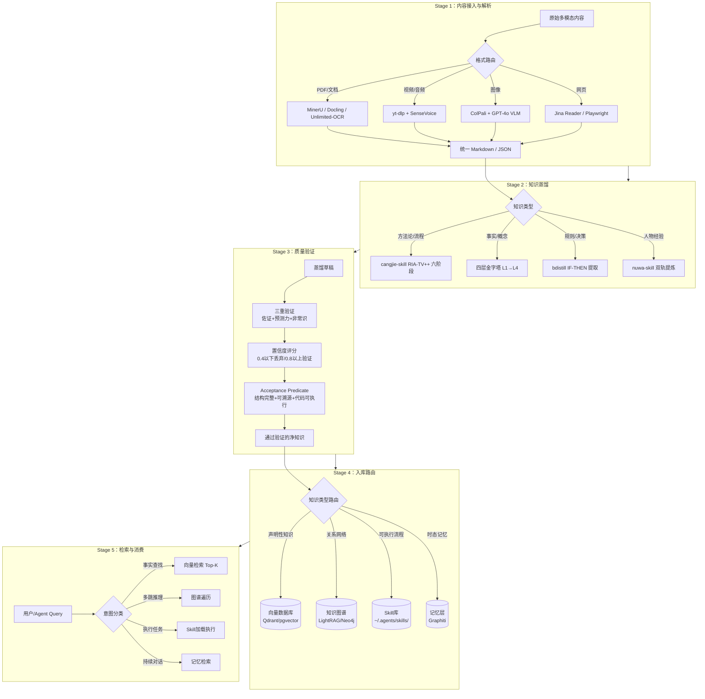
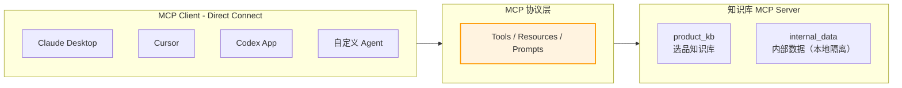

# 第四章：全链路技术架构（+MCP封装层）

> **七阶段流水线**：需求建模 → 内容接入 → 结构化提取 → 质量验证 → 入库路由 → 检索消费 → **MCP 封装（2026新增）**

:::tip 术语说明
本章中的"知识蒸馏"统一使用**「结构化提取」**（Structured Extraction）表述，指通过 LLM 将非结构化文本转化为结构化知识单元，与 ML 领域的模型压缩技术无关。
:::

---

## Stage 0：需求建模——问题→证据→验收闭环

:::danger 最常被跳过的阶段，也是最重要的阶段
所有后续阶段的质量上限，由 Stage 0 定义问题的质量决定。没有问题集，就没有验收标准；没有验收标准，就无法判断系统是否完成。
:::

### Step 1：定义黄金问题集

黄金问题集是系统必须能回答的 20-50 个代表性问题，覆盖四种类型：

| 类型 | 示例 | 测试能力 |
|------|------|----------|
| **精确事实** | "产品 A 的最低起订量是多少？" | 检索精度 |
| **多跳推理** | "哪些供应商同时出现在合规风险和财务报告中？" | 图谱推理 |
| **跨文档综合** | "过去三季度用户投诉主题有何变化？" | 全局理解 |
| **执行指导** | "跨页表格解析失败时完整处理步骤？" | Skill 调用 |

### Step 2：为每个问题标注证据要求

问题集不是问题清单，每个问题必须同时标注：

```python
GOLDEN_QUESTION = {
    "id": "GQ-001",
    "question": "美国市场暖奶器价格带分布是什么？",
    "type": "factual",
    "required_evidence": {
        "source": "Amazon竞品数据 2026Q1",          # 答案应来自哪里
        "evidence_level": 3,                        # Level 1-5，见附录A
        "staleness_limit_days": 30,                 # 超过多少天答案失效
    },
    "acceptance_criteria": {
        "must_include": ["价格区间", "代表品牌数量"],  # 答案必须包含的要素
        "must_not_include": ["2024年数据"],           # 答案不能包含的内容
        "confidence_floor": 0.75,                    # 最低置信度要求
    },
    "failure_consequence": "选品方向错误，影响库存决策",  # 答错后果
    "owner": "选品负责人",
}
```

### Step 3：运行验收测试

每次架构变更或数据更新后，用黄金问题集跑验收测试：

```python
def run_acceptance_test(kb_client, golden_set: list[dict]) -> dict:
    results = []
    for q in golden_set:
        response = kb_client.query(q["question"])

        # 检查接受标准
        passed = True
        failures = []

        for term in q["acceptance_criteria"]["must_include"]:
            if term not in response["answer"]:
                passed = False
                failures.append(f"缺少必要元素：{term}")

        for term in q["acceptance_criteria"]["must_not_include"]:
            if term in response["answer"]:
                passed = False
                failures.append(f"包含禁止内容：{term}")

        if response.get("confidence", 0) < q["acceptance_criteria"]["confidence_floor"]:
            passed = False
            failures.append(f"置信度 {response['confidence']:.2f} 低于要求")

        results.append({
            "id": q["id"],
            "passed": passed,
            "failures": failures,
            "consequence": q["failure_consequence"] if not passed else None
        })

    passed_count = sum(1 for r in results if r["passed"])
    failed_critical = [r for r in results if not r["passed"] and
                       golden_set[results.index(r)]["failure_consequence"]]

    return {
        "pass_rate": passed_count / len(results),
        "blocked": len(failed_critical) > 0,   # 有关键问题失败则阻断上线
        "failed_critical": failed_critical,
        "summary": f"{passed_count}/{len(results)} 通过"
    }
```

### Step 4：上线门控

验收测试结果决定是否允许上线：

```
验收结果
├── pass_rate >= 0.80 AND blocked == False → 允许上线
├── pass_rate >= 0.70 AND blocked == False → 有条件上线（需标注已知盲区）
└── pass_rate < 0.70 OR blocked == True   → 禁止上线，返回 Stage 0 重新定义问题
```

:::tip 最低可行版本
没时间做完整黄金问题集？至少写下这五个问题：**"如果系统答错了这道题，会造成真实的业务损失。"** 这五个问题就是你的最小化验收集，每次上线前必跑。
:::

---

## 总览：六阶段流水线（Stage 1-6）



---

## Stage 1：内容接入与解析

### 职责
将任意格式的原始内容，转化为 LLM 可以处理的统一 Markdown/JSON。

### 解析路由决策

```python
from enum import Enum
from pathlib import Path

class ParseRoute(Enum):
    DOCLING = "docling"           # CPU，MIT协议，金融表格最强
    MINERU = "mineru"             # GPU，精度最高，公式/CJK最强
    UNLIMITED_OCR = "unlimited"   # 高配GPU，跨页超复杂文档
    MARKER = "marker"             # GPU，批量高吞吐
    SENSEVOICE = "sensevoice"     # 音频，中文最强
    FASTER_WHISPER = "whisper"    # 音频，英文/多语言
    COLPALI = "colpali"           # 图像，无需OCR直接嵌入
    JINA_READER = "jina"          # 网页，零配置

def route_parser(file_path: str, has_gpu: bool = False) -> ParseRoute:
    suffix = Path(file_path).suffix.lower()

    if suffix in ['.pdf', '.docx', '.pptx', '.xlsx']:
        # 判断是否为扫描件/复杂混排
        if has_gpu:
            # 检查文件复杂度（页数>100或含大量图片）
            return ParseRoute.UNLIMITED_OCR if is_complex(file_path) \
                   else ParseRoute.MINERU
        return ParseRoute.DOCLING

    elif suffix in ['.mp4', '.mov', '.avi', '.mkv']:
        return ParseRoute.SENSEVOICE  # 先提取音频

    elif suffix in ['.mp3', '.wav', '.m4a']:
        return ParseRoute.SENSEVOICE  # 中文首选

    elif suffix in ['.png', '.jpg', '.jpeg', '.webp']:
        return ParseRoute.COLPALI    # 原生视觉嵌入

    elif file_path.startswith('http'):
        return ParseRoute.JINA_READER

    return ParseRoute.DOCLING  # 兜底
```

### 核心配置

```python
# Stage 1 完整配置
STAGE1_CONFIG = {
    "docling": {
        "output_format": "markdown",
        "table_mode": "accurate",   # 金融表格用 accurate 模式
    },
    "mineru": {
        "effort": "high",           # medium/high，high 开启图片分析
        "output_dir": "./output/",
    },
    "sensevoice": {
        "model": "iic/SenseVoiceSmall",
        "vad_model": "fsmn-vad",
        "use_itn": True,            # 数字规范化
        "language": "auto",
    },
    "chunking": {
        "strategy": "structural",   # 必须用结构化切块，不是 token 切块
        "overlap_tokens": 128,
        "min_chunk_tokens": 100,
        "max_chunk_tokens": 1000,
    }
}
```

### 关键约束
- **绝对不能用 token 数切块**：必须按文档结构边界（标题/段落/表格）切
- **图片内文字必须二次处理**：MinerU 裁出图片后，图片内的文字要再送 VLM
- **Unlimited-OCR 的 ngram_window**：单页用 128，多页必须用 1024

---

## Stage 2：结构化提取（原"知识蒸馏"）

### 职责
将统一的文本，按照知识类型，提炼为不同深度的结构化知识。

### 蒸馏类型路由

```python
def route_distill(content: str, content_type: str) -> str:
    """
    根据内容类型选择蒸馏策略
    Returns: "skill" | "pyramid" | "rule" | "persona"
    """
    METHODOLOGY_KEYWORDS = ["步骤", "方法", "流程", "如何", "怎么", "SOP", "操作"]
    FACT_KEYWORDS = ["是什么", "定义", "概念", "原理", "理论"]
    RULE_KEYWORDS = ["如果", "IF", "条件", "阈值", "规则", "策略"]
    PERSON_KEYWORDS = ["观点", "认为", "建议", "经验", "思维"]

    if any(kw in content for kw in METHODOLOGY_KEYWORDS):
        return "skill"      # → cangjie-skill RIA-TV++ 流水线
    elif any(kw in content for kw in RULE_KEYWORDS):
        return "rule"       # → bdistill IF-THEN 提取
    elif any(kw in content for kw in PERSON_KEYWORDS):
        return "persona"    # → nuwa-skill 双轨提炼
    else:
        return "pyramid"    # → 四层金字塔默认路由
```

### 四层金字塔提取 Prompt 工程

```python
# Level 1：Atomic Insights 提取
ATOMIC_PROMPT = """
从以下文本中提取所有原子事实。
规则：
1. 每条事实必须是独立完整的命题，格式：[主体] [动作/关系] [客体/结论]
2. 不要改写原文意思，不要合并两个不同的事实
3. 去掉修饰语，保留核心主张
4. 每条事实用 JSON 格式输出：
   {"fact": "...", "source_sentence": "...", "confidence": 0.0-1.0}

文本：{text}

输出 JSON 数组：
"""

# Level 2：Concepts 聚合
CONCEPT_PROMPT = """
以下是关于同一文档的一组原子事实：
{atomic_facts}

请将相关的原子事实聚合为概念群：
1. 每个概念群应该有一个清晰的主题名称
2. 包含 3-7 个支撑该概念的原子事实
3. 每个概念输出格式：
   {"concept": "...", "summary": "...", "supporting_facts": [...]}
"""

# Level 4：Cross-Document 冲突检测
CONFLICT_PROMPT = """
以下是来自不同文档的关于同一主题的声明：
文档A：{claim_a}（来源：{source_a}）
文档B：{claim_b}（来源：{source_b}）

判断：
1. 这两个声明是否矛盾？（是/否）
2. 如果矛盾，是什么类型：数值冲突/时态冲突/观点分歧
3. 置信度更高的是哪个？理由是什么？
输出格式：{"conflict": bool, "type": "...", "preferred": "A/B/both", "reason": "..."}
"""
```

### RIA-TV++ 六阶段（cangjie-skill 核心）

```
Phase 0: 整书理解（Adler 分析阅读法）
  → 四步拆解：结构 / 解释 / 批判 / 应用
  → 产物：BOOK_OVERVIEW.md

Phase 1: 5路并行提取器
  → 框架提取器 | 原则提取器 | 案例提取器 | 反例提取器 | 术语对齐器

Phase 1.5: 三重验证（淘汰率 50-75%）
  → 规则1：≥2 处独立佐证（必须跨章节）
  → 规则2：具备预测力（能回答文中未明说的问题）
  → 规则3：非常识（不是人尽皆知的废话）

Phase 2: RIA++ 结构化
  → R（原文引用）+ I（自己重写）+ A1（书中案例）
  + A2（未来触发场景）+ E（执行步骤）+ B（边界与盲点）

Phase 3: Zettelkasten 链接
  → 识别 Skill 之间的依赖/对比/组合关系
  → 生成 INDEX.md 和引用图

Phase 4: 压力测试
  → 每个 Skill 设计包含诱饵题的测试用例
  → 未通过 → 回炉 Phase 2
```

---

## Stage 3：质量验证

### 职责
过滤低质量知识，阻止幻觉和错误进入知识库。

### 三重验证实现

```python
class KnowledgeValidator:
    def __init__(self, llm_client):
        self.llm = llm_client

    def validate(self, claim: dict) -> dict:
        """
        对单条知识进行三重验证
        Returns: {"passed": bool, "score": float, "reasons": [...]}
        """
        results = []

        # 验证1：独立佐证（至少2处，跨章节）
        evidence_count = self._count_independent_evidence(claim)
        results.append({
            "check": "evidence",
            "passed": evidence_count >= 2,
            "score": min(evidence_count / 2, 1.0)
        })

        # 验证2：预测力（能回答原文未明说的问题）
        predictive = self._test_predictive_power(claim)
        results.append({
            "check": "predictive",
            "passed": predictive["score"] > 0.6,
            "score": predictive["score"]
        })

        # 验证3：独特性（不是常识）
        uniqueness = self._test_uniqueness(claim)
        results.append({
            "check": "uniqueness",
            "passed": uniqueness["score"] > 0.5,
            "score": uniqueness["score"]
        })

        overall_score = sum(r["score"] for r in results) / 3
        passed = all(r["passed"] for r in results)

        return {
            "passed": passed,
            "score": overall_score,
            "checks": results,
            "action": "keep" if overall_score > 0.8
                      else "review" if overall_score > 0.4
                      else "discard"
        }

    def adversarial_consistency_test(self, claim: str, n_variants: int = 5) -> float:
        """
        对抗一致性检测：用 5 种不同措辞问同一个问题
        返回：一致性得分（0-1），低于 0.6 标记为幻觉
        """
        variants = self._generate_question_variants(claim, n=n_variants)
        answers = [self.llm.answer(v) for v in variants]
        consistency = self._measure_semantic_consistency(answers)
        return consistency
```

### Acceptance Predicate（Resource2Skill 标准）

任何进入知识库的知识单元，必须同时满足：

```python
def acceptance_predicate(entry: dict) -> bool:
    checks = [
        # 1. 结构完整性：所有必填字段已填写
        all(f in entry for f in ["name", "trigger", "steps", "boundary"]),

        # 2. 溯源可追：source_path 指向真实可访问的来源
        Path(entry.get("source_path", "")).exists() or
        entry.get("source_url", "").startswith("http"),

        # 3. 去重：与现有条目无语义重复
        not has_duplicate(entry, similarity_threshold=0.85),

        # 4. 代码可执行性（有 code_field 时）
        entry.get("code_field") is None or
        is_executable(entry["code_field"]),

        # 5. 模态一致性：声明的模态字段有实际内容
        entry.get("visual_examples") is None or
        all(Path(p).exists() for p in entry["visual_examples"]),
    ]
    return all(checks)
```

---

## Stage 4：入库路由

### 职责
将通过验证的知识，按类型路由到对应的存储后端。

### 路由规则

```python
def route_to_storage(knowledge: dict) -> str:
    """
    Returns: "vector" | "graph" | "skill" | "memory"
    """
    ktype = knowledge.get("type")
    usage = knowledge.get("usage_pattern")

    # 可执行流程/方法论 → Skill 库
    if ktype in ["methodology", "procedure", "workflow"]:
        return "skill"

    # 时态/随时间变化的事实 → 记忆层（Graphiti）
    if ktype == "temporal" or knowledge.get("expires"):
        return "memory"

    # 实体关系/需要多跳推理 → 知识图谱
    if ktype in ["entity_relation", "causal", "comparative"]:
        return "graph"

    # 其余声明性知识 → 向量库
    return "vector"
```

### 生产级存储后端配置

```python
# LightRAG 生产配置（知识图谱 + 向量库双存）
LIGHTRAG_PROD_CONFIG = {
    "kv_storage": "PostgreSQL",       # LLM 响应缓存
    "vector_storage": "Qdrant",       # 高性能向量存储
    "graph_storage": "Neo4j",         # 知识图谱
    "doc_status_storage": "PostgreSQL",

    # [!] Embedding 模型一旦选定不能更换
    "embedding_model": "BAAI/bge-m3", # 多语言，低维快速
    "embedding_dim": 1024,

    # Rerank 模型（可以随时更换）
    "rerank_model": "BAAI/bge-reranker-v2-m3",
}

# Qdrant + Neo4j 混合桥接
# 使用 QdrantNeo4jRetriever：Qdrant 的点 ID == Neo4j 的节点 ID
HYBRID_RETRIEVAL_CONFIG = {
    "qdrant_collection": "knowledge_base",
    "neo4j_uri": "bolt://localhost:7687",
    "id_sync_strategy": "hash_based",  # 保证两侧 ID 一致
}
```

### 三态一致性与级联删除（防知识腐败）

```python
class KnowledgeLifecycleManager:
    """
    当源文件更新/删除时，触发级联清理，防止孤儿知识积累
    """
    def on_source_deleted(self, source_hash: str):
        # 1. 软删除向量库中的关联 Chunks（Tombstone 标记）
        self.qdrant.delete(
            collection_name="knowledge_base",
            points_selector={"filter": {"source_hash": source_hash}},
            wait=True
        )

        # 2. 删除 Neo4j 中的关联节点和边
        self.neo4j.run(
            "MATCH (n {source_hash: $hash}) DETACH DELETE n",
            hash=source_hash
        )

        # 3. 将相关 SKILL.md 标记为过期
        for skill_path in self._find_skills_by_source(source_hash):
            self._mark_skill_outdated(skill_path)
            # 写入 SKILL.md 头部：status: outdated, updated_at: ...

    def _mark_skill_outdated(self, skill_path: str):
        with open(skill_path, 'r') as f:
            content = f.read()
        content = content.replace(
            "status: active",
            f"status: outdated\noutdated_at: {datetime.now().isoformat()}"
        )
        with open(skill_path, 'w') as f:
            f.write(content)
```

---

## Stage 5：检索与消费

### 职责
根据用户/Agent 的查询意图，路由到最合适的检索策略，返回高质量的上下文。

### 意图分类器（路由核心）

```python
from enum import Enum

class QueryIntent(Enum):
    FACTUAL = "factual"       # 单跳事实 → 向量检索
    ANALYTICAL = "analytical" # 多跳推理 → 图谱遍历
    PROCEDURAL = "procedural" # 执行任务 → Skill 加载
    CONVERSATIONAL = "conv"   # 持续对话 → 记忆检索

def classify_intent(query: str, context: dict = None) -> QueryIntent:
    # 简单规则（生产环境用小模型分类器替代）
    ANALYTICAL_SIGNALS = ["哪些", "对比", "影响", "关系", "导致", "趋势"]
    PROCEDURAL_SIGNALS = ["如何", "怎么做", "步骤", "流程", "帮我"]

    if any(s in query for s in PROCEDURAL_SIGNALS):
        return QueryIntent.PROCEDURAL
    elif any(s in query for s in ANALYTICAL_SIGNALS):
        return QueryIntent.ANALYTICAL
    elif context and context.get("conversation_turns", 0) > 2:
        return QueryIntent.CONVERSATIONAL
    return QueryIntent.FACTUAL
```

### 混合检索实现

```python
async def hybrid_retrieve(
    query: str,
    intent: QueryIntent,
    rag: LightRAG,
    skill_bank: SkillBank
) -> dict:

    if intent == QueryIntent.PROCEDURAL:
        # 直接从 Skill 库加载
        skills = skill_bank.search(query, top_k=3)
        return {"type": "skill", "results": skills}

    elif intent == QueryIntent.ANALYTICAL:
        # 图谱遍历（mix 模式）
        result = await rag.aquery(query, param=QueryParam(mode="mix"))
        return {"type": "graph", "results": result}

    elif intent == QueryIntent.FACTUAL:
        # 向量检索（local 模式，精确匹配）
        result = await rag.aquery(query, param=QueryParam(mode="local"))
        return {"type": "vector", "results": result}

    else:  # CONVERSATIONAL
        # 记忆检索 + 向量检索
        memories = memory_store.retrieve(query, top_k=5)
        vector_result = await rag.aquery(query, param=QueryParam(mode="local"))
        return {"type": "hybrid", "memories": memories, "knowledge": vector_result}
```

---

## 多模态 RAG 三种范式对比

| 范式 | 原理 | 优势 | 劣势 | 推荐场景 |
|------|------|------|------|----------|
| **文本化 RAG** | 图片/表格→VLM描述→向量库 | 简单，兼容所有工具链 | 信息损失（布局/颜色/空间）| 文本为主的文档 |
| **原生视觉 RAG (ColPali)** | 文档页→直接图像向量→VLM回答 | 比文本化高 25-39% | 推理成本高，需GPU | 视觉信息密集的文档 |
| **多智能体分层检索 (ViDoRAG)** | Seeker粗检索→Inspector精审→回答 | 视频文档最优 | 架构复杂 | 视频+文档混合知识库 |

---

## 质量评估指标体系

**知识库蒸馏质量**：

| 维度 | 指标 | 测量方式 | 及格线 |
|------|------|----------|--------|
| 准确性 | LLM-as-Judge 正确率 | 与 ground truth 对比 | >85% |
| 完整性 | Completeness Score | 问题各方面是否覆盖 | >0.8 |
| 忠实性 | Faithfulness Score | 是否有幻觉（不在原文中的内容）| >0.9 |
| 相关性 | Context Relevance | 检索内容与查询的相关度 | >0.75 |
| 一致性 | 对抗重问稳定性 | 5种措辞重问的稳定率 | >0.8 |
| 粒度覆盖 | 多层次命中率 | L1-L4 各层的检索命中 | 均>60% |

**多模态解析质量（OmniDocBench 标准）**：

| 指标 | 含义 | MinerU 2.5-Pro 得分 |
|------|------|---------------------|
| CCT | 文本内容准确率 | 0.019 编辑距离（Full 榜首）|
| TEDS | 表格结构准确率 | 93.42% |
| Formula CDM | 公式识别准确率 | 97.29% |
| Reading Order | 阅读顺序 | 0.120 编辑距离 |

---

## Stage 6：MCP 封装层（2026 新增）

将知识库封装为 MCP Server，让 Claude Desktop、Cursor、Codex App 等任意 MCP Client 直接调用，无需为每个客户端写适配代码。



**最小可运行 MCP Server**：

```python
# mcp_server.py — 用 FastMCP 封装 ChromaDB
# 安装：pip install mcp sentence-transformers chromadb
from mcp.server.fastmcp import FastMCP
import chromadb
from sentence_transformers import SentenceTransformer

mcp = FastMCP("product_kb")
client = chromadb.PersistentClient(path="./chroma_db")
collection = client.get_or_create_collection("product_kb_v2")
model = SentenceTransformer("BAAI/bge-m3")

@mcp.tool()
def search_products(query: str, top_k: int = 5, market: str = None) -> str:
    """在选品知识库中搜索产品。支持中英文查询。"""
    q_vec = model.encode(query).tolist()
    where = {"market": market} if market else None
    results = collection.query(query_embeddings=[q_vec], n_results=top_k, where=where)

    lines = []
    for i, (doc, meta, dist) in enumerate(zip(
        results["documents"][0], results["metadatas"][0], results["distances"][0]
    )):
        lines.append(
            f"{i+1}. {meta.get('product_name','—')} | {meta.get('brand','—')} "
            f"| ${meta.get('price','—')} | 相似度:{1-dist:.3f}"
        )
    return "\n".join(lines) if lines else "未找到相关产品"

@mcp.tool()
def get_market_overview(market: str) -> str:
    """返回指定市场（US/UK/JP/DE）的品类和价格带分布。"""
    from collections import Counter
    all_meta = collection.get()["metadatas"]
    items = [m for m in all_meta if m.get("market") == market]
    if not items:
        return f"暂无 {market} 市场数据"
    cats = Counter(m.get("category", "未知") for m in items)
    bands = Counter(m.get("price_band", "未知") for m in items)
    return (f"{market} 市场：{len(items)} 条产品\n"
            f"品类：{dict(cats)}\n价格带：{dict(bands)}")

if __name__ == "__main__":
    mcp.run()
```

**Claude Desktop 配置**（`~/Library/Application Support/Claude/claude_desktop_config.json`）：

```json
{
  "mcpServers": {
    "product_kb": {
      "command": "python",
      "args": ["/path/to/mcp_server.py"]
    }
  }
}
```

配置完成后，在 Claude Desktop 中直接说"帮我搜索美国市场性价比高的便携充电产品"，即可自动调用 `search_products`。


---

:::tip → 下一章
架构理解后，先看数据安全合规（P0必读） → [05-security-compliance](05-security-compliance.md)
:::
