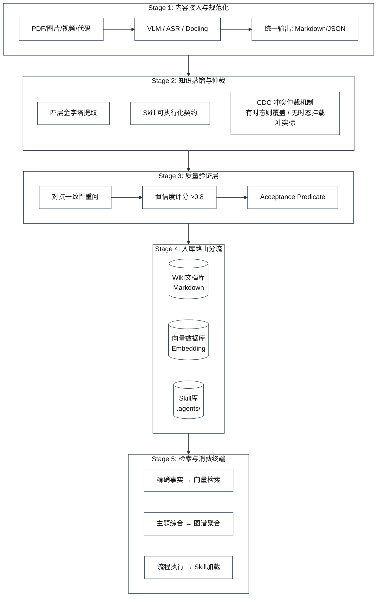

# 第四部分：全链路技术架构

### 4.1 五阶段标准管道

---

### 4.2 多模态 RAG 三种范式对比

| 范式 | 原理 | 优势 | 劣势 | 推荐场景 |
|------|------|------|------|----------|
| **文本化 RAG** | 图片/表格→VLM描述→存入向量库 | 简单，兼容所有文本工具链 | 信息损失（布局/颜色/空间）| 文本为主、视觉为辅的文档 |
| **原生视觉 RAG (VisRAG/ColPali)** | 文档页→直接嵌入为图像向量→VLM生成回答 | VisRAG 比传统高25-39% | 推理成本高 | 视觉信息密集（图表/设计/扫描件）|
| **多智能体分层检索 (ViDoRAG)** | Seeker粗检索→Inspector精审→Answer一致性 | 视频文档最优 | 架构复杂 | 视频+文档混合知识库 |

---

### 4.3 质量评估指标

**知识库蒸馏质量**：

| 维度 | 指标 | 测量方式 |
|------|------|----------|
| 准确性 | LLM-as-Judge 正确率 | 与 ground truth 对比 |
| 完整性 | Completeness Score (0-1) | 问题各方面是否覆盖 |
| 忠实性 | Faithfulness Score | 是否有不在原文中的内容（幻觉）|
| 相关性 | Context Relevance | 检索内容与查询的相关度 |
| 一致性 | 对抗重问稳定性 | 同一claim多角度重问的稳定率 |
| 粒度覆盖 | 多层次命中率 | 从原子到摘要各层的检索命中 |

**多模态解析质量**（OmniDocBench 标准）：

| 指标 | 含义 |
|------|------|
| CCT（Correct Content Transfer）| 文本内容准确率 |
| TEDS（Tree-Edit Distance Score）| 表格结构准确率 |
| Element Alignment | 元素类型识别准确率 |
| Reading Order | 阅读顺序编辑距离 |

---
