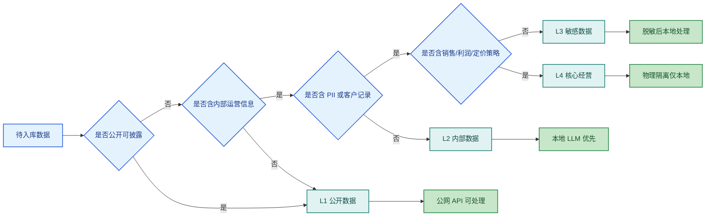
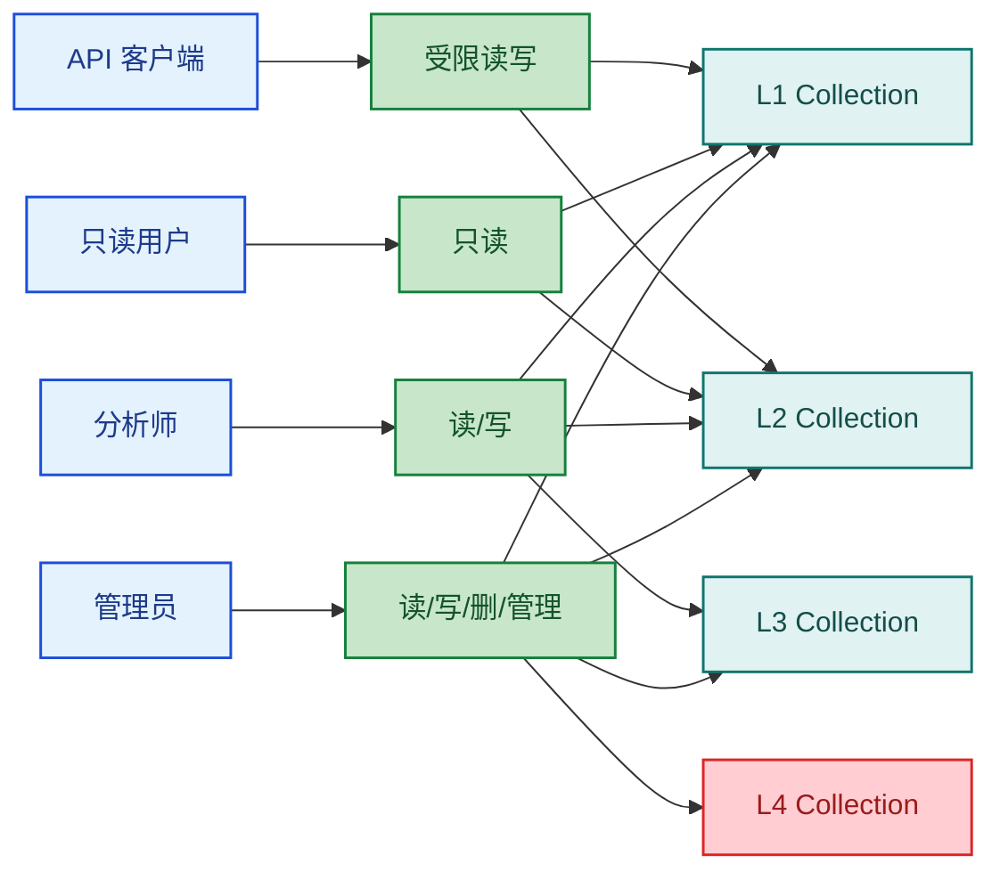

# 第五章：数据安全与合规架构 —— 构建知识库前必读

:::danger 三条绝对红线
- [P0] 内部经营数据（销售 / 供应链 / 客户 / 定价）绝不通过公网 LLM API。
- [P0] 含 PII 数据未脱敏不得入向量库。
- [P0] 知识库 API 暴露公网必须有认证 + 限流。
:::

很多团队做知识库时，第一反应是“先把资料丢进去，再慢慢治理”。这在生产环境里是最危险的路径。知识库不是一个搜索盒子，而是一条数据处理链：采集、清洗、脱敏、嵌入、存储、查询、审计，每一步都可能形成合规责任。真正的顺序必须反过来：**先定义安全边界，再决定技术栈**。如果边界没画清，向量库、GraphRAG、本地 Agent 做得越快，风险暴露就越快。

---

## 5.1 数据分级体系：先分级，再决定模型和存储

建议把所有待入库数据先划为 L1-L4 四级。级别不是按“文件名看起来敏不敏感”，而是按**泄露后的业务后果**决定。

| 级别 | 数据定义 | 典型示例 | 允许工具 | 允许 LLM | 存储要求 | 审计频率 |
|------|----------|----------|----------|----------|----------|----------|
| L1 公开数据 | 对外公开、泄露无新增风险 | Amazon 页面、品牌官网、行业报告 | SaaS ETL / 云向量库 / 公网 API | 公网 API 可用 | 常规加密存储即可 | 每月 |
| L2 内部数据 | 内部运营资料，但不直接含敏感经营指标 | 产品目录、供应商列表、SOP 草稿 | 本地解析器、私有向量库 | 本地 LLM 优先，公网需审批 | 私网存储、最小权限 | 每两周 |
| L3 敏感数据 | 含客户、员工、客服、订单侧敏感信息 | 客服记录、客户信息、售后工单 | 本地解析器、PII 检测器、私有向量库 | 仅本地 LLM，且必须先脱敏 | 加密 + 字段脱敏 + 审计日志 | 每周 |
| L4 核心经营 | 直接影响经营决策与利润模型 | 销售额、毛利率、定价策略 | 物理隔离集群、本地推理、离线导入 | 仅本地 LLM，禁止公网 | 物理隔离、专库专网、禁外连 | 每日 |



一个实用原则：**级别按最高风险字段上浮，不按平均值下调**。一份客服会话里只要出现手机号和订单地址，就不再是 L2，而是 L3；一份经营周报里只要出现毛利率和价格策略，就直接按 L4 管理。

---

## 5.2 本地 LLM 安全方案：默认走本地，例外才走公网

### 5.2.1 Ollama 安装与安全启动

本地推理的核心目标不是“省钱”，而是把高风险数据留在可控边界内。Ollama 最低要求是只监听 `127.0.0.1`，绝不直接暴露到 `0.0.0.0`。

```bash
brew install ollama

launchctl setenv OLLAMA_HOST 127.0.0.1:11434
launchctl setenv OLLAMA_ORIGINS http://127.0.0.1,http://localhost

ollama serve

# 另开终端拉取模型
ollama pull qwen2.5:14b
curl http://127.0.0.1:11434/api/tags
```

如果是 Linux systemd，可用以下服务文件：

```bash
[Unit]
Description=Ollama Local Service
After=network.target

[Service]
Environment="OLLAMA_HOST=127.0.0.1:11434"
Environment="OLLAMA_ORIGINS=http://127.0.0.1,http://localhost"
ExecStart=/usr/local/bin/ollama serve
Restart=always
User=ollama

[Install]
WantedBy=multi-user.target
```

### 5.2.2 数据敏感性检查中间件

下面的中间件把“能不能调用公网模型”收敛为显式规则：先看数据级别，再看是否命中 PII，再决定路由。

```python
from __future__ import annotations

from dataclasses import dataclass
from enum import Enum
from fastapi import FastAPI, HTTPException, Request
from typing import Any


class SensitivityLevel(str, Enum):
    L1 = "L1"
    L2 = "L2"
    L3 = "L3"
    L4 = "L4"


@dataclass
class RoutingDecision:
    allow_public_api: bool
    target_backend: str
    reason: str


def decide_llm_route(level: SensitivityLevel, pii_detected: bool) -> RoutingDecision:
    if level == SensitivityLevel.L4:
        return RoutingDecision(False, "local_ollama", "核心经营数据必须本地物理隔离")
    if level == SensitivityLevel.L3:
        if pii_detected:
            return RoutingDecision(False, "local_ollama", "敏感数据命中 PII，必须脱敏后本地处理")
        return RoutingDecision(False, "local_ollama", "敏感数据默认仅允许本地 LLM")
    if level == SensitivityLevel.L2:
        return RoutingDecision(False, "local_ollama", "内部数据默认本地优先，公网需专项审批")
    return RoutingDecision(True, "public_api", "公开数据可走公网 API")


app = FastAPI()


@app.middleware("http")
async def sensitivity_guard(request: Request, call_next):
    if request.url.path != "/ingest":
        return await call_next(request)

    payload: dict[str, Any] = await request.json()
    level = SensitivityLevel(payload["sensitivity_level"])
    pii_detected = bool(payload.get("pii_detected", False))
    decision = decide_llm_route(level, pii_detected)

    request.state.llm_backend = decision.target_backend
    request.state.routing_reason = decision.reason

    if not decision.allow_public_api and payload.get("requested_backend") == "public_api":
        raise HTTPException(status_code=403, detail=decision.reason)

    return await call_next(request)
```

### 5.2.3 一条数据能否走公网 API 的判定标准

只有同时满足下面三条，才可进入公网模型：

1. 数据级别为 L1；
2. 不含任何可识别自然人信息；
3. 不包含内部经营指标、未发布策略、合同文本或客户上下文。

**只要有一条不满足，就默认回退本地 LLM。** 这比“业务方口头确认没问题”更可靠。

---

## 5.3 PII 检测与脱敏：未脱敏不入库

L3 以上数据进入知识库前，必须先过 PII 检测。推荐用 `microsoft/presidio` 做首轮识别，再根据场景选择替换或哈希。

### 5.3.1 替换策略 vs 哈希策略

| 策略 | 适用场景 | 优点 | 风险 |
|------|----------|------|------|
| 替换策略 | 检索、总结、FAQ 生成 | 文本可读性高，便于 LLM 理解 | 无法跨文档追踪同一主体 |
| 哈希策略 | 行为分析、工单聚类、同人归并 | 可保留一致性标识 | 可读性差，需防止可逆推断 |

建议规则：**面向回答生成用替换，面向统计关联用加盐哈希**。不要把原文、替换文本、哈希文本混放在同一 collection。

### 5.3.2 完整脱敏示例：脱敏后才能入库

```python
from __future__ import annotations

import hashlib
import json
import sqlite3
from datetime import datetime, timezone
from typing import Any

from presidio_analyzer import AnalyzerEngine
from presidio_anonymizer import AnonymizerEngine
from presidio_anonymizer.entities import OperatorConfig


analyzer = AnalyzerEngine()
anonymizer = AnonymizerEngine()


def salted_hash(value: str, salt: str) -> str:
    digest = hashlib.sha256(f"{salt}:{value}".encode("utf-8")).hexdigest()
    return digest[:16]


def detect_and_mask(text: str, strategy: str = "replace", salt: str = "kb-salt") -> dict[str, Any]:
    results = analyzer.analyze(
        text=text,
        language="en",
        entities=["PERSON", "PHONE_NUMBER", "EMAIL_ADDRESS", "LOCATION"],
    )

    pii_detected = len(results) > 0
    detected_entities = [item.entity_type for item in results]

    if strategy == "replace":
        operators = {
            "PERSON": OperatorConfig("replace", {"new_value": "<NAME>"}),
            "PHONE_NUMBER": OperatorConfig("replace", {"new_value": "<PHONE>"}),
            "EMAIL_ADDRESS": OperatorConfig("replace", {"new_value": "<EMAIL>"}),
            "LOCATION": OperatorConfig("replace", {"new_value": "<ADDRESS>"}),
        }
        masked_text = anonymizer.anonymize(text=text, analyzer_results=results, operators=operators).text
    else:
        masked_text = text
        for item in sorted(results, key=lambda x: x.start, reverse=True):
            raw = text[item.start:item.end]
            token = f"<{item.entity_type}:{salted_hash(raw, salt)}>"
            masked_text = masked_text[:item.start] + token + masked_text[item.end:]

    return {
        "pii_detected": pii_detected,
        "detected_entities": detected_entities,
        "masked_text": masked_text,
    }


def write_audit_log(record: dict[str, Any]) -> None:
    conn = sqlite3.connect("audit.db")
    conn.execute(
        """
        CREATE TABLE IF NOT EXISTS ingestion_audit (
            id INTEGER PRIMARY KEY AUTOINCREMENT,
            data_source TEXT NOT NULL,
            sensitivity_level TEXT NOT NULL,
            pii_detected INTEGER NOT NULL,
            detected_entities TEXT NOT NULL,
            created_at TEXT NOT NULL
        )
        """
    )
    conn.execute(
        "INSERT INTO ingestion_audit (data_source, sensitivity_level, pii_detected, detected_entities, created_at) VALUES (?, ?, ?, ?, ?)",
        (
            record["data_source"],
            record["sensitivity_level"],
            int(record["pii_detected"]),
            json.dumps(record["detected_entities"], ensure_ascii=False),
            datetime.now(timezone.utc).isoformat(),
        ),
    )
    conn.commit()
    conn.close()


def sanitize_before_index(text: str, data_source: str, sensitivity_level: str) -> str:
    result = detect_and_mask(text, strategy="replace")
    write_audit_log(
        {
            "data_source": data_source,
            "sensitivity_level": sensitivity_level,
            "pii_detected": result["pii_detected"],
            "detected_entities": result["detected_entities"],
        }
    )
    if sensitivity_level in {"L3", "L4"} and result["pii_detected"]:
        return result["masked_text"]
    return text


if __name__ == "__main__":
    sample = "Alice lives at 1 Infinite Loop, email alice@example.com, phone 13800138000."
    print(sanitize_before_index(sample, data_source="crm_export.csv", sensitivity_level="L3"))
```

### 5.3.3 审计日志 schema

```json
{
  "event_type": "ingestion",
  "data_source": "crm_export.csv",
  "sensitivity_level": "L3",
  "pii_detected": true,
  "detected_entities": ["PERSON", "EMAIL_ADDRESS", "PHONE_NUMBER"],
  "masked_strategy": "replace",
  "operator": "system",
  "created_at": "2026-07-27T10:00:00Z"
}
```

---

## 5.4 RBAC 权限模型：知识库不是所有人都能查

权限控制的关键不是“有没有登录”，而是**谁可以看哪个 collection，能做什么操作**。最小可用模型建议四种角色：管理员、分析师、只读用户、API 客户端。



### 5.4.1 FastAPI RBAC 中间件示例

```python
from __future__ import annotations

from enum import Enum
from fastapi import Depends, FastAPI, Header, HTTPException
from pydantic import BaseModel


class Role(str, Enum):
    ADMIN = "admin"
    ANALYST = "analyst"
    READER = "reader"
    API_CLIENT = "api_client"


class Permission(BaseModel):
    collection: str
    action: str


ROLE_MATRIX: dict[Role, list[Permission]] = {
    Role.ADMIN: [
        Permission(collection="*", action="read"),
        Permission(collection="*", action="write"),
        Permission(collection="*", action="delete"),
        Permission(collection="*", action="manage"),
    ],
    Role.ANALYST: [
        Permission(collection="L1", action="read"),
        Permission(collection="L2", action="read"),
        Permission(collection="L3", action="read"),
        Permission(collection="L2", action="write"),
        Permission(collection="L3", action="write"),
    ],
    Role.READER: [
        Permission(collection="L1", action="read"),
        Permission(collection="L2", action="read"),
    ],
    Role.API_CLIENT: [
        Permission(collection="L1", action="read"),
        Permission(collection="L2", action="read"),
        Permission(collection="L2", action="write"),
    ],
}


def has_permission(role: Role, collection: str, action: str) -> bool:
    for permission in ROLE_MATRIX[role]:
        same_collection = permission.collection in {collection, "*"}
        same_action = permission.action == action
        if same_collection and same_action:
            return True
    return False


def get_current_role(x_role: str = Header(...)) -> Role:
    try:
        return Role(x_role)
    except ValueError as exc:
        raise HTTPException(status_code=401, detail="invalid role") from exc


def require_permission(collection: str, action: str):
    def checker(role: Role = Depends(get_current_role)) -> Role:
        if not has_permission(role, collection, action):
            raise HTTPException(status_code=403, detail=f"{role} cannot {action} on {collection}")
        return role
    return checker


app = FastAPI()


@app.get("/collections/{collection}")
def read_collection(collection: str, role: Role = Depends(require_permission("L2", "read"))):
    return {"collection": collection, "role": role, "status": "ok"}


@app.post("/collections/{collection}")
def write_collection(collection: str, role: Role = Depends(require_permission("L2", "write"))):
    return {"collection": collection, "role": role, "status": "written"}
```

生产环境里应再叠加两层：

- 认证层：JWT / OAuth2 / mTLS，禁止仅靠自定义 Header；
- 配额层：API 客户端按 token、IP、租户三维限流。

---

## 5.5 审计日志系统：查过什么、写过什么，都要留痕

知识库最常见的安全盲点不是“被黑”，而是**出了问题后无法追溯**。最低要求是两类日志：查询日志和写入日志。

### 5.5.1 SQLite 轻量实现

```python
from __future__ import annotations

import json
import sqlite3
from contextlib import contextmanager
from datetime import datetime, timezone
from typing import Iterable


DB_PATH = "kb_audit.sqlite3"


@contextmanager
def get_conn():
    conn = sqlite3.connect(DB_PATH)
    try:
        yield conn
        conn.commit()
    finally:
        conn.close()


def init_db() -> None:
    with get_conn() as conn:
        conn.execute(
            """
            CREATE TABLE IF NOT EXISTS query_audit (
                id INTEGER PRIMARY KEY AUTOINCREMENT,
                user_id TEXT NOT NULL,
                query TEXT NOT NULL,
                retrieved_ids TEXT NOT NULL,
                timestamp TEXT NOT NULL,
                latency_ms INTEGER NOT NULL
            )
            """
        )
        conn.execute(
            """
            CREATE TABLE IF NOT EXISTS write_audit (
                id INTEGER PRIMARY KEY AUTOINCREMENT,
                data_source TEXT NOT NULL,
                sensitivity_level TEXT NOT NULL,
                pii_detected INTEGER NOT NULL,
                timestamp TEXT NOT NULL
            )
            """
        )


def log_query(user_id: str, query: str, retrieved_ids: Iterable[str], latency_ms: int) -> None:
    with get_conn() as conn:
        conn.execute(
            "INSERT INTO query_audit (user_id, query, retrieved_ids, timestamp, latency_ms) VALUES (?, ?, ?, ?, ?)",
            (
                user_id,
                query,
                json.dumps(list(retrieved_ids), ensure_ascii=False),
                datetime.now(timezone.utc).isoformat(),
                latency_ms,
            ),
        )


def log_write(data_source: str, sensitivity_level: str, pii_detected: bool) -> None:
    with get_conn() as conn:
        conn.execute(
            "INSERT INTO write_audit (data_source, sensitivity_level, pii_detected, timestamp) VALUES (?, ?, ?, ?)",
            (
                data_source,
                sensitivity_level,
                int(pii_detected),
                datetime.now(timezone.utc).isoformat(),
            ),
        )


if __name__ == "__main__":
    init_db()
    log_query("u_001", "查 7 月退款原因", ["doc_12", "doc_18"], 143)
    log_write("crm_export.csv", "L3", True)
```

### 5.5.2 最低审计要求

- 每次查询记录：`user / query / retrieved_ids / timestamp / latency`；
- 每次写入记录：`data_source / sensitivity_level / pii_detected`；
- 日志默认不可被普通业务用户删除；
- 日志保留周期至少 180 天，L4 建议 365 天以上。

---

## 5.6 供应商风险评估清单：先看边界，再看价格

公网模型是否可用，不应只看效果，要把数据留存、合规认证和适用数据级别一起比较。下表按 2026 年常见企业采购方式给出保守决策口径；**具体条款以上线时签署的企业协议为准**。

| 供应商 | 数据留存政策（ZDRA） | 合规认证 | 适用数据级别 | 月度成本估算 |
|--------|----------------------|----------|--------------|--------------|
| Claude API | 默认受平台策略约束；企业版可谈零数据留存协议，需合同确认 | SOC 2、ISO 27001、GDPR 支持 | L1；L2 仅限审批后脱敏场景 | 中高，视 token 量约数百到数千美元 |
| OpenAI API | 默认按平台策略处理；企业场景可申请零留存/不训练条款，需合同确认 | SOC 2、ISO 27001、GDPR 支持 | L1；L2 仅限审批后脱敏场景 | 中高，视模型与调用量约数百到数千美元 |
| Azure OpenAI | 走 Azure 企业合规边界，留存与地域控制通常更强，适合企业托管 | SOC 2、ISO 27001、GDPR、区域合规能力较强 | L1-L2；L3 需配合脱敏与专属网络 | 中高到高，外加 Azure 基础设施成本 |
| 本地 Ollama | 无第三方留存，数据留在本地或私有网络 | 取决于自建环境与组织制度 | L1-L4；L3/L4 推荐默认方案 | 低到中，主要为机器与运维成本 |

结论很简单：

- **L1 可以比较自由地选供应商。**
- **L2 不看“能不能”，看“有没有审批与脱敏”。**
- **L3/L4 不再是采购问题，而是架构问题，本地或私有化是默认前提。**

---

## 5.7 上线前安全检查清单

下面这份清单可直接作为上线前自查项。

### P0（阻塞上线）

- ☐ 已完成所有数据源的 L1-L4 分级，且有负责人签字。
- ☐ L3/L4 数据未走任何公网 LLM API。
- ☐ 所有入库文本均经过 PII 检测；命中记录有审计日志。
- ☐ 向量库与知识库 API 暴露公网时已启用认证。
- ☐ 所有公网接口已启用限流、超时与异常告警。
- ☐ Ollama 或本地推理服务仅绑定 `127.0.0.1` 或私网地址。
- ☐ L4 数据所在存储与应用部署在隔离网络，不与公网直连。

### P1（核心回归）

- ☐ RBAC 已按 collection 和 action 生效，而不是只有登录态。
- ☐ 查询日志可追溯到用户、时间、检索文档 ID 和延迟。
- ☐ 写入日志可追溯到数据源、敏感级别、PII 检测结果。
- ☐ 脱敏策略已区分替换与哈希，不混用在同一 collection。
- ☐ 管理员、分析师、API 客户端权限已做最小化收敛。

### P2（一般治理）

- ☐ 审计日志保留周期已配置并验证可导出。
- ☐ 厂商协议、ZDRA 与地域合规条款已归档。
- ☐ 已建立季度安全复审机制，至少复核数据分级、权限和供应商边界。

---

## 本章结论

知识库建设真正的第一步，不是选 Qdrant、Neo4j、LightRAG 还是 GraphRAG，而是先回答四个问题：**数据是什么级别、是否含 PII、谁能访问、出了事能否追溯。** 只要这四件事没定清，任何“先做 MVP 再补安全”的方案，最后都会变成返工。

工程上最稳妥的默认值只有一句话：**数据先分级，敏感默认本地，入库必须脱敏，访问全程留痕。**

---

:::tip → 下一章
安全到位后，按需深入GraphRAG图谱构建 → [05-graphrag](05-graphrag.md)
:::
