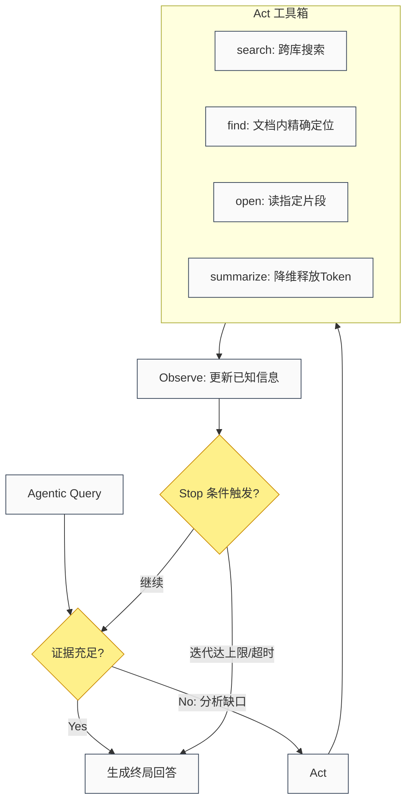

# 第七章：知识库被 Agent 调用 —— 从 RAG 到 MCP

<a id="concept-use-mcp-001"></a>

本章使用 MCP 作为受治理的工具接口边界，协议本身不替代鉴权、路由与责任归属。

:::info 本章在全书中的角色
**读完本章你能做到**：把建好的知识库暴露给 Claude Desktop、Cursor、Codex App 等任意 MCP Client 调用，设计多工具并存时的路由裁决机制。

**前置条件**：已完成第四章架构（有向量库/图谱/Skill 库）和第五章安全配置（权限已就绪）。

**三类读者**：工程师 → 直接从 MCP Server 代码段开始；架构师 → 重点看路由冲突与裁决机制；产品经理 → 重点看 MCP 是什么、与传统 API 的区别。
:::

> **这是完整链路的最后一环**：知识已经蒸馏、已经入库，Agent 如何高效调用它？

---

## 6.1 三种调用模式总览

知识库被 Agent 调用有三种根本不同的模式，不可混淆：

```text
模式1：RAG 检索（被动）
  Agent 查询 → 知识库返回相关块 → Agent 用于生成回答
  → 适合：声明性知识（是什么/为什么），频繁更新的参考资料

模式2：Skill 导航（主动）
  Agent 浏览 Skill 目录 → 找到匹配 Skill → 加载执行
  → 适合：程序性知识（怎么做），可复用的操作流程

模式3：Agentic RAG（自主迭代）
  Agent 自主决定何时检索、检索什么、是否足够、是否重试
  → 适合：复杂多跳问题，需要多步推理的任务
```

**RAG 提供声明性证据（是什么），Skill 提供程序性指导（怎么做）。最佳实践是两者结合：**

来自 Anything2Skill 论文实验数据：
- 纯 RAG：95.41%（qsv）/ 76.50%（GitHub-CLI）
- Anything2Skill + RAG：**98.85%（qsv）/ 94.10%（GitHub-CLI）**
- 结论：Skill 和 RAG 互补，分别解决程序性和声明性两类需求

---

## 6.2 模式1：RAG 检索调用 SOP

**基础向量 RAG 调用**：

```python
# LangChain 方式
from langchain_community.vectorstores import Chroma
from langchain_openai import OpenAIEmbeddings

vectorstore = Chroma(
    persist_directory="./chroma_db",
    embedding_function=OpenAIEmbeddings()
)

# Agent 工具定义
from langchain.tools import Tool

knowledge_retrieval_tool = Tool(
    name="knowledge_search",
    description="""在知识库中搜索相关信息。
    输入：自然语言查询
    适用：当需要查询事实、参考资料、文档内容时""",
    func=lambda q: vectorstore.similarity_search(q, k=5)
)
```

**GraphRAG 调用（LightRAG）**：

```python
# 将 LightRAG 封装为 Agent 工具
from langchain.tools import BaseTool

class LightRAGTool(BaseTool):
    name = "graphrag_search"
    description = """知识图谱查询工具。
    适合：需要理解实体关系、跨文档综合的复杂查询。
    输入：自然语言查询
    模式：mix（默认，综合效果最好）"""
    
    def _run(self, query: str, mode: str = "mix") -> str:
        result = rag.query(query, param=QueryParam(mode=mode))
        return result
    
    async def _arun(self, query: str, mode: str = "mix") -> str:
        result = await rag.aquery(query, param=QueryParam(mode=mode))
        return result
```

**查询路由（向量 RAG vs GraphRAG 混合）**：

```python
# 简单路由规则（生产中用小模型分类器替代）
def route_query(query: str) -> str:
    multi_hop_signals = ["关系", "联系", "影响", "导致", "比较", "所有", "哪些", "趋势"]
    if any(s in query for s in multi_hop_signals):
        return "graphrag"
    return "vector_rag"

# 路由执行
def retrieve(query: str) -> str:
    if route_query(query) == "graphrag":
        return rag.query(query, param=QueryParam(mode="mix"))
    else:
        docs = vectorstore.similarity_search(query, k=5)
        return "\n\n".join([d.page_content for d in docs])
```

---

## 6.3 模式2：Skill 导航调用 SOP

**Corpus2Skill 调用方式**（导航式，无向量检索）：

```bash
# 编译阶段（一次性，离线）
python -m corpus2skill compile \
  --input ./knowledge_docs/ \
  --output ./skill_tree/ \
  --p 10 \
  --max-top 8 \
  --model claude-sonnet-4-6 \
  --embed-model Qwen/Qwen3-Embedding-0.6B
```

**Agent 调用时（serve time）**：

```python
from corpus2skill import serve

# Agent 有两个工具：
# 1. code_execution：浏览 SKILL.md 和 INDEX.md（导航）
# 2. get_document(doc_id)：获取完整文档内容

# 典型查询流程（2-3 轮）：
# 轮1：Agent 读 SKILL.md → 了解知识库全局结构（鸟瞰图）
# 轮2：Agent 读相关 INDEX.md → 缩小到具体文档列表
# 轮3：Agent 调用 get_document → 获取完整证据
```

**Corpus2Skill 的核心优势**：Agent 知道"还有多少没看"，可以回溯，可以跨分支综合——这是向量检索永远无法提供的结构性可见性。

**Agent Skill 原子性约束与降级协议（防执行崩溃）**：
> [!] **The 3-7-1 Rule**：一个合格的 SKILL.md 必须满足：最多 3 层逻辑嵌套、最多 7 个主要执行步骤、单一的输入输出结构。
- **降级拆解**：若蒸馏出的长视频或复杂流程超过 7 步，必须拆分为一个 `MASTER_SKILL.md` 引用多个子 Skill。
- **硬编码降级**：若 Skill 中包含大量复杂的 IF-THEN 判断，不要用自然语言让 LLM 去猜，必须将其提取为 Python 脚本并封装为 MCP 工具，SKILL 仅负责调用该工具。

**成本优化**（官方数据）：
- 默认配置：每次查询 $0.172
- 启用 prompt cache（默认开启）：$0.089（**节省 48%**）
- cache 命中率约 70%，命中部分仅需原价的 1/10

---

## 6.4 模式3：Agentic RAG 调用 SOP

**Agentic RAG 的核心架构（AgenticRAG 论文，2026）**：

Agent 不再是 RAG 的被动消费者，而是主动控制检索过程：



**五种 Agentic RAG 模式（按复杂度排序）**：

```text
模式 1 — 迭代检索（Iterative Retrieval）
  流程：检索 → 阅读 → 评估缺口 → 精化查询 → 重复
  适用：单一查询，但第一次检索不够完整
  成本：低（1-3轮额外检索）

模式 2 — 查询分解（Query Decomposition）
  流程：复杂查询 → 拆分为 2-6 个子查询 → 并行检索 → 合并
  适用："A 相比 B 在 C 方面表现如何，考虑到 D 条件" 类查询
  成本：中（N个子查询 × 检索成本）

模式 3 — 假设驱动检索（Hypothesis-Driven）
  流程：提出假设 → 专门检索证实/证伪 → 更新假设
  适用："X 是否真的是 Y 的原因？"调查类查询
  成本：中（每假设 1-2 轮检索）

模式 4 — 跨源三角验证（Cross-Corpus Triangulation）
  流程：同一查询 → 多个知识源并行检索 → 融合/标注分歧
  适用：需要从内部文档 + 知识图谱 + 向量库多源印证
  成本：高（M个源 × 检索成本）

模式 5 — 证据加权合成（Evidence-Weighted Synthesis）
  流程：检索多份可能矛盾的证据 → 按来源可信度加权 → 合成
  适用：不同文档对同一问题有不同说法
  成本：中（额外一次推理用于合成）
```

**A-RAG 实现（推荐起点）**：

```python
# A-RAG：层次化检索接口，Agent 自主选择检索策略
# 三个工具：keyword_search / semantic_search / chunk_read

from arag import ARAG

agent = ARAG(
    corpus_dir="./knowledge_docs/",
    llm="claude-opus-4-7",  # 推理能力强的模型效果更好
    max_iterations=7,
    token_budget=40000
)

result = agent.query("哪些项目同时涉及风险A和风险B，且负责人都是同一团队？")
# Agent 自主选择：先 keyword_search 找关键实体，再 semantic_search 补充，
# 最后 chunk_read 读完整上下文——无需预设工作流
```

---

## 6.5 Skill 检索与路由（大规模 Skill 库）

当 Skill 数量超过 50 个时，需要 Skill 检索机制（否则全量加载超出上下文）：

**Anthropic Tool Search Tool 模式**（官方推荐）：

```python
# 启动时只加载 search_tool，其余 Skill 按需检索
# 效果：Opus 4 准确率从 49% → 74%（Tool Search），token 减少 85%

# 系统提示配置：
system_prompt = """
你可以访问以下技能库。使用 search_skills 工具查找适合当前任务的技能，
然后使用 load_skill 工具加载并执行它。

可用工具：
- search_skills(query): 在技能库中搜索相关技能
- load_skill(skill_name): 加载指定技能
"""

# Agent 调用流程：
# 1. 接收任务
# 2. search_skills("需要做什么") → 找到候选 Skill
# 3. load_skill("匹配的Skill名") → 加载 SKILL.md
# 4. 按 Skill 指导执行
```

**组合 Skill 路由（Gao 2026 论文，Compositional Skill Routing）**：

```text
任务分解器（Decomposer）
    ↓ 分解为原子子任务
双编码器检索（Bi-encoder FAISS）
    ↓ 为每个子任务检索最匹配的 Skill
Skill-Aware 反馈循环（SAD）
    ↓ 将检索结果反馈给分解器重新调整（准确率 51% → 67.7%）
DAG 规划器（Dependency-Aware Planner）
    ↓ 组合为可执行计划
```

**适用阈值**：
- < 50 Skills → 直接 prompt caching 全量加载，不需要检索
- 50-200 Skills → 单步 retrieve-and-rerank（SkillRouter 方案）
- 200+ Skills → 完整 Compositional Skill Routing

---

## 6.6 Agent 记忆层（跨会话知识持久化）

**TencentDB Agent Memory 架构**（Tencent，2026，集成 OpenClaw）：

```text
短期记忆（任务内）：
  底层：完整工具输出（refs/*.md，只读存档）
  中层：步骤摘要（JSONL）
  顶层：Mermaid 任务状态图（极致压缩，Agent 只读顶层）
  → token 减少 61.38%，任务成功率提升 51.52%

长期记忆（跨会话）：
  L0 Conversation → L1 Atom（原子事实）
           ↓
  L2 Scenario（场景块）→ L3 Persona（用户档案）
  → Agent 日常只查 L3 Persona，细节时下钻到 L1 Atom
```

**记忆层写入时机**：

```text
任务完成时 → 写入长期记忆
  · 蒸馏本次任务中涌现的新知识 → wiki/
  · 更新用户偏好 → Persona
  · 记录本次使用了哪些 Skill、效果如何 → Skill 生命周期

任务失败时 → 写入经验教训
  · 记录失败原因和解决方案 → bdistill 规则提取
  · 更新 Skill 的 contraindications（禁忌）字段
```

---

## 6.7 完整端到端链路（蒸馏 → 入库 → Agent 调用）

```text
┌─────────────────────────────────────────────────────────────────────┐
│                          原始多模态内容                               │
│                  (PDF/视频/音频/网页/代码/图像...)                    │
└────────────────────────────┬────────────────────────────────────────┘
                             │  第1-4部分（蒸馏）
                             ▼
┌─────────────────────────────────────────────────────────────────────┐
│                          内容解析层                                   │
│  MinerU / Docling / LlamaParse / faster-whisper / VLM Caption       │
│                  ↓ 统一 Markdown/JSON                                │
│                          知识蒸馏层                                   │
│  cangjie-skill / Resource2Skill / COLLEAGUE.SKILL / bdistill        │
│                          质量验证层                                   │
│  对抗一致性检测 + 置信度评分 + acceptance_predicate                  │
└────────────────────────────┬────────────────────────────────────────┘
                             │  分流入库
          ┌──────────────────┼──────────────────┐
          ▼                  ▼                  ▼
┌──────────────┐   ┌──────────────────┐  ┌───────────────┐
│  Skill 库    │   │  知识图谱         │  │  向量库        │
│  SKILL.md   │   │  (LightRAG/      │  │  (pgvector/   │
│ ~/.agents/  │   │   GraphRAG/      │  │   Qdrant/     │
│  skills/    │   │   Graphiti)      │  │   Milvus)     │
└──────┬───────┘   └────────┬─────────┘  └──────┬────────┘
       │  第6部分（Agent 调用）                   │
       └──────────────────┬──────────────────────┘
                          │
                    ┌─────▼──────┐
                    │  查询路由   │
                    │  分类器    │
                    └─────┬──────┘
              ┌────────────┼────────────┐
              ▼            ▼            ▼
      ┌──────────┐  ┌──────────┐  ┌──────────┐
      │简单事实  │  │多跳/综合  │  │程序性任务│
      │向量RAG  │  │GraphRAG  │  │Skill导航 │
      │精确/快速│  │LightRAG  │  │Corpus2S. │
      └────┬─────┘  └────┬─────┘  └────┬─────┘
           └─────────────┼─────────────┘
                         ▼
                 ┌──────────────┐
                 │ Agentic Loop │
                 │ (A-RAG 范式) │
                 │ ReAct 迭代   │
                 │ 工具调用     │
                 └──────┬───────┘
                        ▼
                   最终回答 + 来源引用
                        │
                   ┌────▼─────┐
                   │ 记忆回写  │
                   │ (长期记忆 │
                   │  更新)   │
                   └──────────┘
```

---

## 6.8 调用层工具总览

| 工具/框架 | 类型 | 用途 | 推荐场景 |
|-----------|------|------|----------|
| LightRAG Query API | GraphRAG 检索 | 5种模式图谱查询 | 多跳/综合查询 |
| Corpus2Skill serve | Skill 导航 | Agent 浏览层次技能树 | 单域文档问答 |
| Anything2Skill SkillBank | Skill 检索 | RAG + Skill 双轨 | 程序性知识调用 |
| A-RAG（arag）| Agentic 检索 | 三层次工具自主检索 | 复杂多步推理 |
| AgenticRAG（search/find/open）| Agentic 检索 | 企业文档问答 | 企业知识库 |
| Anthropic Tool Search | Skill 路由 | 大规模 Skill 库按需加载 | 200+ Skill 场景 |
| TencentDB Agent Memory | 记忆层 | 短期+长期分层记忆 | 长运行 Agent |
| Graphiti（Zep）| 时态记忆 | Agent 时态知识图谱 | 知识随时间变化的场景 |
| xMemory | Agent 记忆 | 分层记忆（L0→L3）去冗余 | 多会话连续推理 |

---

## 6.9 2026 新范式：MCP 协议（Model Context Protocol）

:::tip 核心认知
MCP 不是"插件"，是 2026 年 Agent 与知识库连接的**标准协议**。封装一次 MCP Server，Claude Desktop、Cursor、Codex App 都可以直接调用，无需写任何适配代码。
:::

### 传统调用 vs MCP 调用

| 维度 | 传统 FastAPI 封装 | MCP Server 封装 |
|------|-----------------|----------------|
| 每个 Agent 都需要 | 写适配代码调用 REST API | (OK) 无需，MCP 统一 |
| 新增知识库 | 每个 Agent 改代码 | (OK) 只需注册新 Server |
| Claude Desktop 直接用 | (X) 不支持 | (OK) 原生支持 |
| Cursor 直接用 | (X) 需要 Extension | (OK) 原生支持 |
| 工程量 | 每端各写一套 | 一次封装，多端复用 |

### MCP 协议三类能力

```text
Tools（工具）   — Agent 可以调用的函数，如 search_products()
Resources（资源）— Agent 可以读取的静态数据，如知识库 schema
Prompts（提示词）— 预置的对话模板，引导用户更好地描述需求
```

### 完整 MCP Server 示例

参考 [第 4 章 Stage 6](04-architecture.md) 的 `mcp_server.py` 最小实现，以及 [第 15 章 Prompt 05](15-codex-prompts.md) 的完整生产版封装（含 `get_market_overview` + 错误处理）。

### LangGraph Agent 通过 MCP 调用知识库

```python
# langgraph_mcp_agent.py
# 展示 LangGraph Agent 如何通过 MCP 工具调用知识库
from langchain_mcp_adapters.tools import load_mcp_tools
from langgraph.prebuilt import create_react_agent
from langchain_anthropic import ChatAnthropic
import asyncio

async def run_agent():
    # 加载 MCP Server 上的工具（自动发现 search_products 等）
    tools = await load_mcp_tools(server_url="http://localhost:8000/mcp")

    model = ChatAnthropic(model="claude-3-5-sonnet-20241022")
    agent = create_react_agent(model, tools)

    result = await agent.ainvoke({
        "messages": [{"role": "user",
                      "content": "美国市场性价比最高的便携充电器有哪些？"}]
    })
    print(result["messages"][-1].content)

asyncio.run(run_agent())
```

### 知识库调用工具全景（2026 更新版）

| 工具/框架 | 类型 | 用途 | 推荐场景 |
|-----------|------|------|----------|
| **MCP Python SDK** | **MCP 封装** | **知识库→通用工具** | **2026 首选，跨 Client 复用** |
| LightRAG Query API | GraphRAG 检索 | 5种模式图谱查询 | 多跳/综合查询 |
| Corpus2Skill serve | Skill 导航 | Agent 浏览层次技能树 | 单域文档问答 |
| Anything2Skill SkillBank | Skill 检索 | RAG + Skill 双轨 | 程序性知识调用 |
| A-RAG | Agentic 检索 | 三层次工具自主检索 | 复杂多步推理 |
| Graphiti（Zep）| 时态记忆 | Agent 时态知识图谱 | 知识随时间变化 |
---

## MCP 路由冲突与裁决机制

当知识库被封装为多个 MCP Server，且多个 Server 提供功能重叠的工具时，路由器面临裁决问题。这不是协议问题，而是**知识治理问题**。

### 三类典型冲突场景

**冲突一：同名工具，不同数据源**
`search_product_info` 在 `kb-server-public`（公开竞品数据）和 `kb-server-internal`（内部产品数据）都存在。Agent 调用时选哪个？

**冲突二：重叠覆盖，质量不同**
`get_pricing_data` 同时存在于"历史价格库"（周度更新）和"实时报价库"（分钟更新），两者对同一产品给出不同价格。

**冲突三：权限边界交叉**
Agent 有 Server A 的完整权限和 Server B 的只读权限，但完成当前任务需要 Server B 的最新数据。

### 裁决框架：PTDS 四维优先级

在发生路由冲突时，按以下优先级顺序裁决：

| 优先级 | 维度 | 规则 | 示例 |
|--------|------|------|------|
| P1 | **精确性（Precision）** | 更精确匹配任务意图的工具优先 | 任务要"内部数据"则走内部Server |
| P2 | **时效性（Timeliness）** | 时效要求高时，新鲜度优先于深度 | 实时价格 > 月度报告 |
| P3 | **数据级别（Data Level）** | 默认优先使用最低敏感级别能满足需求的来源 | 能用L1回答就不调L3 |
| P4 | **成本（Cost）** | 同等质量下，低成本路由优先 | 本地缓存 > API调用 |

```python
class MCPRouter:
    def resolve_conflict(self, candidates: list[dict], task_context: dict) -> dict:
        """
        candidates: [{"server": "...", "tool": "...", "freshness": ..., 
                       "data_level": ..., "cost": ..., "precision_score": ...}]
        返回唯一胜出的工具调用方案
        """
        # P1: 精确性过滤
        best_precision = max(c["precision_score"] for c in candidates)
        candidates = [c for c in candidates 
                      if c["precision_score"] >= best_precision - 0.05]
        
        # P2: 若任务有时效要求，选最新鲜的
        if task_context.get("requires_realtime"):
            candidates = sorted(candidates, key=lambda c: c["freshness"])[:1]
        
        # P3: 最低敏感数据级别优先
        min_level = min(c["data_level"] for c in candidates)
        candidates = [c for c in candidates if c["data_level"] == min_level]
        
        # P4: 最低成本
        return min(candidates, key=lambda c: c["cost"])
```

### 冲突日志与审计

**所有路由冲突必须记录**，否则无法发现系统性偏差：

```python
def log_routing_conflict(candidates, winner, task_id):
    record = {
        "timestamp": datetime.now().isoformat(),
        "task_id": task_id,
        "candidates": len(candidates),
        "winner": winner["server"] + "." + winner["tool"],
        "reason": winner.get("selection_reason", "PTDS"),
        "losers": [c["server"] + "." + c["tool"] for c in candidates if c != winner]
    }
    # 每日汇总：哪些工具总是输？可能说明某个Server需要升级或下线
    append_to_audit_log("mcp_routing_conflicts.jsonl", record)
```

:::tip 路由治理的核心原则
协议标准化（MCP）解决的是接口问题，不解决语义冲突和责任归属。**每个 MCP Server 应该有明确的"服务边界声明"**：它承诺回答什么、不回答什么、精度保证范围是什么。没有边界声明的Server接入越多，路由器的不确定性越高。
:::

---

:::tip → 下一章
Agent 调用架构到位后，深入进阶选型——如何在 LoD 阶梯上选对蒸馏深度、何时用图谱 → [07-advanced-theory](07-advanced-theory.md)
:::

## 来源与复核

- **复核状态**：待复核。任何易漂移的版本、价格、法律或性能结论，采用前都必须回到一手来源再次确认。
- **代码状态**：示意代码。未被本地 smoke test 覆盖的片段不得解释为生产可运行。
- **证据边界**：本页成熟度只描述内容形态，不代表部署、上线或生产验收已经完成。
- **下一验收动作**：按仓库根目录 `content-audit.md` 中本模块的证据缺口补齐来源、fixture 与验收回执。
