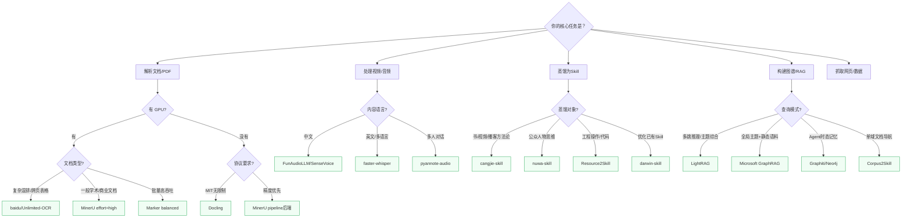

# 第八部分：工具完整手册与选型决策树

> **使用方式**：先看选型决策树确定你需要哪个工具，再查对应工具的完整安装和使用指引。每个工具都标注了 GPU 要求、操作系统兼容性和实际适用边界。

---

## 全局选型决策树



---

## A. 文档解析工具

### MinerU（opendatalab/MinerU）

**定位**：2026 年精度榜首的端到端文档解析引擎，75K Stars  
**适用**：PDF / DOCX / PPTX / XLSX / 图片，支持 109 种语言 OCR  
**GPU 要求**：推荐 ≥8GB 显存；有 pipeline 后端可纯 CPU 运行（精度降低）

```bash
# 安装
pip install mineru

# 基础用法（CPU 可用，中等精度）
mineru -p document.pdf -o ./output/

# 高精度模式（需 GPU，开启图片分析）
mineru -p document.pdf -o ./output/ --effort high

# 批量处理整个目录
mineru -p ./pdf_folder/ -o ./output/ --effort medium

# API 服务模式（支持异步任务）
mineru-api --host 0.0.0.0 --port 8080
# 然后：POST /file_parse 或 POST /tasks（异步）

# Docker 部署（推荐生产环境）
docker pull opendatalab/mineru:latest
docker run -p 8080:8080 opendatalab/mineru:latest
```

**产物说明**：
- `output.md`：保留阅读顺序的 Markdown（表格→HTML，公式→LaTeX）
- `images/`：从文档裁出的高清图片（需再送 VLM/OCR 处理内容）
- `output.json`：结构化 JSON，含每个元素的边界框、类型、坐标

**OmniDocBench v1.6 评分**：综合 95.69（Full），在文本/表格/公式/阅读顺序四项均领先

---

### Unlimited-OCR（baidu/Unlimited-OCR）

**定位**：One-Shot Long-horizon Parsing，2026.06 发布，消灭流水线误差传递  
**核心创新**：直接用 32K 超长上下文 VLM 一次性处理多页 PDF，无需版面分析+裁剪+拼接  
**GPU 要求**：必须（推荐 A100/H100，支持 CUDA 12.9/13.0）

```bash
# 方式一：vLLM Docker（推荐生产部署）
docker pull vllm/vllm-openai:unlimited-ocr
docker run --gpus all -p 8000:8000 vllm/vllm-openai:unlimited-ocr \
  --model baidu/Unlimited-OCR \
  --served-model-name Unlimited-OCR

# 方式二：SGLang（高并发推荐）
pip install sglang pymupdf
python -m sglang.launch_server \
    --model baidu/Unlimited-OCR \
    --attention-backend fa3 \
    --context-length 32768 \
    --enable-custom-logit-processor \
    --host 0.0.0.0 --port 10000

# 方式三：Transformers 直接推理
pip install transformers torch pymupdf
```

```python
# 核心调用代码
import fitz, os, tempfile, torch
from transformers import AutoModel, AutoTokenizer

def pdf_to_images(pdf_path, dpi=300):
    doc = fitz.open(pdf_path)
    tmp_dir = tempfile.mkdtemp()
    mat = fitz.Matrix(dpi/72, dpi/72)
    paths = []
    for i, page in enumerate(doc):
        out = os.path.join(tmp_dir, f'page_{i+1:04d}.png')
        page.get_pixmap(matrix=mat).save(out)
        paths.append(out)
    return paths

model = AutoModel.from_pretrained('baidu/Unlimited-OCR',
    trust_remote_code=True, torch_dtype=torch.bfloat16).eval().cuda()
tokenizer = AutoTokenizer.from_pretrained('baidu/Unlimited-OCR',
    trust_remote_code=True)

# 多页 PDF（用 base 模式，ngram_window=1024）
model.infer_multi(
    tokenizer,
    prompt='<image>Multi page parsing.',
    image_files=pdf_to_images('doc.pdf', dpi=300),
    output_path='./output/',
    image_size=1024,
    max_length=32768,
    no_repeat_ngram_size=35,
    ngram_window=1024,   # 多页必须 1024，单页用 128
    save_results=True,
)
```

**选型边界**：超复杂跨页表格、混排长文档首选；简单文档用 MinerU 更经济

---

### Marker（datalab-to/marker）

**定位**：批量速度最快的 PDF 解析器，基于 Surya OCR 2  
**GPU 要求**：推荐（B200 上 balanced 模式 2.9页/秒，fast 模式 7.4页/秒）  
**协议注意**：GPL-3.0 代码 + RAIL-M 权重（有收入阈值限制，商用前确认）

```bash
# 安装
pip install marker-pdf           # 基础版（只支持 PDF）
pip install marker-pdf[full]     # 完整版（+ DOCX/PPTX/XLSX/EPUB）

# 单文件解析
marker_single document.pdf ./output/ --output_format markdown

# 批量处理（推荐 GPU 环境）
marker ./pdf_folder/ ./output/ --workers 4

# 开启 LLM 后处理（提升表格和公式准确率，需要 API Key）
marker_single document.pdf ./output/ --use_llm

# 模式选择
# --mode balanced  默认，GPU 上精度最好（76.0% olmOCR-bench）
# --mode fast      速度优先（66.6%）
# --disable_ocr    纯 CPU，不调用 VLM（43.6%，23.7页/秒）
```

---

### Docling（DS4SD/docling）

**定位**：IBM Research 出品，MIT 协议，企业部署最友好，63K Stars  
**GPU 要求**：不需要（完整功能纯 CPU 运行）  
**最强项**：金融表格（TableFormer 专为此训练）、Office 格式（DOCX/PPTX/XLSX）

```bash
# 安装
pip install docling

# 基础解析
docling document.pdf --output output.md

# 支持的格式（一行命令）
docling report.docx --output report.md
docling slides.pptx --output slides.md

# Python API（推荐程序化使用）
from docling.document_converter import DocumentConverter

converter = DocumentConverter()
result = converter.convert("document.pdf")

# 输出为保留结构的 Markdown
print(result.document.export_to_markdown())

# 输出为结构化 JSON（含标题层级、表格、图片引用）
import json
print(json.dumps(result.document.export_to_dict(), ensure_ascii=False, indent=2))

# 批量转换（目录）
from pathlib import Path
results = converter.convert_all(Path("./pdf_folder").glob("*.pdf"))
for res in results:
    out_path = Path("output") / res.input.file.stem
    res.document.save_as_markdown(out_path.with_suffix(".md"))
```

---

## B. 音视频处理工具

### SenseVoice（FunAudioLLM/SenseVoice）

**定位**：阿里开源，中文 ASR 最强 + 情绪识别，11K Stars  
**优势**：比 faster-whisper 中文准确率高 15%+，同时输出情绪标签  
**GPU 要求**：推荐；CPU 可用但较慢

```bash
pip install funasr modelscope

python3 << 'EOF'
from funasr import AutoModel

model = AutoModel(
    model="iic/SenseVoiceSmall",
    trust_remote_code=True,
    vad_model="fsmn-vad",                       # 自动检测静音段，加速 3-5x
    vad_kwargs={"max_single_segment_time": 30000},
    device="cuda:0",                             # CPU 用 "cpu"
)

res = model.generate(
    input="audio.mp3",
    cache={},
    language="auto",    # 自动检测语言
    use_itn=True,       # 自动将"三十二"转为"32"
    batch_size_s=60,
    merge_vad=True,
)

# 输出：时间戳 + 情绪标签（<|NEUTRAL|> <|HAPPY|> <|ANGRY|> 等）+ 文本
for seg in res:
    print(f"[{seg.get('start',0):.1f}s] {seg['text']}")
EOF
```

---

### faster-whisper（SYSTRAN/faster-whisper）

**定位**：OpenAI Whisper 的高效本地实现，比原版快 4x，内存减半，16K Stars  
**适用**：英文/多语言内容；中文可用但不如 SenseVoice

```bash
pip install faster-whisper

# CLI 使用
faster-whisper \
  --model large-v3 \
  --language zh \
  --output_format txt \
  --output_dir ./output/ \
  audio.mp3

# Python API
from faster_whisper import WhisperModel

model = WhisperModel("large-v3", device="cuda", compute_type="float16")
segments, info = model.transcribe("audio.mp3", language="zh")

with open("transcript.txt", "w") as f:
    for seg in segments:
        f.write(f"[{seg.start:.2f}s -> {seg.end:.2f}s] {seg.text}\n")

# 可用模型（按精度/速度权衡）
# tiny / base / small / medium / large-v2 / large-v3
# 中文推荐：large-v3（精度最好）
# 速度优先：medium（精度/速度平衡）
```

---

### pyannote-audio（pyannote/pyannote-audio）

**定位**：说话人分离（Speaker Diarization）标准库，7K Stars  
**用途**：多人对话场景，识别"谁在什么时候说话"

```bash
pip install pyannote.audio

# 需要 HuggingFace Token（免费申请：huggingface.co/settings/tokens）
# 然后在 pyannote/speaker-diarization-3.1 模型页面申请访问权限

python3 << 'EOF'
from pyannote.audio import Pipeline

pipeline = Pipeline.from_pretrained(
    "pyannote/speaker-diarization-3.1",
    use_auth_token="YOUR_HF_TOKEN"
)

diarization = pipeline("audio.mp3")

# 输出每个说话段：时间范围 + 说话人标签
for turn, _, speaker in diarization.itertracks(yield_label=True):
    print(f"[{turn.start:.1f}s - {turn.end:.1f}s] {speaker}")

# 结合 faster-whisper 时间戳，将说话人标签和文字对齐
EOF
```

---

### yt-dlp（yt-dlp/yt-dlp）

**定位**：视频/音频下载，支持 1000+ 网站，95K Stars

```bash
pip install yt-dlp

# 下载视频 + 官方字幕
yt-dlp --write-subs --sub-langs zh-Hans,en "VIDEO_URL"

# 仅提取音频（节省空间）
yt-dlp -x --audio-format mp3 "VIDEO_URL" -o "audio.%(ext)s"

# 下载字幕不下视频
yt-dlp --write-subs --skip-download "VIDEO_URL"

# 下载播客（支持小宇宙等平台）
yt-dlp "PODCAST_URL" -x --audio-format mp3

# 查看可用字幕列表
yt-dlp --list-subs "VIDEO_URL"
```

---

## C. 知识蒸馏核心工具

### cangjie-skill（kangarooking/cangjie-skill）

**定位**：书/视频/播客 → 方法论 Skill，RIA-TV++ 六阶段流水线，4.6K Stars  
**核心机制**：5路并行提取 + 三重验证（≥2处佐证 + 预测力 + 非常识），淘汰率 50-75%

```bash
# 安装到全局（所有项目可用）
git clone https://github.com/kangarooking/cangjie-skill ~/.claude/skills/cangjie-skill
# 或
npx skills add kangarooking/cangjie-skill

# 在 Claude Code / OpenCode 中使用
/cangjie-skill your_content.md

# 多文件聚合蒸馏（推荐：先聚合同主题再蒸馏）
/cangjie-skill chapter1.md chapter2.md chapter3.md

# 产物结构：
# BOOK_OVERVIEW.md      整书/内容概览
# skills/               每个 Skill 独立目录
#   skill-name/
#     SKILL.md          主 Skill 文件（RIA++ 结构）
# INDEX.md              Skill 之间的关系图
# test-prompts.json     压力测试用例（必须全部通过）
```

**RIA++ 结构说明**（每个 SKILL.md 必须包含）：
- **R**：原文引用（≥2处独立佐证）
- **I**：用自己的话重写
- **A1**：书/内容中的案例
- **A2**：未来触发场景（何时该调用此 Skill）
- **E**：可执行步骤
- **B**：边界与盲点（绝对不能做什么）

---

### nuwa-skill（alchaincyf/nuwa-skill）

**定位**：公众人物/专家 → 思维框架 Skill，6路并行调研 + 三重验证

```bash
npx skills add alchaincyf/nuwa-skill
# 或
git clone https://github.com/alchaincyf/nuwa-skill ~/.claude/skills/nuwa-skill

# 在 Claude Code 中：
/nuwa "Naval Ravikant"
/nuwa "Charlie Munger"

# 支持 50+ AI Agent 运行时：
# Claude Code / Codex / Cursor / OpenClaw / Hermes Agent 等
```

**输出结构**：
- `能力轨（work_skill.md）`：工作方法 / 心智模型 / 决策启发式
- `行为轨（persona_skill.md）`：表达风格 / 沟通边界（非语气模仿）
- 内置 darwin-skill 评估驱动的持续优化

---

### darwin-skill（alchaincyf/darwin-skill）

**定位**：Skill 自动进化引擎，受 Karpathy autoresearch 启发，被微软 SkillOpt 列为官方集成

```bash
npx skills add alchaincyf/darwin-skill

# 在 Claude Code 中对任意 SKILL.md 执行优化：
/darwin-skill path/to/SKILL.md
```

**核心机制**：
- **9维度加权评分**（v2.0，对齐微软 SkillLens 论文）
- **棘轮机制（Ratchet）**：只有评分提升时才 `git commit`，否则 `git revert`
- **human-in-the-loop**：关键节点强制暂停等待人工确认

**9个评估维度**：触发精确性 / 执行步骤清晰度 / 可执行具体性 / 边界与禁忌 / **失败模式编码** / **高风险行动黑名单** / 溯源可追 / 格式规范 / 上下文感知

**8条反例黑名单**（darwin v2.0 明文禁止）：

| 反模式 | 原因 |
| :--- | :--- |
| 同一个 AI 又改又评 | LLM 自评准确率仅 46.4%（SkillLens 实证）|
| 用 `git reset --hard` 回滚 | 应用 `git revert`，保留变更历史 |
| 为凑分堆冗余内容 | 评分提升但 Agent 调用时 context 膨胀 |
| 跳过 test-prompts 直接评分 | 等于没有验证 |
| 一轮内改多个维度 | 无法定位哪个改动带来提升 |
| 干跑比例 > 30% | Skill 覆盖面不足的信号 |
| 静默跳过异常 | 掩盖失败，累积技术债 |
| 忽视维度相关簇 | 维度之间有耦合，需联动调整 |

---

### Resource2Skill（microsoft/Resource2Skill）

**定位**：多模态资源（视频/代码/文章）→ 带可执行代码的工程 Skill，278 Stars  
**与 cangjie 的核心差异**：cangjie 蒸馏方法论（声明性知识），R2S 蒸馏操作步骤（程序性知识+可执行代码）

```bash
git clone https://github.com/microsoft/Resource2Skill
cd Resource2Skill
python3.11 -m venv .venv && source .venv/bin/activate
pip install -r requirements.txt
cp .env.example .env  # 填入 Azure OpenAI 或 OpenAI API Key

# 运行 Web 领域 Agent
python cli.py agent \
  --domain web \
  --task "Build a landing page for X with Y style. Save and STOP." \
  --model gpt-4o \
  --max-iter 40

# 支持的领域：web / ppt / excel / blender / reaper
python cli.py domains  # 列出所有支持域
python cli.py validate-domain --domain web  # 验证环境

# Skill Entry 结构（acceptance_predicate 必须全部通过）：
# name: 技能名称
# text_body: 触发条件 / 为何使用 / 使用边界
# code_field: 完整可运行代码（含所有 import）
# visual_examples: before/after 截图路径
# source_path: 原始资源路径（溯源）
```

---

## D. RAG / 知识图谱工具

### LightRAG（HKUDS/LightRAG）

**定位**：轻量级知识图谱 RAG，GraphRAG 的 1/100 成本，22K Stars  
**架构**：双层（向量 + 图谱），五种查询模式，支持增量更新

```bash
pip install lightrag-hku

# 基础配置
from lightrag import LightRAG, QueryParam
from lightrag.llm.openai import gpt_4o_mini_complete, openai_embedding

rag = LightRAG(
    working_dir="./lightrag_storage",
    # EXTRACT 角色：高频调用，用快速便宜模型，关闭 thinking 模式
    llm_model_func=gpt_4o_mini_complete,
    # EMBEDDING：选低维快速模型
    embedding_func=openai_embedding,
)

# 插入文档
with open("knowledge.md", "r") as f:
    rag.insert(f.read())

# 五种查询模式
# local  → 精确实体（谁/什么）
# global → 跨文档主题综合
# hybrid → 两者合并
# mix    → 默认推荐，综合效果最好
# naive  → 退化为纯向量 RAG

result = rag.query("主要风险主题", param=QueryParam(mode="mix"))
```

**⚠️ 关键约束**：Embedding 模型选定后**不能更换**（更换需重新 embed 全部内容）

---

### Corpus2Skill（dukesun99/Corpus2Skill）

**定位**：文档语料库 → 层级 Skill 目录树，Agent 导航而非检索  
**论文**："Don't Retrieve, Navigate"，WixQA F1 超过 Dense 检索 27%

```bash
pip install corpus2skill

# 编译阶段（一次性，离线）
python -m corpus2skill compile \
  --input ./knowledge_docs/ \
  --output ./skill_tree/ \
  --p 10 \         # 分支因子（每个节点最多10个子节点）
  --max-top 8 \    # 最多8个顶层技能（Anthropic API 限制）
  --model claude-sonnet-4-6 \
  --embed-model Qwen/Qwen3-Embedding-0.6B

# 服务阶段（每次查询）
# Agent 使用两个工具：
# 1. code_execution  → 浏览 SKILL.md / INDEX.md（导航）
# 2. get_document(doc_id) → 获取完整文档（读取证据）
# 典型流程：2-3轮导航即可定位答案

# 成本优化：默认开启 Anthropic Prompt Cache
# 每次查询：$0.172 → $0.089（节省 48%）
```

---

## E. 内容抓取工具

### Jina Reader

**定位**：URL → 干净 Markdown，零安装，公共 API

```bash
# 最简用法（零配置）
curl "r.jina.ai/https://example.com/article" > article.md

# 批量抓取
for url in url1 url2 url3; do
  curl "r.jina.ai/$url" > "$(echo $url | md5sum | cut -c1-8).md"
done
```

---

### Playwright（microsoft/playwright）

**定位**：浏览器自动化，CDP 级控制，95K Stars  
**用途**：BI 看板/SPA 动态内容抓取，CDP 级交互

```bash
pip install playwright
playwright install chromium

# 基础用法（见场景 J 的完整代码）
```

---

### ColPali（illuin-tech/colpali）

**定位**：文档图像直接嵌入为多模态向量，无需 OCR，2K Stars  
**用途**：图像/文档页面的视觉检索（检索轨）

```bash
pip install colpali-engine

# 基础用法（见场景 H 的完整代码）
# 核心：图像直接变向量，文字 Query 可检索图像，无需任何文字提取
```

---

## F. GitHub 生态速查表

| 仓库 | Stars | 分类 | 核心用途 |
| :--- | :--- | :--- | :--- |
| `opendatalab/MinerU` | 75K | 文档解析 | PDF/图片/Office → 结构化 Markdown |
| `DS4SD/docling` | 63K | 文档解析 | CPU友好，金融表格最强，MIT协议 |
| `yt-dlp/yt-dlp` | 95K | 音视频 | 下载视频/音频/字幕，1000+网站 |
| `SYSTRAN/faster-whisper` | 16K | 语音识别 | 本地 ASR，比官方快4x |
| `FunAudioLLM/SenseVoice` | 11K | 语音识别 | 中文最强，带情绪识别 |
| `pyannote/pyannote-audio` | 7K | 语音处理 | 说话人分离 |
| `kangarooking/cangjie-skill` | 4.6K | Skill蒸馏 | 书/视频/播客 → 方法论 Skill |
| `alchaincyf/nuwa-skill` | — | Skill蒸馏 | 公众人物 → 思维框架 Skill |
| `alchaincyf/darwin-skill` | — | Skill优化 | Skill 自动进化，棘轮机制 |
| `therealXiaomanChu/ex-skill` | 5.9K | 人格克隆 | ⚠️ 仅情绪价值 |
| `notdog1998/yourself-skill` | 3.2K | 人格克隆 | 自我蒸馏，数字永生 |
| `tmstack/awesome-persona-skills` | 3.4K | 导航目录 | Skill 生态聚合索引 |
| `microsoft/Resource2Skill` | 278 | Skill蒸馏 | 工程操作 → 带代码的 Skill |
| `HKUDS/LightRAG` | 22K | 图谱RAG | 知识图谱，1/100成本 |
| `dukesun99/Corpus2Skill` | — | 知识导航 | 文档 → 层级导航树 |
| `microsoft/graphrag` | 14K | 图谱RAG | 全局主题综合，重量级 |
| `microsoft/playwright` | 68K | 浏览器自动化 | BI看板/SPA 动态内容 |
| `illuin-tech/colpali` | 2K | 视觉检索 | 图像直接嵌入向量，无需OCR |
| `baidu/Unlimited-OCR` | — | 文档解析 | One-Shot 32K上下文，消灭流水线 |
| `google/langextract` | 37.7K | 结构提取 | 从文本提取结构化信息 |
| `Aider-AI/aider` | 27K | 代码仓库 | Repomix：仓库打包为单文件 |
| `FLHonker/Awesome-KD` | 2.7K | 学术参考 | 神经网络蒸馏论文全集（2014-2021）|
