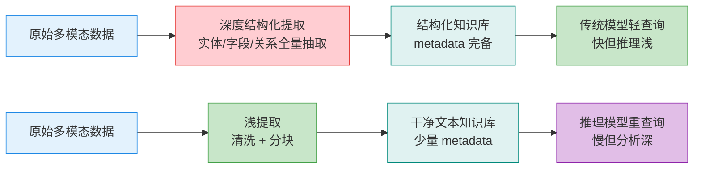
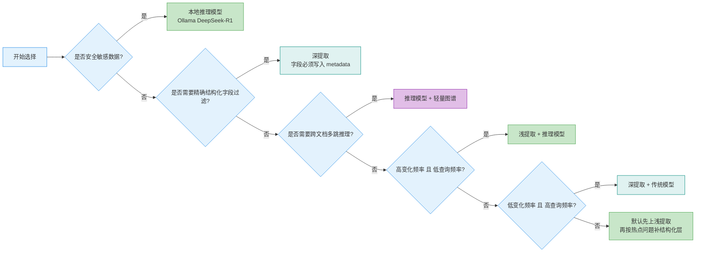

# 第九章：推理模型时代的知识库重构

> DeepSeek-R1、o3、Gemini 2.5 Thinking 把一个旧假设打穿了：知识库不一定要在入库前把信息“榨干”，很多分析可以推迟到查询时再做。

:::tip 核心命题
推理模型可以在查询时做深度推理，这让“预先深度结构化提取”的必要性降低了 80%。但它不是银弹——正确的策略是根据数据变化频率和查询频率来选择。
:::

## 9.1 两种范式对比：重预处理 vs 重查询



| 对比维度 | 传统范式（2024） | 推理范式（2026） |
| --- | --- | --- |
| 预处理成本 | 高：先做字段、关系、标签、摘要 | 低：只做清洗、切块、去噪 |
| 查询成本 | 低：普通模型即可回答 | 高：要调用推理模型做重分析 |
| 数据新鲜度维护 | 差：源数据一变就要重抽字段 | 好：重跑分块即可更新 |
| 准确性 | 在固定字段过滤上更稳 | 在开放式分析、多跳推理上更强 |
| 适用场景 | 月更数据、高频查询、精确过滤 | 日更数据、低频分析、探索式问题 |

一句话理解：传统范式是“把钱花在入库前”，推理范式是“把钱花在查询时”。

## 9.2 决策框架：何时用哪种范式



可以把它翻译成 5 条硬规则：

1. **数据每天更新、查询每周几次**：选“浅提取 + 推理模型”。因为你不想每天重跑昂贵结构化抽取。
2. **数据月更、查询每天几百次**：选“深提取 + 传统模型”。一次重提取，换来大量便宜查询。
3. **必须按字段过滤**：比如 `price_band=20-30`、`seller_country=CN`，那就必须深提取，因为字段必须提前存在于 metadata。
4. **核心问题是跨文档多跳推理**：例如“谁在低价段缺位，且渠道评价又最好”，优先“推理模型 + 轻量图谱”，图谱负责连边，推理模型负责判断。
5. **涉及内部敏感数据**：优先本地模型，典型就是 Ollama 跑 `deepseek-r1:14b` 或 `qwen3-qwq`。

## 9.3 推理模型选型表

| 模型 | 推理能力 | 本地部署 | 适用数据级别 | Ollama命令 | 月度成本对比 |
| --- | --- | --- | --- | --- | --- |
| DeepSeek-R1:14b | 强，适合中等复杂分析 | 是 | **内部数据 / 公开数据** | `ollama pull deepseek-r1:14b` | 增量 API 成本接近 0，主要是本地算力 |
| DeepSeek-R1:70b | 很强，适合高价值决策 | 是 | **内部核心数据 / 公开数据** | `ollama pull deepseek-r1:70b` | 增量 API 成本接近 0，但硬件门槛最高 |
| o3-mini（API） | 很强，稳定性高 | 否 | **仅公开数据** | 不适用 | 约为本地 14b 的 2-4 倍查询成本 |
| Gemini 2.5 Flash Thinking（API） | 强，长上下文友好 | 否 | **仅公开数据** | 不适用 | 约为本地 14b 的 1.5-3 倍查询成本 |
| Qwen3-QwQ | 强，中文和本地化友好 | 是 | **内部数据 / 公开数据** | `ollama pull qwen3-qwq` | 与本地 R1:14b 同量级，部署更灵活 |

:::warning 选型红线
**本地部署 = 内部数据安全。API = 仅公开数据。** 如果你的语料包含利润率、供应商、用户隐私、投放计划，就不要把原文送到外部 API。
:::

## 9.4 实战代码：浅提取 Pipeline

下面的脚本故意只做两件事：**清洗**和**分块**。不抽品牌、不抽价格区间、不生成复杂 schema。传统深提取常见是 **30 秒/文档**，这个浅提取版本目标是 **约 2 秒/文档**。

```python
"""light_ingest.py

运行前安装：
pip install chromadb sentence-transformers

作用：
1. 从 raw_docs/ 读取 txt 或 md 文件
2. 只做清洗 + 分块
3. 写入 ChromaDB
4. metadata 只保留 source/date/category
"""

from __future__ import annotations

import hashlib
import re
import time
from dataclasses import dataclass
from datetime import datetime
from pathlib import Path

import chromadb
from sentence_transformers import SentenceTransformer


RAW_DIR = Path("raw_docs")
DB_DIR = Path("chroma_light")
COLLECTION_NAME = "market_docs"


@dataclass
class ChunkRecord:
    text: str
    metadata: dict


def clean_text(text: str) -> str:
    text = re.sub(r"```.*?```", " ", text, flags=re.S)
    text = re.sub(r"<[^>]+>", " ", text)
    text = re.sub(r"\s+", " ", text)
    return text.strip()


def split_into_chunks(text: str, chunk_size: int = 800, overlap: int = 120) -> list[str]:
    chunks: list[str] = []
    start = 0
    while start < len(text):
        end = min(len(text), start + chunk_size)
        chunk = text[start:end].strip()
        if len(chunk) > 80:
            chunks.append(chunk)
        start = max(end - overlap, end)
    return chunks


def shallow_extract(file_path: Path, category: str) -> list[ChunkRecord]:
    raw_text = file_path.read_text(encoding="utf-8")
    cleaned = clean_text(raw_text)
    chunks = split_into_chunks(cleaned)
    today = datetime.now().strftime("%Y-%m-%d")
    return [
        ChunkRecord(
            text=chunk,
            metadata={
                "source": str(file_path),
                "date": today,
                "category": category,
            },
        )
        for chunk in chunks
    ]


def build_ids(source: str, count: int) -> list[str]:
    prefix = hashlib.md5(source.encode("utf-8")).hexdigest()[:12]
    return [f"{prefix}-{idx}" for idx in range(count)]


def main() -> None:
    client = chromadb.PersistentClient(path=str(DB_DIR))
    collection = client.get_or_create_collection(name=COLLECTION_NAME)
    encoder = SentenceTransformer("BAAI/bge-m3")

    all_docs: list[str] = []
    all_ids: list[str] = []
    all_meta: list[dict] = []

    started_at = time.perf_counter()
    for file_path in RAW_DIR.glob("*.*"):
        category = file_path.stem.split("_")[0]
        records = shallow_extract(file_path, category=category)
        ids = build_ids(str(file_path), len(records))

        all_docs.extend(record.text for record in records)
        all_meta.extend(record.metadata for record in records)
        all_ids.extend(ids)

    embeddings = encoder.encode(all_docs, normalize_embeddings=True).tolist()
    collection.upsert(ids=all_ids, documents=all_docs, metadatas=all_meta, embeddings=embeddings)

    cost_seconds = time.perf_counter() - started_at
    print(f"完成浅提取，共写入 {len(all_docs)} 个 chunk，耗时 {cost_seconds:.2f}s")
    print("对比经验值：传统深提取约 30s/文档；浅提取约 2s/文档")


if __name__ == "__main__":
    main()
```

这个脚本的核心不是“更聪明”，而是“更克制”：把推理留到查询阶段，把入库阶段压到最低成本。

## 9.5 实战代码：推理模型查询

这个版本使用本地 Ollama 运行 `DeepSeek-R1:14b`。流程是：先检索 **Top-10 原始文本块**，再让推理模型围绕“竞争格局 / 价格空白 / 机会评分”做深分析，并输出可审计的 `reasoning_chain`。

```python
"""reasoning_query.py

运行前安装：
pip install chromadb sentence-transformers ollama

并先拉模型：
ollama pull deepseek-r1:14b
"""

from __future__ import annotations

import json
from typing import Any

import chromadb
import ollama
from sentence_transformers import SentenceTransformer


DB_DIR = "chroma_light"
COLLECTION_NAME = "market_docs"
TOP_K = 10


def search_context(query: str, top_k: int = TOP_K) -> list[dict[str, Any]]:
    client = chromadb.PersistentClient(path=DB_DIR)
    collection = client.get_collection(COLLECTION_NAME)
    encoder = SentenceTransformer("BAAI/bge-m3")
    query_vector = encoder.encode([query], normalize_embeddings=True).tolist()

    result = collection.query(query_embeddings=query_vector, n_results=top_k)
    docs = result["documents"][0]
    metas = result["metadatas"][0]
    distances = result.get("distances", [[None] * len(docs)])[0]

    return [
        {
            "rank": idx + 1,
            "text": doc,
            "metadata": meta,
            "distance": distances[idx],
        }
        for idx, (doc, meta) in enumerate(zip(docs, metas))
    ]


def run_reasoning(query: str) -> dict[str, Any]:
    context_items = search_context(query)
    context_text = "\n\n".join(
        [
            f"[Chunk {item['rank']}] source={item['metadata']['source']} category={item['metadata']['category']}\n{item['text']}"
            for item in context_items
        ]
    )

    prompt = f"""
你是资深市场分析师。请只基于给定上下文回答，不要编造外部事实。

任务：分析“便携太阳能充电器 US 市场”的竞争格局、价格空白和机会评分。
用户问题：{query}

请输出严格 JSON，对象字段如下：
{{
  "competition_landscape": [{{"player": "", "positioning": "", "evidence": ""}}],
  "price_gap": {{"gap_range": "", "why_it_exists": "", "evidence": ""}},
  "opportunity_score": {{"score": 0, "demand": 0, "competition": 0, "margin": 0, "execution": 0}},
  "reasoning_chain": ["步骤1...", "步骤2...", "步骤3..."],
  "recommended_action": ["动作1", "动作2", "动作3"]
}}

上下文如下：
{context_text}
""".strip()

    response = ollama.chat(
        model="deepseek-r1:14b",
        messages=[{"role": "user", "content": prompt}],
        format="json",
    )

    payload = json.loads(response["message"]["content"])
    payload["model"] = "deepseek-r1:14b"
    payload["retrieved_chunks"] = context_items
    return payload


if __name__ == "__main__":
    result = run_reasoning("便携太阳能充电器US市场分析")
    print(json.dumps(result, ensure_ascii=False, indent=2))
```

这里最重要的变化是：**知识库不再试图预先回答“市场机会在哪”，它只负责把原始证据找回来；真正的判断，由推理模型在查询时完成。**

## 9.6 成本对比实验：什么时候推理范式更经济

以查询 **“便携太阳能充电器 US 市场分析”** 为例，假设月初要处理一批同类市场资料：

- 传统深提取预处理成本：**X = $60/月**
- 传统单次查询成本：**Y = $0.02/次**
- 推理范式预处理成本：**X/10 = $6/月**
- 推理范式单次查询成本：**Y×3 = $0.06/次**

| 项目 | 传统深提取 | 推理范式 | 解释 |
| --- | --- | --- | --- |
| 预处理成本 | X = $60 | X/10 = $6 | 浅提取不做结构化抽取，成本直接缩到十分之一 |
| 单次查询成本 | Y = $0.02 | Y×3 = $0.06 | 推理模型更贵，但只在查询时花钱 |
| 月度总成本公式 | `$60 + 0.02Q` | `$6 + 0.06Q` | Q = 月查询量 |
| 经济性阈值 | `Q = 1350` | `Q = 1350` | 低于 1350 次/月，推理范式更省 |

所以结论并不玄学：

- **月查询量 < 1350 次**：推理范式更经济。
- **月查询量 > 1350 次**：传统深提取开始反超。
- **如果数据更新频繁**，即使查询量略高，也要重新评估，因为传统范式还要承担频繁重提取的维护成本。

:::warning 反直觉洞察
推理模型不会消灭知识库，而是改变知识库的存储策略：从“存结构化知识”转向“存干净的原始信息 + 少量关键 metadata”。
:::

## 9.8 延迟预算：被遗漏的第三条约束

成本和准确性是选型的两个常见维度，但在实时 Agent 场景，**延迟是比成本更硬的约束**。

### 推理模型的延迟现实

| 模型 | 典型 TTFT | 典型 P90 延迟 | 适用场景 |
|------|-----------|---------------|----------|
| GPT-4o（API） | 0.8s | 3s | 对话式，可接受等待 |
| DeepSeek-R1:14b（本地）| 2-5s | 10-20s | 批量分析，离线处理 |
| DeepSeek-R1:70b（本地）| 5-15s | 30-60s | 夜间批处理，不适合在线 |
| Qwen3-QwQ（本地）| 3-8s | 15-35s | 离线分析 |

:::danger 延迟陷阱
本地推理模型的安全优势是真实的，但如果你的用户期望 3 秒内得到响应，而本地 14B 模型需要 20 秒，这不是"可接受的延迟"，而是系统不可用。

**在选择"浅提取 + 推理模型"范式之前，先量化你的延迟预算。**
:::

### 延迟预算决策树

```
你的 P90 延迟预算是多少？
│
├── < 3s（实时对话、用户直接等待）
│   └── 必须用深提取 + 轻量模型（GPT-4o-mini / Qwen2.5-7B）
│       推理模型在这个约束下不可用
│
├── 3-10s（半实时，用户有等待容忍）
│   ├── 公开数据 → API 推理模型（GPT-4o / Gemini Flash Thinking）
│   └── 内部数据 → 本地 14B + 浅提取（需 A100/H100 级别硬件）
│
├── 10-30s（后台任务，用户不直接等待）
│   └── 本地 70B 模型 + 浅提取 均可
│
└── > 30s（批量离线处理）
    └── 任意模型，按成本最优选
```

---

## 9.9 推理模型的幻觉风险警示

推理模型产生的幻觉比普通模型**更难被识别**。普通模型的幻觉通常语言生硬或逻辑跳跃，而推理模型会给出"有完整推理链条的错误结论"——每一步推理看起来都合理，但方向错了。

### 推理幻觉的四种典型模式

**模式一：过度自信的多跳推理**
推理模型会在没有足够证据时仍然给出确定性的多跳结论，因为它被训练成"把推理进行到底"。

**模式二：基于训练数据的"幽灵知识"**
即使启用了知识库检索，推理模型有时会优先用训练时的知识推理，把检索结果当作"参考"而不是"约束"。

**模式三：数值和统计的滑点**
涉及数字计算的推理，即使每步逻辑看起来正确，细微的精度损失可能累积成显著的最终误差。

**模式四：否定性推理的反转**
在"A不是B，B不是C，所以A是什么"类型的推理中，模型容易在多层否定后产生方向错误。

### 防护措施：推理结果的事实锚定

对推理模型的输出强制执行"事实锚定"后处理：

```python
def anchor_reasoning_output(response: str, kb_client, threshold=0.75):
    claims = extract_factual_claims(response)
    unverified = []
    for claim in claims:
        evidence = kb_client.search(claim, top_k=3)
        if max_similarity(evidence, claim) < threshold:
            unverified.append(claim)
    if len(unverified) / max(len(claims), 1) > 0.3:
        return response, {"warning": f"{len(unverified)} 个声明无法在知识库中找到支撑"}
    return response, {"verified": True}
```

---

:::tip → 下一章
推理模型策略确定后，做成本规划和预算管理 → [10-cost-model](10-cost-model.md)
:::

---

## 9.10 错误代价分层：选型的隐藏第一约束

**延迟和成本是可见的约束，错误代价是隐藏的第一约束。** 同样的幻觉，在不同场景的代价相差100倍，但大多数选型讨论完全忽略这个维度。

### 错误代价分级表

| 代价级别 | 场景示例 | 错误后果 | 选型影响 |
|----------|----------|----------|----------|
| **L1 可忽略** | FAQ问答、内容推荐、创意写作 | 用户体验略差，无实质损失 | 可接受推理模型的幻觉风险 |
| **L2 可纠正** | 产品描述、营销文案、日程建议 | 需人工复核，有时间成本 | 需要置信度展示，不能静默失败 |
| **L3 业务损失** | 选品决策、定价建议、供应商筛选 | 直接影响 GMV/利润，损失可量化 | 必须深提取+强推理，启用事实锚定 |
| **L4 合规风险** | 法律条款解读、安全操作规程、财务申报 | 法律责任、监管处罚、人身安全 | 禁止完全自动化，必须 HITL 审核 |
| **L5 不可逆** | 生产指令、医疗建议、投资决策 | 无法撤销的现实后果 | 知识库只提供参考，最终决策必须人工 |

### 如何确定你的场景级别

```python
def assess_error_level(scenario: dict) -> int:
    """
    场景：{"reversible": bool, "legal_risk": bool,
           "financial_impact": float, "human_safety": bool}
    """
    if scenario["human_safety"]:
        return 5
    if scenario["legal_risk"]:
        return 4
    if scenario["financial_impact"] > 10000:   # 单次错误潜在损失（元）
        return 3
    if not scenario["reversible"]:
        return 3
    if scenario["financial_impact"] > 500:
        return 2
    return 1

# 场景级别决定技术选型
LEVEL_TO_STRATEGY = {
    1: "浅提取 + 推理模型，接受延迟换成本",
    2: "浅提取 + 推理模型 + 置信度展示",
    3: "深提取 + 事实锚定 + 强推理模型",
    4: "深提取 + 事实锚定 + HITL 审核节点",
    5: "仅作参考输出，决策权不委托给系统",
}
```

### 场景级别与技术选型的硬约束

**L1-L2**：月查询阈值（1350次）有意义，可以用经济性模型决策。

**L3**：经济性阈值失效——即使月查询量低于1350次，只要单次错误代价高，也必须用深提取确保精度。

**L4-L5**：成本和延迟都不是主要约束，正确性和可审计性才是。推理模型的幻觉风险在这两个级别是不可接受的，必须叠加事实锚定 + 人工介入。

:::danger 1350次阈值的适用边界
**第九章的1350次/月经济性阈值，仅适用于 L1-L2 场景。**
L3及以上场景，请忽略该阈值，优先按错误代价选型。
:::

