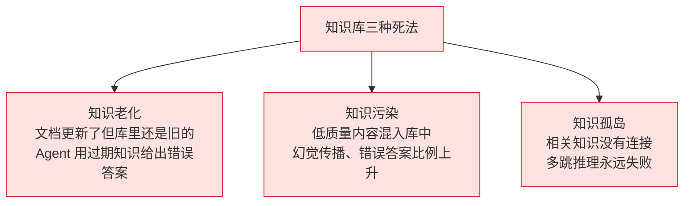
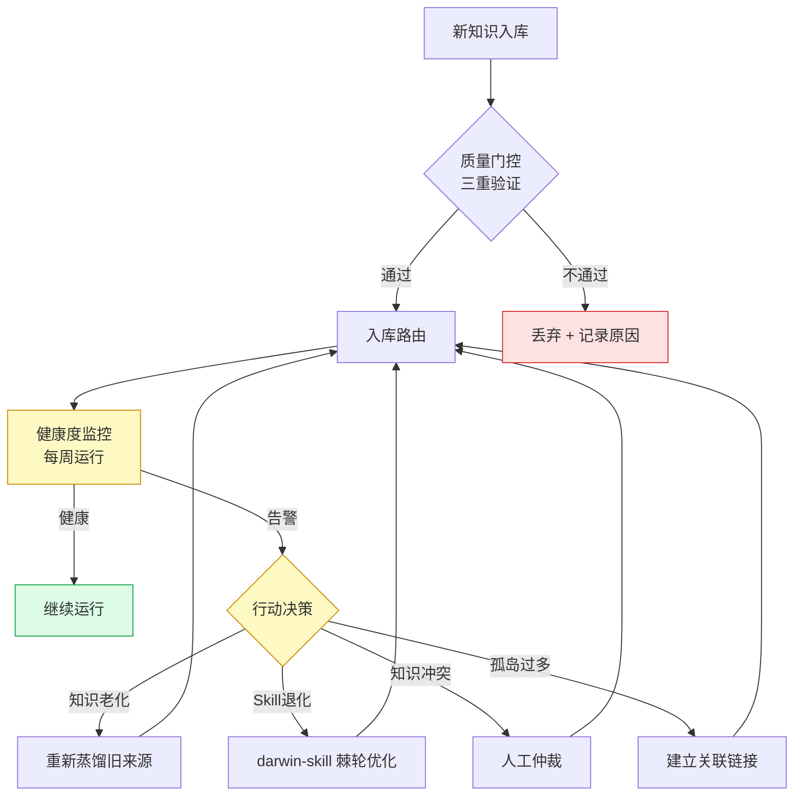

# 第十一部分：知识库进化——闭环的最后一公里

> **核心问题**：知识库不是一次性工程，而是一个有生命周期的活体系统。知识会老化、会产生矛盾、会随业务变化而失效。这一章解决"建完之后怎么维护"这个绝大多数指南都不提的问题。

---

## 11.1 为什么知识库会腐烂？

知识库有三种死法：



**解决方案：建立知识库的"免疫系统"**——由三个机制构成：
1. **健康度监控**（定期扫描，发现病灶）
2. **Skill 迭代进化**（darwin-skill 棘轮机制）
3. **冲突仲裁**（矛盾知识的自动标注和人工介入流程）

---

## 11.2 知识库健康度评估体系

### 健康度的六个维度

| 维度 | 含义 | 衡量指标 | 告警阈值 |
| :--- | :--- | :--- | :--- |
| **新鲜度** | 知识是否与最新信息一致 | 距上次更新的天数 | >90天 |
| **一致性** | 同一主题的知识是否自相矛盾 | 冲突条目比例 | >5% |
| **覆盖率** | 用户查询是否都能找到相关知识 | 查询命中率 | <80% |
| **幻觉率** | Agent 输出的内容有多少无法溯源 | 幻觉检测比例 | >10% |
| **孤岛率** | 没有任何关联的孤立知识条目比例 | 孤立节点占比 | >20% |
| **利用率** | 知识被实际调用的比例 | 30天内零查询的条目比例 | >30% |

### 健康度检查实现

```python
# pipeline/evolution.py

import json
from pathlib import Path
from datetime import datetime, timedelta
from loguru import logger
import yaml

with open("config.yaml") as f:
    CONFIG = yaml.safe_load(f)


class KnowledgeHealthChecker:
    """知识库健康度检查器"""

    def __init__(self):
        self.skill_dir = Path(CONFIG["storage"]["skill_dir"]).expanduser()
        self.wiki_dir = Path(CONFIG["storage"]["wiki_dir"])
        self.staleness_days = CONFIG["evolution"]["staleness_days"]

    def check(self) -> dict:
        """运行全量健康度检查"""
        report = {
            "timestamp": datetime.now().isoformat(),
            "dimensions": {}
        }

        # 1. 新鲜度检查
        report["dimensions"]["freshness"] = self._check_freshness()

        # 2. Skill 健康度
        report["dimensions"]["skills"] = self._check_skills()

        # 3. 孤岛检查（Wiki 文件没有被引用）
        report["dimensions"]["orphans"] = self._check_orphans()

        # 4. 综合得分
        scores = [
            report["dimensions"]["freshness"]["score"],
            report["dimensions"]["skills"]["score"],
            100 - report["dimensions"]["orphans"]["orphan_rate"] * 100,
        ]
        report["overall_score"] = sum(scores) / len(scores)
        report["status"] = "healthy" if report["overall_score"] > 80 \
                          else "warning" if report["overall_score"] > 60 \
                          else "critical"

        # 打印报告
        self._print_report(report)
        return report

    def _check_freshness(self) -> dict:
        """检查知识新鲜度"""
        stale_count = 0
        total_count = 0
        stale_items = []

        for skill_md in self.skill_dir.rglob("SKILL.md"):
            content = skill_md.read_text()
            total_count += 1

            # 检查 created_at 或 updated_at
            import re
            date_match = re.search(r'(created|updated)_at: (.+)', content)
            if date_match:
                date_str = date_match.group(2).strip()
                try:
                    created = datetime.fromisoformat(date_str)
                    age_days = (datetime.now() - created).days
                    if age_days > self.staleness_days:
                        stale_count += 1
                        stale_items.append({
                            "path": str(skill_md),
                            "age_days": age_days
                        })
                except ValueError:
                    pass

            # 检查 outdated 标记
            if "status: outdated" in content:
                stale_count += 1

        stale_rate = stale_count / max(total_count, 1)
        return {
            "total": total_count,
            "stale": stale_count,
            "stale_rate": stale_rate,
            "stale_items": stale_items[:10],  # 最多显示10条
            "score": max(0, 100 - stale_rate * 100)
        }

    def _check_skills(self) -> dict:
        """检查所有 Skill 的质量状态"""
        issues = []
        healthy = 0
        outdated = 0
        needs_review = 0

        for skill_md in self.skill_dir.rglob("SKILL.md"):
            content = skill_md.read_text()

            if "status: outdated" in content:
                outdated += 1
                issues.append({"path": str(skill_md), "issue": "outdated"})
            elif "status: needs_review" in content:
                needs_review += 1
                issues.append({"path": str(skill_md), "issue": "needs_review"})
            else:
                # 检查必要字段是否存在
                required_sections = ["触发条件", "执行步骤", "边界与禁忌"]
                missing = [s for s in required_sections if s not in content]
                if missing:
                    issues.append({
                        "path": str(skill_md),
                        "issue": f"缺少字段: {missing}"
                    })
                else:
                    healthy += 1

        total = healthy + outdated + needs_review
        return {
            "total": total,
            "healthy": healthy,
            "outdated": outdated,
            "needs_review": needs_review,
            "issues": issues[:10],
            "score": (healthy / max(total, 1)) * 100
        }

    def _check_orphans(self) -> dict:
        """检查孤立的 Wiki 页面（没有被任何其他页面引用）"""
        if not self.wiki_dir.exists():
            return {"orphan_rate": 0, "score": 100}

        all_pages = list(self.wiki_dir.rglob("*.md"))
        all_content = " ".join([p.read_text() for p in all_pages])

        orphans = []
        for page in all_pages:
            if page.name == "index.md":
                continue
            # 检查是否被其他页面引用
            stem = page.stem
            if stem not in all_content.replace(page.read_text(), ""):
                orphans.append(str(page))

        orphan_rate = len(orphans) / max(len(all_pages), 1)
        return {
            "total_pages": len(all_pages),
            "orphan_count": len(orphans),
            "orphan_rate": orphan_rate,
            "orphans": orphans[:10],
        }

    def _print_report(self, report: dict):
        """打印可读性强的健康度报告"""
        status_emoji = {"healthy": "✅", "warning": "⚠️", "critical": "🔴"}

        print(f"\n{'='*60}")
        print(f"知识库健康度报告 {report['timestamp'][:10]}")
        print(f"{'='*60}")
        print(f"综合评分: {report['overall_score']:.1f}/100 "
              f"{status_emoji.get(report['status'], '?')} {report['status'].upper()}")
        print()

        dims = report["dimensions"]
        print(f"📅 新鲜度: {dims['freshness']['score']:.0f}分 "
              f"({dims['freshness']['stale']} 条过期/{dims['freshness']['total']} 条总计)")
        print(f"🛠️  Skill质量: {dims['skills']['score']:.0f}分 "
              f"({dims['skills']['healthy']} 健康/"
              f"{dims['skills']['outdated']} 过期/"
              f"{dims['skills']['needs_review']} 待审)")
        print(f"🕸️  孤岛率: {dims['orphans']['orphan_rate']:.1%} "
              f"({dims['orphans']['orphan_count']}/{dims['orphans']['total_pages']} 页面孤立)")

        if report['status'] != 'healthy':
            print(f"\n⚠️ 建议行动:")
            if dims['freshness']['stale'] > 0:
                print(f"  → 更新 {dims['freshness']['stale']} 条过期知识")
            if dims['skills']['outdated'] > 0:
                print(f"  → 重新蒸馏 {dims['skills']['outdated']} 个过期 Skill")
        print(f"{'='*60}\n")
```

---

## 11.3 Skill 迭代进化（darwin-skill 棘轮机制）

### 核心原则

```
棘轮原理：只能向前，不能后退
  每次修改 Skill → 9维度评分
  评分提升 → git commit（保留改进）
  评分持平/下降 → git revert（回滚）

结果：Skill 库只会越来越好，永远不会因为一次糟糕的更新而退化
```

### 9维度评估实现

```python
class SkillEvaluator:
    """darwin-skill 9维度评估器"""

    DIMENSIONS = {
        "trigger_precision":    {"weight": 0.15, "name": "触发精确性"},
        "step_clarity":         {"weight": 0.15, "name": "执行步骤清晰度"},
        "actionable_specificity": {"weight": 0.15, "name": "可执行具体性"},
        "boundary_coverage":    {"weight": 0.12, "name": "边界与禁忌覆盖"},
        "failure_encoding":     {"weight": 0.12, "name": "失败模式编码"},
        "risk_blacklist":       {"weight": 0.10, "name": "高风险行动黑名单"},
        "source_traceability":  {"weight": 0.08, "name": "溯源可追"},
        "format_standard":      {"weight": 0.07, "name": "格式规范"},
        "context_awareness":    {"weight": 0.06, "name": "上下文感知"},
    }

    # 明文禁止的反模式（darwin v2.0）
    ANTI_PATTERNS = [
        "视情况而定",
        "根据具体情况",
        "灵活把握",
        "可以考虑",
        "建议",
        "也许",
        "可能",
    ]

    def __init__(self):
        from openai import OpenAI
        # ⚠️ 重要：评估模型必须和蒸馏模型不同（防止自评偏差）
        # LLM 自评准确率仅 46.4%（SkillLens 实证）
        self.llm = OpenAI()
        self.eval_model = "gpt-4o"  # 不能是 gpt-4o-mini

    def evaluate(self, skill_content: str) -> dict:
        """对 SKILL.md 内容进行9维度评估"""
        results = {}
        total_score = 0

        for dim_key, dim_config in self.DIMENSIONS.items():
            score = self._evaluate_dimension(skill_content, dim_key, dim_config["name"])
            weighted_score = score * dim_config["weight"] * 100
            results[dim_key] = {
                "raw_score": score,
                "weighted": weighted_score,
                "name": dim_config["name"],
            }
            total_score += weighted_score

        # 检查反模式（有则扣分）
        anti_pattern_count = sum(
            1 for p in self.ANTI_PATTERNS if p in skill_content
        )
        if anti_pattern_count > 0:
            penalty = min(anti_pattern_count * 3, 20)
            total_score -= penalty
            results["anti_pattern_penalty"] = {
                "count": anti_pattern_count,
                "penalty": penalty
            }

        return {
            "total_score": max(0, total_score),
            "dimensions": results,
            "pass": total_score >= CONFIG["evolution"]["skill_min_score"],
        }

    def _evaluate_dimension(self, content: str, dim: str, dim_name: str) -> float:
        """评估单个维度（0-1）"""
        import json

        prompts = {
            "trigger_precision": "评估 SKILL.md 中触发条件的精确性：是否清楚说明了'什么情况下'应该调用此Skill？(0-1分)",
            "step_clarity": "评估执行步骤的清晰度：步骤是否有明确序号、每步是否可独立执行？(0-1分)",
            "actionable_specificity": "评估可执行具体性：是否包含'视情况而定'等模糊词？有则扣分。(0-1分)",
            "boundary_coverage": "评估边界覆盖：是否明确说明了禁忌/不该做的事/适用边界？(0-1分)",
            "failure_encoding": "评估失败模式编码：是否包含已知的错误案例或失败路径？(0-1分)",
            "risk_blacklist": "评估高风险操作：危险操作（如删除/重置/force push）是否有显式警告？(0-1分)",
            "source_traceability": "评估溯源可追：每个关键主张是否都有来源引用？(0-1分)",
            "format_standard": "评估格式规范：是否有标准的 frontmatter（name/status/source）？(0-1分)",
            "context_awareness": "评估上下文感知：Skill 是否考虑了不同调用场景的差异？(0-1分)",
        }

        try:
            resp = self.llm.chat.completions.create(
                model=self.eval_model,
                messages=[{
                    "role": "user",
                    "content": f"{prompts.get(dim, '')}\n\nSKILL 内容：\n{content[:2000]}\n\n只返回 0-1 之间的数字："
                }],
                max_tokens=10,
            )
            score_str = resp.choices[0].message.content.strip()
            return min(1.0, max(0.0, float(score_str)))
        except (ValueError, Exception):
            return 0.5


class SkillEvolver:
    """darwin-skill 棘轮进化控制器"""

    def __init__(self):
        self.evaluator = SkillEvaluator()

    def evolve_one_dimension(self, skill_path: str, dimension: str) -> dict:
        """
        单维度优化（每次只改一个维度，防止干扰）
        Returns: {"improved": bool, "old_score": float, "new_score": float}
        """
        import subprocess
        from openai import OpenAI

        skill_path = Path(skill_path)
        original_content = skill_path.read_text()

        # 评估基线
        baseline = self.evaluator.evaluate(original_content)
        old_score = baseline["total_score"]
        logger.info(f"基线评分: {old_score:.1f} | 优化维度: {dimension}")

        # CHECKPOINT：打印基线，等待人工确认（darwin 的 human-in-the-loop）
        logger.warning(f"🔴 CHECKPOINT: 基线评分 {old_score:.1f}，准备优化 [{dimension}]")
        confirm = input("是否继续优化？(y/n): ").strip().lower()
        if confirm != 'y':
            return {"improved": False, "reason": "用户取消"}

        # 生成改进版本
        llm = OpenAI()
        dim_name = SkillEvaluator.DIMENSIONS.get(dimension, {}).get("name", dimension)

        resp = llm.chat.completions.create(
            model="gpt-4o",
            messages=[{
                "role": "user",
                "content": f"""改进以下 SKILL.md 的「{dim_name}」维度。
只改这一个维度，不要改动其他内容。

当前 SKILL：
{original_content}

请输出改进后的完整 SKILL.md 内容："""
            }]
        )
        improved_content = resp.choices[0].message.content

        # 写入改进版本
        skill_path.write_text(improved_content)

        # 评估新版本
        new_eval = self.evaluator.evaluate(improved_content)
        new_score = new_eval["total_score"]
        logger.info(f"新评分: {new_score:.1f}")

        # 棘轮决策
        if new_score > old_score + 1.0:  # 至少提升1分才保留
            # git commit
            subprocess.run(["git", "add", str(skill_path)])
            subprocess.run(["git", "commit", "-m",
                f"skill: improve [{dimension}] {old_score:.1f}→{new_score:.1f}"])
            logger.success(f"✅ 改进保留: {old_score:.1f} → {new_score:.1f}")
            return {"improved": True, "old_score": old_score, "new_score": new_score}
        else:
            # git revert（不用 reset --hard！）
            skill_path.write_text(original_content)
            logger.warning(f"❌ 改进未达标，回滚: {new_score:.1f} <= {old_score:.1f}")
            return {"improved": False, "old_score": old_score, "new_score": new_score}
```

---

## 11.4 知识冲突仲裁

### 冲突的三种类型

| 类型 | 示例 | 处理策略 |
| :--- | :--- | :--- |
| **数值冲突** | A文档说重试3次，B文档说5次 | 有时间戳→新版本覆盖旧版本；无时间戳→标记冲突等待人工 |
| **时态冲突** | 旧方案 vs 新方案（明确的版本更迭）| 自动标记 `supersedes`，旧版降权 |
| **观点分歧** | 两位专家对同一问题意见不同 | 双向挂载，标注来源，呈现分歧本身 |

### 冲突检测实现

```python
class ConflictDetector:
    """知识冲突检测与仲裁"""

    def __init__(self, rag):
        from openai import OpenAI
        self.rag = rag
        self.llm = OpenAI()

    def check_conflict(self, new_entry: dict, top_k: int = 5) -> dict:
        """
        为新知识条目检查是否与现有知识冲突
        """
        import json

        claim = new_entry.get("fact", new_entry.get("summary", ""))
        if not claim:
            return {"has_conflict": False}

        # 检索相似的现有知识
        similar = self.rag.query(
            f"与以下内容相关的知识：{claim}",
            param={"mode": "local", "top_k": top_k}
        )

        # 用 LLM 判断是否有冲突
        resp = self.llm.chat.completions.create(
            model="gpt-4o",
            messages=[{
                "role": "user",
                "content": f"""判断新知识与现有知识是否存在矛盾：

新知识：{claim}

现有知识：{similar[:500]}

判断：
1. 是否有语义矛盾？（注意：补充/扩展不算矛盾）
2. 如果有，是什么类型：numerical/temporal/opinion
3. 置信度更高的是哪个？

输出 JSON：
{{"conflict": bool, "type": "none/numerical/temporal/opinion", "preferred": "new/existing/both", "reason": "..."}}"""
            }],
            response_format={"type": "json_object"},
        )

        result = json.loads(resp.choices[0].message.content)

        if result.get("conflict"):
            self._handle_conflict(new_entry, similar, result)

        return result

    def _handle_conflict(self, new_entry: dict, existing: str, conflict_info: dict):
        """处理冲突"""
        conflict_type = conflict_info.get("type", "unknown")

        if conflict_type == "temporal":
            # 时态冲突：新版本自动覆盖
            logger.info(f"时态冲突：新版本覆盖旧版本")
            new_entry["supersedes"] = "previous_version"
            new_entry["status"] = "supersedes_old"

        elif conflict_type in ["numerical", "opinion"]:
            # 数值或观点冲突：标记待仲裁
            conflict_doc = {
                "type": "CONFLICT",
                "new_claim": new_entry.get("fact", ""),
                "existing_claim": existing[:200],
                "conflict_type": conflict_type,
                "created_at": datetime.now().isoformat(),
                "status": "pending_arbitration",
                "preferred": conflict_info.get("preferred", "unknown"),
            }

            # 写入冲突记录文件
            conflict_dir = Path("wiki/conflicts/")
            conflict_dir.mkdir(parents=True, exist_ok=True)
            conflict_file = conflict_dir / f"conflict_{hash(new_entry.get('fact',''))}.json"
            with open(conflict_file, 'w') as f:
                json.dump(conflict_doc, f, ensure_ascii=False, indent=2)

            logger.warning(f"🔴 发现知识冲突，已记录: {conflict_file}")
            new_entry["has_conflict"] = True
            new_entry["conflict_file"] = str(conflict_file)
```

---

## 11.5 自动化进化 CI/CD

### GitHub Actions 配置

```yaml
# .github/workflows/kb-health.yml
name: 知识库健康度定期检查

on:
  schedule:
    - cron: '0 9 * * 1'  # 每周一早上 9 点
  workflow_dispatch:      # 支持手动触发

jobs:
  health-check:
    runs-on: ubuntu-latest
    steps:
      - uses: actions/checkout@v4

      - name: 设置 Python
        uses: actions/setup-python@v4
        with:
          python-version: '3.11'

      - name: 安装依赖
        run: pip install -r requirements.txt

      - name: 运行健康度检查
        env:
          OPENAI_API_KEY: ${{ secrets.OPENAI_API_KEY }}
        run: python main.py health

      - name: 生成健康度报告
        run: |
          python -c "
          from pipeline.evolution import KnowledgeHealthChecker
          import json
          checker = KnowledgeHealthChecker()
          report = checker.check()
          with open('health_report.json', 'w') as f:
              json.dump(report, f, ensure_ascii=False, indent=2)
          "

      - name: 上传报告
        uses: actions/upload-artifact@v3
        with:
          name: health-report
          path: health_report.json

      - name: 如果健康度低于60分，发送告警
        if: always()
        run: |
          python -c "
          import json
          with open('health_report.json') as f:
              report = json.load(f)
          score = report.get('overall_score', 100)
          if score < 60:
              print(f'::warning::知识库健康度告警: {score:.1f}/100')
              exit(1)
          "
```

### 每次 Ingest 后自动触发的检查

```python
# 在 main.py 的 ingest_cmd 结束后自动运行
def post_ingest_check(ingest_result: dict):
    """
    每次 Ingest 后的轻量级健康检查
    检查新增知识是否引入了冲突
    """
    if ingest_result["stats"]["validated_count"] == 0:
        logger.warning("⚠️ 本次 Ingest 没有任何知识通过验证，请检查源文件质量")
        return

    acceptance_rate = ingest_result["stats"]["acceptance_rate"]
    if acceptance_rate < 0.3:
        logger.warning(f"⚠️ 知识通过率偏低: {acceptance_rate:.1%}，建议检查三重验证参数")

    logger.success(f"✅ Ingest 健康: 通过率 {acceptance_rate:.1%}")
```

---

## 11.6 知识进化闭环：完整图示


