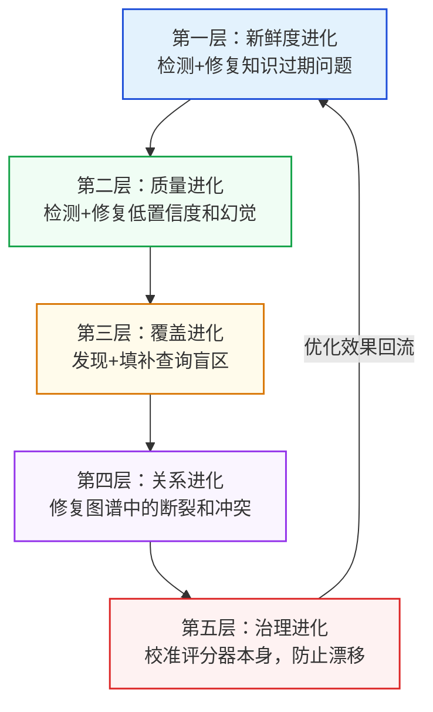

# 第十三章：知识库进化与自进化闭环

:::info 本章在全书中的角色
**读完本章你能做到**：让知识库从"一次性工程"变成"会自我维护的活体系统"——包括健康度监控、Skill 迭代优化、冲突仲裁，以及最重要的：防止进化系统把自己优化偏。

**核心前提**：进化不是魔法，是受控的系统工程。本章每一节都对应一个具体的运维责任：谁触发、谁执行、谁验收。没有明确责任人的进化机制比不进化更危险。

**阅读顺序建议**：先看 11.7 五层飞轮（理解整体）→ 再按需深入各机制细节 → 最后看 11.9 评分器治理（防止进化系统本身失控）。
:::

> **核心问题**：知识库不是一次性工程，而是一个有生命周期的活体系统。知识会老化、会产生矛盾、会随业务变化而失效。这一章解决"建完之后怎么维护"这个绝大多数指南都不提的问题。

## 进化系统五层模型：本章全局导图

在进入每个具体机制之前，先建立整体视图。进化系统由五层构成，每一层解决上一层发现的问题：



**本章各节的对应关系**：

| 本章章节 | 对应层级 | 解决的核心问题 |
|---------|---------|--------------|
| 11.1 为什么知识库会腐烂 | 背景 | 理解进化的必要性 |
| 11.2 健康度评估体系 | L1+L2 | 检测哪里出了问题 |
| 11.3 Skill 迭代进化 | L2 | 持续提升 Skill 质量 |
| 11.4 知识冲突仲裁 | L4 | 解决矛盾信息 |
| 11.5 自动化 CI/CD | L1-L4 | 自动触发各层进化 |
| 11.9 评分器治理 | **L5** | **防止进化系统本身失控** |

:::warning 进化系统的最大风险不在数据，在治理
L5（评分器治理）是整个进化闭环中最重要也最容易被忽略的一层。如果没有 L5，前四层的进化会在无人察觉的情况下悄悄偏离正确方向——而且每次迭代都在强化这种偏离。
:::

---

## 11.1 为什么知识库会腐烂？

知识库有三种死法：

```mermaid
flowchart TD
    Death[知识库三种死法]
    D1[知识老化<br/>文档更新了但库里还是旧的<br/>Agent 用过期知识给出错误答案]
    D2[知识污染<br/>低质量内容混入库中<br/>幻觉传播、错误答案比例上升]
    D3[知识孤岛<br/>相关知识没有连接<br/>多跳推理永远失败]
    Death --> D1
    Death --> D2
    Death --> D3

    classDef red fill:#fee2e2,stroke:#dc2626,stroke-width:1px;
    class Death,D1,D2,D3 red;
```text

**解决方案：建立知识库的"免疫系统"**——由三个机制构成：
1. **健康度监控**（定期扫描，发现病灶）
2. **Skill 迭代进化**（darwin-skill 棘轮机制）
3. **冲突仲裁**（矛盾知识的自动标注和人工介入流程）

---

## 11.2 知识库健康度评估体系

### 健康度的六个维度

| 维度 | 含义 | 衡量指标 | 告警阈值 |
| :--- | :--- | :--- | :--- |
| **新鲜度** | 知识是否与最新信息一致 | 距上次更新的天数 | >90天 |
| **一致性** | 同一主题的知识是否自相矛盾 | 冲突条目比例 | >5% |
| **覆盖率** | 用户查询是否都能找到相关知识 | 查询命中率 | <80% |
| **幻觉率** | Agent 输出的内容有多少无法溯源 | 幻觉检测比例 | >10% |
| **孤岛率** | 没有任何关联的孤立知识条目比例 | 孤立节点占比 | >20% |
| **利用率** | 知识被实际调用的比例 | 30天内零查询的条目比例 | >30% |

### 健康度检查实现

```python
# pipeline/evolution.py

import json
from pathlib import Path
from datetime import datetime, timedelta
from loguru import logger
import yaml

with open("config.yaml") as f:
    CONFIG = yaml.safe_load(f)


class KnowledgeHealthChecker:
    """知识库健康度检查器"""

    def __init__(self):
        self.skill_dir = Path(CONFIG["storage"]["skill_dir"]).expanduser()
        self.wiki_dir = Path(CONFIG["storage"]["wiki_dir"])
        self.staleness_days = CONFIG["evolution"]["staleness_days"]

    def check(self) -> dict:
        """运行全量健康度检查"""
        report = {
            "timestamp": datetime.now().isoformat(),
            "dimensions": {}
        }

        # 1. 新鲜度检查
        report["dimensions"]["freshness"] = self._check_freshness()

        # 2. Skill 健康度
        report["dimensions"]["skills"] = self._check_skills()

        # 3. 孤岛检查（Wiki 文件没有被引用）
        report["dimensions"]["orphans"] = self._check_orphans()

        # 4. 综合得分
        scores = [
            report["dimensions"]["freshness"]["score"],
            report["dimensions"]["skills"]["score"],
            100 - report["dimensions"]["orphans"]["orphan_rate"] * 100,
        ]
        report["overall_score"] = sum(scores) / len(scores)
        report["status"] = "healthy" if report["overall_score"] > 80 \
                          else "warning" if report["overall_score"] > 60 \
                          else "critical"

        # 打印报告
        self._print_report(report)
        return report

    def _check_freshness(self) -> dict:
        """检查知识新鲜度"""
        stale_count = 0
        total_count = 0
        stale_items = []

        for skill_md in self.skill_dir.rglob("SKILL.md"):
            content = skill_md.read_text()
            total_count += 1

            # 检查 created_at 或 updated_at
            import re
            date_match = re.search(r'(created|updated)_at: (.+)', content)
            if date_match:
                date_str = date_match.group(2).strip()
                try:
                    created = datetime.fromisoformat(date_str)
                    age_days = (datetime.now() - created).days
                    if age_days > self.staleness_days:
                        stale_count += 1
                        stale_items.append({
                            "path": str(skill_md),
                            "age_days": age_days
                        })
                except ValueError:
                    pass

            # 检查 outdated 标记
            if "status: outdated" in content:
                stale_count += 1

        stale_rate = stale_count / max(total_count, 1)
        return {
            "total": total_count,
            "stale": stale_count,
            "stale_rate": stale_rate,
            "stale_items": stale_items[:10],  # 最多显示10条
            "score": max(0, 100 - stale_rate * 100)
        }

    def _check_skills(self) -> dict:
        """检查所有 Skill 的质量状态"""
        issues = []
        healthy = 0
        outdated = 0
        needs_review = 0

        for skill_md in self.skill_dir.rglob("SKILL.md"):
            content = skill_md.read_text()

            if "status: outdated" in content:
                outdated += 1
                issues.append({"path": str(skill_md), "issue": "outdated"})
            elif "status: needs_review" in content:
                needs_review += 1
                issues.append({"path": str(skill_md), "issue": "needs_review"})
            else:
                # 检查必要字段是否存在
                required_sections = ["触发条件", "执行步骤", "边界与禁忌"]
                missing = [s for s in required_sections if s not in content]
                if missing:
                    issues.append({
                        "path": str(skill_md),
                        "issue": f"缺少字段: {missing}"
                    })
                else:
                    healthy += 1

        total = healthy + outdated + needs_review
        return {
            "total": total,
            "healthy": healthy,
            "outdated": outdated,
            "needs_review": needs_review,
            "issues": issues[:10],
            "score": (healthy / max(total, 1)) * 100
        }

    def _check_orphans(self) -> dict:
        """检查孤立的 Wiki 页面（没有被任何其他页面引用）"""
        if not self.wiki_dir.exists():
            return {"orphan_rate": 0, "score": 100}

        all_pages = list(self.wiki_dir.rglob("*.md"))
        all_content = " ".join([p.read_text() for p in all_pages])

        orphans = []
        for page in all_pages:
            if page.name == "index.md":
                continue
            # 检查是否被其他页面引用
            stem = page.stem
            if stem not in all_content.replace(page.read_text(), ""):
                orphans.append(str(page))

        orphan_rate = len(orphans) / max(len(all_pages), 1)
        return {
            "total_pages": len(all_pages),
            "orphan_count": len(orphans),
            "orphan_rate": orphan_rate,
            "orphans": orphans[:10],
        }

    def _print_report(self, report: dict):
        """打印可读性强的健康度报告"""
        status_emoji = {"healthy": "(OK)", "warning": "[!]", "critical": "[P0]"}

        print(f"\n{'='*60}")
        print(f"知识库健康度报告 {report['timestamp'][:10]}")
        print(f"{'='*60}")
        print(f"综合评分: {report['overall_score']:.1f}/100 "
              f"{status_emoji.get(report['status'], '?')} {report['status'].upper()}")
        print()

        dims = report["dimensions"]
        print(f"[日期] 新鲜度: {dims['freshness']['score']:.0f}分 "
              f"({dims['freshness']['stale']} 条过期/{dims['freshness']['total']} 条总计)")
        print(f"[工具]  Skill质量: {dims['skills']['score']:.0f}分 "
              f"({dims['skills']['healthy']} 健康/"
              f"{dims['skills']['outdated']} 过期/"
              f"{dims['skills']['needs_review']} 待审)")
        print(f"(web)  孤岛率: {dims['orphans']['orphan_rate']:.1%} "
              f"({dims['orphans']['orphan_count']}/{dims['orphans']['total_pages']} 页面孤立)")

        if report['status'] != 'healthy':
            print(f"\n[!] 建议行动:")
            if dims['freshness']['stale'] > 0:
                print(f"  → 更新 {dims['freshness']['stale']} 条过期知识")
            if dims['skills']['outdated'] > 0:
                print(f"  → 重新蒸馏 {dims['skills']['outdated']} 个过期 Skill")
        print(f"{'='*60}\n")
```text

---

## 11.3 Skill 迭代进化（darwin-skill 棘轮机制）

### 核心原则

```text
棘轮原理：只能向前，不能后退
  每次修改 Skill → 9维度评分
  评分提升 → git commit（保留改进）
  评分持平/下降 → git revert（回滚）

结果：Skill 库只会越来越好，永远不会因为一次糟糕的更新而退化
```text

### 9维度评估实现

```python
class SkillEvaluator:
    """darwin-skill 9维度评估器"""

    DIMENSIONS = {
        "trigger_precision":    {"weight": 0.15, "name": "触发精确性"},
        "step_clarity":         {"weight": 0.15, "name": "执行步骤清晰度"},
        "actionable_specificity": {"weight": 0.15, "name": "可执行具体性"},
        "boundary_coverage":    {"weight": 0.12, "name": "边界与禁忌覆盖"},
        "failure_encoding":     {"weight": 0.12, "name": "失败模式编码"},
        "risk_blacklist":       {"weight": 0.10, "name": "高风险行动黑名单"},
        "source_traceability":  {"weight": 0.08, "name": "溯源可追"},
        "format_standard":      {"weight": 0.07, "name": "格式规范"},
        "context_awareness":    {"weight": 0.06, "name": "上下文感知"},
    }

    # 明文禁止的反模式（darwin v2.0）
    ANTI_PATTERNS = [
        "视情况而定",
        "根据具体情况",
        "灵活把握",
        "可以考虑",
        "建议",
        "也许",
        "可能",
    ]

    def __init__(self):
        from openai import OpenAI
        # [!] 重要：评估模型必须和蒸馏模型不同（防止自评偏差）
        # LLM 自评准确率仅 46.4%（SkillLens 实证）
        self.llm = OpenAI()
        self.eval_model = "gpt-4o"  # 不能是 gpt-4o-mini

    def evaluate(self, skill_content: str) -> dict:
        """对 SKILL.md 内容进行9维度评估"""
        results = {}
        total_score = 0

        for dim_key, dim_config in self.DIMENSIONS.items():
            score = self._evaluate_dimension(skill_content, dim_key, dim_config["name"])
            weighted_score = score * dim_config["weight"] * 100
            results[dim_key] = {
                "raw_score": score,
                "weighted": weighted_score,
                "name": dim_config["name"],
            }
            total_score += weighted_score

        # 检查反模式（有则扣分）
        anti_pattern_count = sum(
            1 for p in self.ANTI_PATTERNS if p in skill_content
        )
        if anti_pattern_count > 0:
            penalty = min(anti_pattern_count * 3, 20)
            total_score -= penalty
            results["anti_pattern_penalty"] = {
                "count": anti_pattern_count,
                "penalty": penalty
            }

        return {
            "total_score": max(0, total_score),
            "dimensions": results,
            "pass": total_score >= CONFIG["evolution"]["skill_min_score"],
        }

    def _evaluate_dimension(self, content: str, dim: str, dim_name: str) -> float:
        """评估单个维度（0-1）"""
        import json

        prompts = {
            "trigger_precision": "评估 SKILL.md 中触发条件的精确性：是否清楚说明了'什么情况下'应该调用此Skill？(0-1分)",
            "step_clarity": "评估执行步骤的清晰度：步骤是否有明确序号、每步是否可独立执行？(0-1分)",
            "actionable_specificity": "评估可执行具体性：是否包含'视情况而定'等模糊词？有则扣分。(0-1分)",
            "boundary_coverage": "评估边界覆盖：是否明确说明了禁忌/不该做的事/适用边界？(0-1分)",
            "failure_encoding": "评估失败模式编码：是否包含已知的错误案例或失败路径？(0-1分)",
            "risk_blacklist": "评估高风险操作：危险操作（如删除/重置/force push）是否有显式警告？(0-1分)",
            "source_traceability": "评估溯源可追：每个关键主张是否都有来源引用？(0-1分)",
            "format_standard": "评估格式规范：是否有标准的 frontmatter（name/status/source）？(0-1分)",
            "context_awareness": "评估上下文感知：Skill 是否考虑了不同调用场景的差异？(0-1分)",
        }

        try:
            resp = self.llm.chat.completions.create(
                model=self.eval_model,
                messages=[{
                    "role": "user",
                    "content": f"{prompts.get(dim, '')}\n\nSKILL 内容：\n{content[:2000]}\n\n只返回 0-1 之间的数字："
                }],
                max_tokens=10,
            )
            score_str = resp.choices[0].message.content.strip()
            return min(1.0, max(0.0, float(score_str)))
        except (ValueError, Exception):
            return 0.5


class SkillEvolver:
    """darwin-skill 棘轮进化控制器"""

    def __init__(self):
        self.evaluator = SkillEvaluator()

    def evolve_one_dimension(self, skill_path: str, dimension: str) -> dict:
        """
        单维度优化（每次只改一个维度，防止干扰）
        Returns: {"improved": bool, "old_score": float, "new_score": float}
        """
        import subprocess
        from openai import OpenAI

        skill_path = Path(skill_path)
        original_content = skill_path.read_text()

        # 评估基线
        baseline = self.evaluator.evaluate(original_content)
        old_score = baseline["total_score"]
        logger.info(f"基线评分: {old_score:.1f} | 优化维度: {dimension}")

        # CHECKPOINT：打印基线，等待人工确认（darwin 的 human-in-the-loop）
        logger.warning(f"[P0] CHECKPOINT: 基线评分 {old_score:.1f}，准备优化 [{dimension}]")
        confirm = input("是否继续优化？(y/n): ").strip().lower()
        if confirm != 'y':
            return {"improved": False, "reason": "用户取消"}

        # 生成改进版本
        llm = OpenAI()
        dim_name = SkillEvaluator.DIMENSIONS.get(dimension, {}).get("name", dimension)

        resp = llm.chat.completions.create(
            model="gpt-4o",
            messages=[{
                "role": "user",
                "content": f"""改进以下 SKILL.md 的「{dim_name}」维度。
只改这一个维度，不要改动其他内容。

当前 SKILL：
{original_content}

请输出改进后的完整 SKILL.md 内容："""
            }]
        )
        improved_content = resp.choices[0].message.content

        # 写入改进版本
        skill_path.write_text(improved_content)

        # 评估新版本
        new_eval = self.evaluator.evaluate(improved_content)
        new_score = new_eval["total_score"]
        logger.info(f"新评分: {new_score:.1f}")

        # 棘轮决策
        if new_score > old_score + 1.0:  # 至少提升1分才保留
            # git commit
            subprocess.run(["git", "add", str(skill_path)])
            subprocess.run(["git", "commit", "-m",
                f"skill: improve [{dimension}] {old_score:.1f}→{new_score:.1f}"])
            logger.success(f"(OK) 改进保留: {old_score:.1f} → {new_score:.1f}")
            return {"improved": True, "old_score": old_score, "new_score": new_score}
        else:
            # git revert（不用 reset --hard！）
            skill_path.write_text(original_content)
            logger.warning(f"(X) 改进未达标，回滚: {new_score:.1f} <= {old_score:.1f}")
            return {"improved": False, "old_score": old_score, "new_score": new_score}
```text

---

## 11.4 知识冲突仲裁

### 冲突的三种类型

| 类型 | 示例 | 处理策略 |
| :--- | :--- | :--- |
| **数值冲突** | A文档说重试3次，B文档说5次 | 有时间戳→新版本覆盖旧版本；无时间戳→标记冲突等待人工 |
| **时态冲突** | 旧方案 vs 新方案（明确的版本更迭）| 自动标记 `supersedes`，旧版降权 |
| **观点分歧** | 两位专家对同一问题意见不同 | 双向挂载，标注来源，呈现分歧本身 |

### 冲突检测实现

```python
class ConflictDetector:
    """知识冲突检测与仲裁"""

    def __init__(self, rag):
        from openai import OpenAI
        self.rag = rag
        self.llm = OpenAI()

    def check_conflict(self, new_entry: dict, top_k: int = 5) -> dict:
        """
        为新知识条目检查是否与现有知识冲突
        """
        import json

        claim = new_entry.get("fact", new_entry.get("summary", ""))
        if not claim:
            return {"has_conflict": False}

        # 检索相似的现有知识
        similar = self.rag.query(
            f"与以下内容相关的知识：{claim}",
            param={"mode": "local", "top_k": top_k}
        )

        # 用 LLM 判断是否有冲突
        resp = self.llm.chat.completions.create(
            model="gpt-4o",
            messages=[{
                "role": "user",
                "content": f"""判断新知识与现有知识是否存在矛盾：

新知识：{claim}

现有知识：{similar[:500]}

判断：
1. 是否有语义矛盾？（注意：补充/扩展不算矛盾）
2. 如果有，是什么类型：numerical/temporal/opinion
3. 置信度更高的是哪个？

输出 JSON：
{{"conflict": bool, "type": "none/numerical/temporal/opinion", "preferred": "new/existing/both", "reason": "..."}}"""
            }],
            response_format={"type": "json_object"},
        )

        result = json.loads(resp.choices[0].message.content)

        if result.get("conflict"):
            self._handle_conflict(new_entry, similar, result)

        return result

    def _handle_conflict(self, new_entry: dict, existing: str, conflict_info: dict):
        """处理冲突"""
        conflict_type = conflict_info.get("type", "unknown")

        if conflict_type == "temporal":
            # 时态冲突：新版本自动覆盖
            logger.info(f"时态冲突：新版本覆盖旧版本")
            new_entry["supersedes"] = "previous_version"
            new_entry["status"] = "supersedes_old"

        elif conflict_type in ["numerical", "opinion"]:
            # 数值或观点冲突：标记待仲裁
            conflict_doc = {
                "type": "CONFLICT",
                "new_claim": new_entry.get("fact", ""),
                "existing_claim": existing[:200],
                "conflict_type": conflict_type,
                "created_at": datetime.now().isoformat(),
                "status": "pending_arbitration",
                "preferred": conflict_info.get("preferred", "unknown"),
            }

            # 写入冲突记录文件
            conflict_dir = Path("wiki/conflicts/")
            conflict_dir.mkdir(parents=True, exist_ok=True)
            conflict_file = conflict_dir / f"conflict_{hash(new_entry.get('fact',''))}.json"
            with open(conflict_file, 'w') as f:
                json.dump(conflict_doc, f, ensure_ascii=False, indent=2)

            logger.warning(f"[P0] 发现知识冲突，已记录: {conflict_file}")
            new_entry["has_conflict"] = True
            new_entry["conflict_file"] = str(conflict_file)
```text

---

## 11.5 自动化进化 CI/CD

### GitHub Actions 配置

```yaml
# .github/workflows/kb-health.yml
name: 知识库健康度定期检查

on:
  schedule:
    - cron: '0 9 * * 1'  # 每周一早上 9 点
  workflow_dispatch:      # 支持手动触发

jobs:
  health-check:
    runs-on: ubuntu-latest
    steps:
      - uses: actions/checkout@v4

      - name: 设置 Python
        uses: actions/setup-python@v4
        with:
          python-version: '3.11'

      - name: 安装依赖
        run: pip install -r requirements.txt

      - name: 运行健康度检查
        env:
          OPENAI_API_KEY: ${{ secrets.OPENAI_API_KEY }}
        run: python main.py health

      - name: 生成健康度报告
        run: |
          python -c "
          from pipeline.evolution import KnowledgeHealthChecker
          import json
          checker = KnowledgeHealthChecker()
          report = checker.check()
          with open('health_report.json', 'w') as f:
              json.dump(report, f, ensure_ascii=False, indent=2)
          "

      - name: 上传报告
        uses: actions/upload-artifact@v3
        with:
          name: health-report
          path: health_report.json

      - name: 如果健康度低于60分，发送告警
        if: always()
        run: |
          python -c "
          import json
          with open('health_report.json') as f:
              report = json.load(f)
          score = report.get('overall_score', 100)
          if score < 60:
              print(f'::warning::知识库健康度告警: {score:.1f}/100')
              exit(1)
          "
```text

### 每次 Ingest 后自动触发的检查

```python
# 在 main.py 的 ingest_cmd 结束后自动运行
def post_ingest_check(ingest_result: dict):
    """
    每次 Ingest 后的轻量级健康检查
    检查新增知识是否引入了冲突
    """
    if ingest_result["stats"]["validated_count"] == 0:
        logger.warning("[!] 本次 Ingest 没有任何知识通过验证，请检查源文件质量")
        return

    acceptance_rate = ingest_result["stats"]["acceptance_rate"]
    if acceptance_rate < 0.3:
        logger.warning(f"[!] 知识通过率偏低: {acceptance_rate:.1%}，建议检查三重验证参数")

    logger.success(f"(OK) Ingest 健康: 通过率 {acceptance_rate:.1%}")
```text

---

## 11.6 知识进化闭环：完整图示

```mermaid
flowchart TD
    Ingest[新知识入库] --> Check{质量门控<br/>三重验证}
    Check --> |通过| Store[入库路由]
    Check --> |不通过| Discard[丢弃 + 记录原因]

    Store --> Monitor[健康度监控<br/>每周运行]
    Monitor --> |健康| Continue[继续运行]
    Monitor --> |告警| Action{行动决策}

    Action --> |知识老化| Reingest[重新蒸馏旧来源]
    Action --> |Skill退化| Darwin[darwin-skill 棘轮优化]
    Action --> |知识冲突| Arbitration[人工仲裁]
    Action --> |孤岛过多| Link[建立关联链接]

    Reingest & Darwin & Arbitration & Link --> Store

    classDef green fill:#dcfce7,stroke:#16a34a;
    classDef yellow fill:#fef9c3,stroke:#ca8a04;
    classDef red fill:#fee2e2,stroke:#dc2626;
    class Continue green;
    class Action,Monitor yellow;
    class Discard red;
```text

---

## 11.7 五层自进化飞轮

> 知识库从"静态资产"到"会学习的系统"，需要五层机制依次建立。

```mermaid
flowchart TD
    subgraph L1["第一层：新鲜度进化"]
        F1["半衰期监控\n每天自动检查"] --> F2["过期标记\n降低检索权重"]
        F2 --> F3["触发重新采集\n自动更新"]
    end
    subgraph L2["第二层：质量进化"]
        Q1["用户反馈\n+1-1信号"] --> Q2["低质量标记\n置信度下调"]
        Q2 --> Q3["对抗验证\n矛盾检测"]
    end
    subgraph L3["第三层：覆盖进化"]
        C1["未命中分析\n查询日志挖掘"] --> C2["盲区发现\n自动生成报告"]
        C2 --> C3["自动补采\n定向填补"]
    end
    subgraph L4["第四层：关系进化"]
        R1["新实体入库\n触发图谱扩展"] --> R2["冲突关系检测\n自动标记"]
    end
    subgraph L5["第五层：结构进化"]
        S1["Schema使用分析\n哪些字段从未被过滤"] --> S2["月度优化建议\n人工审核后执行"]
    end

    L1 --> L2 --> L3 --> L4 --> L5
    L5 -->|优化效果回流| L1

    style L1 fill:#e3f2fd,stroke:#1d4ed8
    style L2 fill:#e8f5e9,stroke:#16a34a
    style L3 fill:#fff3e0,stroke:#ea580c
    style L4 fill:#f3e5f5,stroke:#9333ea
    style L5 fill:#fce4ec,stroke:#dc2626
```text

### 第一层实践：半衰期新鲜度检查（30分钟可上线）

```python
"""freshness_guard.py — 第一层自进化：新鲜度监控"""
from datetime import datetime, timedelta
from dataclasses import dataclass
import chromadb

HALF_LIFE = {
    "competitor_price": 1,     # 竞品价格 1天
    "platform_ranking": 7,     # BSR榜单 1周
    "social_signal": 14,       # 社媒信号 2周
    "industry_report": 90,     # 行业报告 3个月
    "internal_sales": 30,      # 内部销售 月更
    "compliance": 180,         # 合规法规 半年
}

@dataclass
class FreshnessReport:
    total: int
    green: int    # age < half_life * 0.5
    yellow: int   # half_life * 0.5 <= age < half_life
    expired: int  # age >= half_life
    expired_items: list[dict]

def check_freshness(collection) -> FreshnessReport:
    """检查所有知识的新鲜度，返回报告"""
    all_data = collection.get(include=["metadatas"])
    now = datetime.now()
    report = FreshnessReport(total=0, green=0, yellow=0, expired=0, expired_items=[])

    for i, meta in enumerate(all_data["metadatas"]):
        report.total += 1
        extracted = meta.get("extracted_at")
        source_type = meta.get("source_type", "industry_report")
        half_life = HALF_LIFE.get(source_type, 90)

        if not extracted:
            continue

        age_days = (now - datetime.fromisoformat(extracted)).days

        if age_days < half_life * 0.5:
            report.green += 1
        elif age_days < half_life:
            report.yellow += 1
        else:
            report.expired += 1
            report.expired_items.append({
                "id": all_data["ids"][i],
                "title": meta.get("product_name", meta.get("title", "未知")),
                "age_days": age_days,
                "half_life": half_life,
                "source_url": meta.get("source_url", ""),
                "action": "auto_refresh" if meta.get("source_url") else "manual_review"
            })

    return report

if __name__ == "__main__":
    client = chromadb.PersistentClient(path="./chroma_db")
    col = client.get_collection("product_kb_v2")
    r = check_freshness(col)

    print(f"知识库新鲜度报告 {datetime.now().strftime('%Y-%m-%d')}")
    print(f"总计: {r.total} | [OK]新鲜: {r.green} | [P1]临期: {r.yellow} | [P0]过期: {r.expired}")
    if r.expired_items:
        print(f"\n过期知识（前5条）：")
        for item in r.expired_items[:5]:
            print(f"  {item['title'][:40]} | 已过期{item['age_days']}天 | 建议: {item['action']}")
```text

### 第三层实践：未命中分析（发现盲区）

```python
"""blind_spot_finder.py — 第三层自进化：覆盖分析"""
import json
from collections import Counter
from pathlib import Path

def analyze_query_log(log_path: str = "query_audit.jsonl") -> dict:
    """分析查询日志，找出未命中和低分查询"""
    if not Path(log_path).exists():
        return {"error": "查询日志不存在，请先开启审计日志"}

    no_hit = []      # 未命中（命中数为0）
    low_score = []   # 低相似度（<0.5）

    for line in Path(log_path).read_text().strip().split("\n"):
        if not line: continue
        r = json.loads(line)
        if r.get("hits", 0) == 0:
            no_hit.append(r["query"])
        elif r.get("max_similarity", 1.0) < 0.5:
            low_score.append(r["query"])

    # 聚类找共同主题
    all_missing = no_hit + low_score
    words = Counter()
    for q in all_missing:
        for w in q.split():
            if len(w) > 1:
                words[w] += 1

    print(f"盲区分析报告")
    print(f"未命中查询: {len(no_hit)} 条 | 低质量命中: {len(low_score)} 条")
    print(f"高频缺失关键词（Top10）: {words.most_common(10)}")
    print(f"\n建议补采主题:")
    for q in no_hit[:5]:
        print(f"  → {q}")
    return {"no_hit": no_hit, "low_score": low_score, "missing_keywords": words.most_common(10)}
```text

### 预测验证闭环（选品场景专属第六层）

```python
"""prediction_loop.py — 预测→执行→验证→回写"""
import json
from datetime import datetime
from pathlib import Path

PREDICTIONS_FILE = "predictions.jsonl"

def record_prediction(category: str, market: str, score: int, assumptions: list[str]):
    """记录一次选品预测"""
    entry = {
        "timestamp": datetime.now().isoformat(),
        "category": category, "market": market,
        "opportunity_score": score,
        "key_assumptions": assumptions,
        "status": "pending"   # pending | executed | validated
    }
    with open(PREDICTIONS_FILE, "a") as f:
        f.write(json.dumps(entry, ensure_ascii=False) + "\n")
    print(f"(OK) 预测已记录: {category}/{market} 机会分{score}")

def validate_prediction(category: str, market: str,
                        actual_revenue: float, predicted_revenue: float):
    """30天后验证预测准确性，回写置信度"""
    accuracy = 1 - abs(predicted_revenue - actual_revenue) / max(actual_revenue, 1)
    verdict = "准确" if accuracy > 0.8 else ("偏差" if accuracy > 0.5 else "严重偏差")
    print(f"验证结果 {category}/{market}: 准确率={accuracy:.1%} [{verdict}]")

    # 回写到知识库（调整置信度）
    confidence_delta = 0.1 if accuracy > 0.8 else (-0.15 if accuracy < 0.5 else 0)
    print(f"置信度调整: {confidence_delta:+.2f}")
    return {"accuracy": accuracy, "verdict": verdict, "confidence_delta": confidence_delta}
```text

---

## 11.8 三阶段实施路线

| 阶段 | 时间 | 目标 | 关键动作 |
|------|------|------|---------|
| **阶段一：基础监控** | 培训后第1-2周 | 知识不再"静默腐烂" | 半衰期标注 + 新鲜度权重 + 查询审计日志 |
| **阶段二：质量与覆盖** | 第3-4周 | 知识库能发现"自己不知道什么" | 盲区报告 + 冲突检测 + 自动补采Pipeline |
| **阶段三：验证闭环** | 第2个月起 | 知识库成为"会学习的决策系统" | 预测→执行→销售回灌→置信度更新 |

---

## 11.9 评分器治理：谁来管理进化准则本身

darwin-skill 棘轮机制依赖一个核心假设：**9维综合评分能代表知识质量**。但这个假设本身需要被治理——否则评分器会悄悄成为新的单点故障。

### 评分器的三种失效模式

| 失效类型 | 表现 | 风险级别 |
|----------|------|----------|
| **维度失真** | 某个评分维度的权重不再反映业务真实需求 | 高：所有迭代方向偏离 |
| **基准漂移** | "60分及格线"随时间悄悄降低（宽松化）或升高（过严化） | 中：质量标准不一致 |
| **覆盖盲区** | 评分框架无法覆盖某类新出现的知识类型 | 中：新类型知识被误判 |

### 评分器校准机制

**每季度执行一次评分器校准审计**，按以下三步进行：

**步骤一：黄金样本回检**
从"已被业务验证为高价值"的知识条目中随机抽取 30 条，送入当前评分器打分。若平均分低于预期 10%，说明评分器已偏离业务实际。

```python
def calibrate_scorer(scorer, golden_samples: list[dict], expected_min: float = 0.80):
    scores = [scorer.score(s["content"]) for s in golden_samples]
    avg = sum(scores) / len(scores)
    if avg < expected_min:
        print(f"[警告] 评分器偏离：黄金样本均分 {avg:.2f}，低于期望 {expected_min}")
        print("建议：重新标注维度权重，或增补低覆盖维度的训练样本")
    return {"avg_score": avg, "needs_recalibration": avg < expected_min}
```text

**步骤二：维度相关性验证**
检验每个评分维度与"用户正向反馈率"的相关系数。若某维度相关系数低于 0.3，说明该维度已失去预测价值，需要重新定义或替换。

**步骤三：评分器版本控制**
评分器本身要像代码一样做版本管理。每次调整评分维度权重后，保存版本快照，并用同一批黄金样本验证新旧版本的评分差异不超过 ±5%。

```yaml
scorer_versions:
  - version: "v1.0"
    date: "2025-01-01"
    change: "初始版本，9维度等权重"
    golden_avg: 0.82
  - version: "v1.1"
    date: "2025-07-01"
    change: "提升「边界声明完整性」权重至 0.20，降低「结构格式」至 0.05"
    golden_avg: 0.85
    reason: "发现Agent在边界模糊时失败率更高，优先保护边界完整性"
```

### 评分器的元治理原则

:::warning 评分器不能自我证明
永远不要用"darwin-skill优化的结果"来评估"darwin-skill评分器是否合理"。这是循环论证，相当于用考试成绩来证明考试题目出得好。评分器的校准标准必须来自外部——业务结果、用户满意度、黄金样本，而不是系统内部指标。
:::

**谁来负责评分器治理**：
- 每个评分维度应有一位**维度负责人**（通常是对应业务最熟悉的人），负责维度定义的持续有效性
- 季度校准审计由**知识库负责人**主持，不能委托给运行评分器的工程师（存在利益冲突）
- 评分器重大调整（权重变化超过 ±10%）需要经过"双人审核"，并记录变更理由

:::tip 下一章
知识库进化得好不好，需要量化评估——详见 [第十四章：评估质量体系](12-evaluation.md)。
:::
