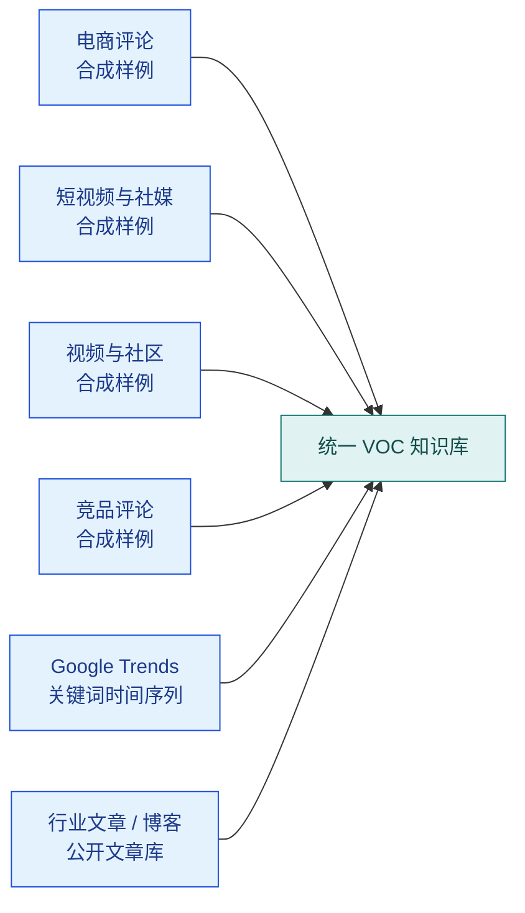

# 第十六章：VOC 洞察系统方法示例 —— 母婴电器合成案例

> **证据标签：合成方法示例。** 本页没有随仓库提供原始数据、采集授权、运行日志或业务验收回执；所有品牌背景、数据规模和产出仅用于解释工作流，不得作为真实项目成果引用。

## 16.1 案例概览

| 维度 | 内容 |
| --- | --- |
| 品牌 | 合成品牌（母婴喂养电器背景） |
| 数据规模 | 十万级合成记录；不对应真实采集回执 |
| 分析周期 | 仅作为项目排期示例，不提供真实周期结论 |
| 最终产出 | 机会候选清单与上市素材草案；必须由研究与业务负责人复核 |
| 成本对比 | 由实际平台、地区、币种和调用量计算，本页不提供未经证实的节省比例 |
| 数据安全口径 | “公开可见”不等于可任意采集或转交模型；仍需核对 ToS、robots、版权、隐私与供应商条款 |

:::tip 为什么这个案例值得放进指南
它同时满足三个条件：数据量足够大、结论能落到产品决策、流程可以标准化复用。对读者来说，这比“做一个问答机器人”更能说明知识库真正的商业价值。
:::

## 16.2 六源数据基座



| 数据源 | 接入方式 | 数据量 | 更新频率 | 敏感级别 |
| --- | --- | --- | --- | --- |
| 电商评论 | 经授权 API / 离线 fixture | 合成样例 | 周级 | 需逐源判定 |
| 短视频与社媒 | 官方 API 优先 | 合成样例 | 日级 | 需逐源判定 |
| 视频与社区 | 官方 API / 合规导出 | 合成样例 | 日级 | 需逐源判定 |
| 竞品评论 | 经授权 API / 离线 fixture | 合成样例 | 周级 | 需逐源判定 |
| Google Trends | pytrends | 关键词趋势点位 | 日级 | L1 公开数据 |
| 行业文章 / 博客 | Firecrawl / RSS / 公开网页 | 公开文章库 | 周级 | L1 公开数据 |

:::info 口径说明
数据量只是用于演示聚合规模的参数，不是事实声明。真实实施必须记录来源 URL、授权依据、抽样窗口、去重规则、删除请求处理与逐源计数回执。
:::

## 16.3 七步端到端工作流

```mermaid
flowchart LR
    W1[WF01 竞品格局分析\n输入: 竞品公开评论\nAI角色: 社交媒体分析师\n方法: 份额/情感/特征聚类\n输出: 竞品格局图] -->
    W2[WF02 用户需求挖掘\n输入: 评论全文+场景语料\nAI角色: UX研究专家\n方法: 三层痛点+JTBD\n输出: 痛点与场景库] -->
    W3[WF03 产品机会矩阵\n输入: 痛点与趋势证据\nAI角色: 产品战略专家\n方法: 机会评分矩阵\n输出: Top机会排序] -->
    W4[WF04 产品定义与视觉\n输入: Top机会\nAI角色: 产品设计师\n方法: 人群/卖点/视觉锚点\n输出: 产品定义稿] -->
    W5[WF05 AI概念图生成\n输入: 产品定义稿\nAI角色: 图像生成专家\n方法: Prompt分层生成\n输出: 概念图与参数] -->
    W6[WF06 网站SEO架构\n输入: 卖点与关键词\nAI角色: 网站架构师\n方法: 信息架构+SEO聚类\n输出: 网站结构与PDP] -->
    W7[WF07 拍摄视频策划\n输入: 卖点与视觉方案\nAI角色: 摄影策划师\n方法: 分镜/机位/脚本\n输出: 视频拍摄包]

    classDef stage fill:#e3f2fd,stroke:#1d4ed8,color:#1e3a8a;
    classDef focus fill:#e1bee7,stroke:#9333ea,color:#581c87;
    classDef decision fill:#c8e6c9,stroke:#15803d,color:#14532d;
    classDef execution fill:#fff4cc,stroke:#d97706,color:#78350f;
    class W1 stage;
    class W2 focus;
    class W3 decision;
    class W4,W5,W6,W7 execution;
```



这个流程的关键不在“7 个 AI 角色”，而在于**每一步都消耗上一步的结构化输出，而不是重新从原始评论开始问模型**。这正是知识库存在的意义：把一次性分析沉淀成可重复调用的业务资产。

## 16.4 知识库技术架构


这里刻意没有把系统做成“万能 RAG 问答”。因为 WF03 之后的节点需要的是**稳定的中间结构**，例如机会分数、产品定位、关键词簇，而不是自由文本回答。这也是后面会提到的“什么时候不要只靠 RAG”。

## 16.5 WF02 深度解析：用户需求挖掘

WF02 是整条链路里技术含量最高的一步。它解决的是：**用户表面在抱怨什么、实际卡在什么场景、背后真正焦虑的是什么**。

### 痛点三层模型

| 层级 | 判断问题 | 合成案例示例 |
| --- | --- | --- |
| 功能痛点 | 产品有没有做到用户要求的事？ | 消毒后仍有水珠、暖奶温度偏差大 |
| 体验痛点 | 做到了，但使用过程是否别扭？ | 半夜单手操作复杂、按钮反馈不清晰 |
| 情感痛点 | 这个问题触发了什么情绪？ | 担心奶过热、担心奶瓶没消毒干净、担心宝宝哭闹升级 |

### JTBD 场景还原代码

```python
from pydantic import BaseModel
from anthropic import Anthropic


class JTBDScenario(BaseModel):
    mom_is_doing: str
    problem: str
    desired_result: str
    evidence_quote: str


client = Anthropic()


def extract_jtbd_scenarios(review_batch: list[str]) -> str:
    """把评论还原成“妈妈在做什么 → 遇到什么问题 → 想要什么结果”"""
    prompt = f"""
你是母婴产品 UX 研究专家。
请从下面的评论中提取 JTBD 场景，输出 JSON 数组。

要求：
1. mom_is_doing：妈妈/爸爸当时在做什么
2. problem：具体卡住的问题
3. desired_result：用户真正想得到的结果
4. evidence_quote：保留一句原始引文

评论：{review_batch}
"""

    resp = client.messages.create(
        model="claude-3-5-sonnet-20241022",
        max_tokens=1800,
        messages=[{"role": "user", "content": prompt}],
    )
    return resp.content[0].text
```

### 情感词云提取代码

```python
from collections import Counter
import jieba


def build_emotion_wordcloud_tokens(comments: list[str]) -> list[tuple[str, int]]:
    """抽取高频情感词，供前端词云组件直接渲染"""
    emotion_lexicon = {
        "焦虑", "崩溃", "放心", "安心", "着急", "烦躁", "失望", "惊喜", "后悔", "解放"
    }
    counter = Counter()
    for comment in comments:
        for token in jieba.lcut(comment):
            if token in emotion_lexicon:
                counter[token] += 1
    return counter.most_common(20)
```

### 反直觉需求发现

- **爸爸参与度 27%**：夜间喂养讨论中，约 27% 明确提到爸爸操作设备，说明“只为妈妈设计”会漏掉关键使用人。
- **消毒可视化**：用户不是不信 UV，而是不信“这次真的完成了吗”，所以需要状态可视、结果可见。
- **一物多用**：大量讨论并非要求更多功能，而是要求更少桌面杂物；收纳、烘干、消毒被期待合并到一个物理设备中。

WF02 的价值在这里体现得最明显：这些信号都不是简单关键词统计能直接得出的，而是要把评论映射回真实照护场景。

## 16.6 三大产品机会

### 机会 1：消毒器“真烘干”

- **洞察**：用户真正厌恶的不是“消毒慢”，而是“消毒完还是湿的”。
- **数据支撑**：Amazon 评论中 **34%** 提及“潮湿 / 水珠 / 没干”。
- **竞品现状**：多数产品停留在 UV 消毒或弱风干，完成状态不可感知。
- **产品方向**：UV + 热风闭环烘干、湿度感应、可视化完成提示。
- **机会评分**：**84 / 100**。

### 机会 2：暖奶器“精准温控”

- **洞察**：用户买暖奶器不是为了“加热”，而是为了“在哭闹压力下也不出错”。
- **数据支撑**：社媒中有 **12,847 条**讨论“过热 / 营养流失 / 温度不准”。
- **竞品现状**：主流仍是经验式档位控制，缺少精准温控与反馈回路。
- **产品方向**：多点测温、±0.5°C 控温、夜间快捷模式、加热完成提醒。
- **机会评分**：**89 / 100**。

### 机会 3：反直觉需求组合款

- **洞察**：被忽视的不是新功能，而是新使用者和新场景。
- **数据支撑**：爸爸参与度 **27%**、可视化消毒高频出现、一物多用需求反复出现。
- **竞品现状**：多数竞品仍按“妈妈白天单人使用”的单一假设设计。
- **产品方向**：爸爸友好交互 + 状态可视化 + 收纳/消毒/烘干一体化。
- **机会评分**：**81 / 100**。

:::warning 为什么第三个机会最容易被漏掉
因为它不是单一大词频痛点，而是多个中强度信号在同一场景里叠加出来的机会。传统表格式市调往往会把它拆散，从而错过真正的差异化入口。
:::

## 16.7 方法论对本指南的映射

| WF步骤 | 本指南对应章节 | 核心方法 | 可复用代码 |
| --- | --- | --- | --- |
| WF01 竞品格局分析 | [第3章 SOP 场景 D](03-scene-sops.md) | 网页文章与公开评论采集 | 抓取、清洗、竞品聚类 |
| WF02 用户需求挖掘 | [第4章 结构化提取](04-architecture.md) | 三层痛点 + JTBD 抽取 | Prompt + Pydantic 结构化输出 |
| WF03 产品机会矩阵 | [第8章 架构选型](07-advanced-theory.md) | 何时不用纯 RAG，转为结构化评分 | 机会评分矩阵 |
| 整体 Pipeline | [第12章 完整 Pipeline](10-e2e-pipeline.md) | 采集、提取、入库、检索、产出闭环 | 端到端工程模板 |
| 自进化验证 | [第13章 知识库进化](11-kb-evolution.md) | 上市反馈回灌与置信度修正 | 预测-验证回写逻辑 |

## 16.8 ROI 数据

### AI 方案成本明细

| 项目 | 说明 | 成本 |
| --- | --- | --- |
| 采集 | Scrapy / Playwright / API 调用 | $800 |
| 提取 | MinerU / Whisper / 清洗脚本 | $600 |
| 向量库 | Qdrant / ChromaDB / 存储 | $300 |
| LLM 调用 | Claude API 结构化提取与归纳 | $1,600 |
| 人力审核 | 研究员复核与机会讨论 | $1,700 |
| **合计** | 7-10 个工作日完成 | **约 $5,000** |

### 与传统市调对比

| 维度 | AI 方案 | 传统市调 |
| --- | --- | --- |
| 周期 | 7-10 天 | 2-3 个月 |
| 直接成本 | $5K 左右 | $50K+ |
| 证据密度 | 十万级合成记录（无真实回执） | 数百份抽样问卷（示例口径） |
| 决策质量 | 数据支撑的机会点 | 经验判断为主 |
| 可复用性 | 可周更、可复跑、可回灌 | 一次性交付为主 |

**时间节省**：约 80%-90%。

**决策质量提升**：从“凭经验拍方向”升级为“每个机会点都有评论、场景和竞品证据支撑”。

## 16.9 可复用的核心代码片段

### 1. 多源数据统一采集 + 元数据标记

```python
from dataclasses import dataclass
from datetime import datetime


@dataclass
class VOCRecord:
    text: str
    source: str
    product: str
    brand: str
    collected_at: str
    sensitivity: str = "L1"


def normalize_record(text: str, source: str, product: str, brand: str) -> VOCRecord:
    """统一不同来源的评论结构，后续才能走同一套提取流程"""
    return VOCRecord(
        text=text.strip(),
        source=source,
        product=product,
        brand=brand,
        collected_at=datetime.utcnow().isoformat(),
    )
```

### 2. VOC 情感分析 + 痛点提取 Prompt

```python
VOC_PROMPT = """
你是母婴品类 VOC 分析师。请把评论抽取为 JSON：
1. sentiment: positive / neutral / negative
2. pain_layer: functional / experience / emotional
3. pain_point: 20字内概括
4. jtbd_scene: 用一句话描述使用场景
5. evidence_quote: 保留原句

评论：{review}
"""

# 这段 Prompt 的关键不是“总结”，而是强制模型输出可统计、可聚类、可追溯的字段。
```

### 3. 机会评分矩阵计算

```python verify=syntax
def score_opportunity(jtbd_score: float, pain_intensity: float, feasibility: float) -> float:
    """机会分 = JTBD 场景强度 × 痛点强度 × 可行性"""
    weighted = jtbd_score * 0.4 + pain_intensity * 0.4 + feasibility * 0.2
    return round(weighted, 2)


example = score_opportunity(
    jtbd_score=92,       # 夜间喂养场景出现频率高
    pain_intensity=88,   # 评论负面情绪强
    feasibility=74,      # 技术上可实现但有一定门槛
)
print(example)  # 86.8
```

## 16.10 小结

:::tip 本章真正想证明的事
知识库的价值，不是把评论“存进去”，而是把**公开数据转成结构化中间资产**，再由不同 AI 角色接力调用，最终变成产品机会和上市动作。
:::

这个合成案例说明：当数据基座、结构化提取和工作流设计都到位时，知识库可以从“查询系统”扩展为连接市场信号与经营动作的决策辅助系统；是否真正有效，仍取决于真实数据、人工复核和业务验收。

---

## 16.11 案例边界：这套方法在哪里失效

**该合成案例的成立条件**：消费品类、用户痛点可以从公开评论中读取、产品机会可以通过竞品分析量化。当这些条件不成立时，方法的有效性会显著下降。

### 失效场景一：B2B 产品与复杂服务

B2B 采购决策中，用户的真实痛点很少出现在公开评论里——它们在闭门会议、合同谈判、内部沟通工具里。即使聚合十万级公开数据，也可能只捕获到用户愿意公开表达的表层需求，而核心决策因素（安全合规要求、集成复杂度、预算审批流程）完全不在数据里。

**判断标准**：如果你的目标用户很少在公开平台讨论购买决策，这套方法的信噪比会极低。

### 失效场景二：快速迭代的技术产品

对于每 6 个月发布新版本的技术产品，历史评论代表的是旧版本体验。七步工作流分析出来的"高潜力机会"，可能已经在最新版本中被解决，或者因技术路径变化不再可行。

**判断标准**：如果产品迭代周期短于数据有效期，分析结论的时效性是核心问题。

### 失效场景三：竞争对手也在用同样的工具

当行业内所有头部玩家都在用相同的 AI 分析框架，基于相同的公开数据，分析出来的"高潜力机会"会高度趋同。先动优势迅速消失，最终变成"谁实现得更快"的执行竞争，而不是"谁发现了别人没发现的机会"的洞察竞争。

**判断标准**：如果主要竞争对手也在做 VOC AI 分析，差异化的来源必须是独占数据（内部数据、专有渠道），而不是对公开数据的分析方法。

### 失效场景四：需要监管合规验证的结论

$5K AI 方案 vs $50K 传统市调——这个成本对比忽略了一个维度：传统市调公司为结论提供法律背书和责任担保。当分析结论用于投资决策、监管申报时，AI 分析报告的法律效力远低于专业机构报告。

**判断标准**：如果结论需要在正式文件中引用，或者决策失败有法律后果，需要叠加人工验证和专业机构背书。

:::info 正确的定位
这套方法在**高频、低风险、快速决策**场景下价值最大——比如选品方向参考、营销文案方向、用户分层标签。它不适合替代需要法律背书或深度定性研究的决策。
:::

---

:::tip → 下一章
方法示例之后，看三个复合失败案例——了解知识库在哪里失败，以及如何提前发现 → [17-failure-cases](17-failure-cases.md)
:::

## 来源与复核

- **复核状态**：待复核。任何易漂移的版本、价格、法律或性能结论，采用前都必须回到一手来源再次确认。
- **代码状态**：示意代码。未被本地 smoke test 覆盖的片段不得解释为生产可运行。
- **证据边界**：本页成熟度只描述内容形态，不代表部署、上线或生产验收已经完成。
- **下一验收动作**：按仓库根目录 `content-audit.md` 中本模块的证据缺口补齐来源、fixture 与验收回执。
