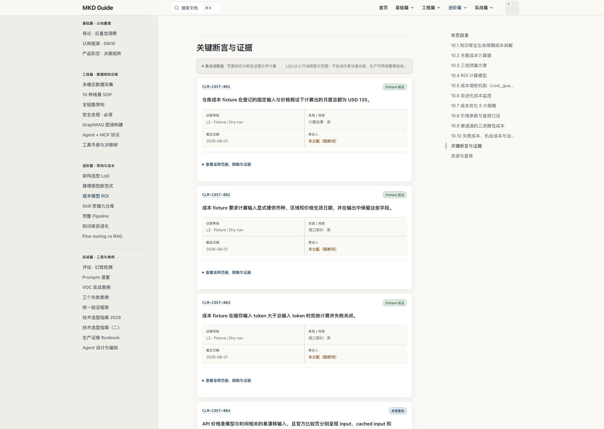
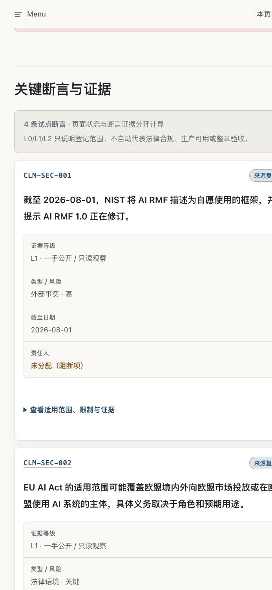
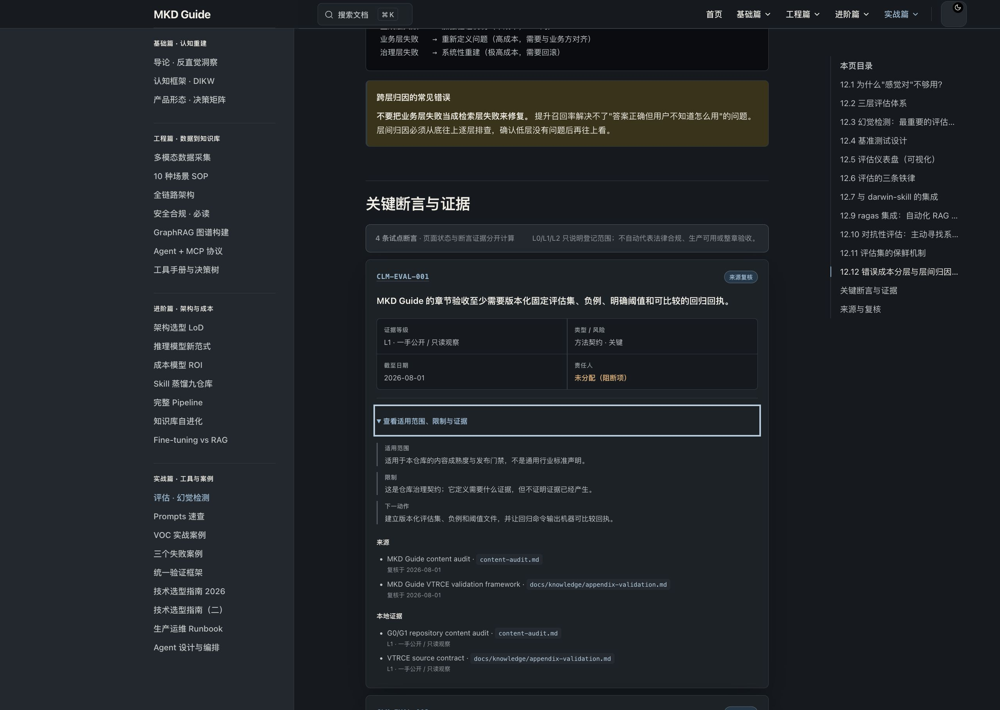

# MKD Guide G2.1 Claim-level Evidence 试点审计

审计日期：2026-08-01 
范围：`KS-SECURITY-COMPLIANCE`、`KS-COST-MODEL`、`KS-EVALUATION` 
判定：`allowed-with-label`，允许把已登记状态展示给读者，不允许据此宣称整章验收、法律合规或生产完成。

## 交付事实

- 建立 `knowledge-system/schemas/claim.schema.json` 与 `knowledge-system/claims.yml`，登记 12 条高风险或关键断言、5 个来源、4 个本地证据记录。
- 三个试点文档各登记 4 个 `claimRefs`，正文声明旁有稳定锚点，页面底部由同一份注册表渲染可见证据账本。
- 新增 `docs:claims` 与 `docs:evidence`。前者检查身份、页面引用、锚点邻接和可见组件；后者检查来源、路径、状态与等级映射，阻止无证据升级。
- 首页和三个页面的 frontmatter 成熟度没有改变。站点仍是 2 个 principle、22 个 solution、2 个 runnable、0 个 acceptance。

## 证据总账

| 文档 | L0 | L1 | L2 | L3/L4 | 解释 |
|---|---:|---:|---:|---:|---|
| 安全合规 | 2 | 2 | 0 | 0 | NIST 与 EU 官方公开表述完成来源复核；演练控制和示例期限没有执行回执 |
| 成本模型 | 0 | 1 | 3 | 0 | 官方价格维度完成来源复核；固定总额、必填口径和缓存失败关闭有 fixture + test |
| 质量评估 | 1 | 3 | 0 | 0 | 仓库验收契约与当前缺口完成只读审计；RAGAS 与评估器代码尚无 smoke evidence |
| 合计 | 3 | 6 | 3 | 0 | 没有生产只读或授权在线证据 |

等级含义：

- `L0-unverified`：只有待验断言与下一动作。
- `L1-public-or-runtime`：一手公开资料或仓库只读事实，不证明执行完成。
- `L2-fixture-or-dry-run`：固定输入的本地 fixture 或 dry-run，不证明生产表现。
- `L3-production-read-only` / `L4-authorized-live`：本轮均为 0。

## 允许与禁止的解释

允许：

- 说 NIST 官方公开页面把 AI RMF 描述为自愿框架，并提示 1.0 正在修订，截止日期为 2026-08-01。
- 说欧盟官方 FAQ 的公开适用范围可能包含欧盟境外主体，但具体义务仍取决于角色、用途、豁免与辖区判断。
- 说成本 fixture 在测试文件的固定输入下返回 USD 135，要求币种、区域与生效日期，并拒绝缓存输入大于总输入。
- 说当前评估章仍缺固定评估集、负例、批准阈值与回归回执。

禁止：

- 不得把 L1 来源复核写成组织已经合规或法律意见。
- 不得把 USD 135 写成当前供应商报价、真实预算或生产账单。
- 不得把页面中的 180/365 天、48 小时或 30 天写成通用法定期限或已批准控制。
- 不得把质量评估章写成可验收，也不得把页面构建成功写成 RAGAS 或评估代码已运行。

## 结构脆弱点

| 优先级 | 缺口 | 当前控制 | 下一证据 |
|---|---|---|---|
| P1 | 12/12 断言没有正式 owner | 页面与命令均显示“未分配（阻断项）” | 由安全、预算、评估与法务角色确认 owner，并登记审批日期 |
| P1 | 安全控制没有威胁模型或演练回执 | 两条控制保持 L0 | 在隔离环境用获授权代表性样本完成演练、销毁和复盘回执 |
| P1 | 评估章没有可重复 Lab | 代码状态保持 illustrative，断言保持 L0/L1 | 抽取固定评估集、负例、阈值和 mock provider，生成 JSON 回归回执 |
| P2 | OpenAI 官方页面对自动链接审计返回 403 | `docs:links` 标记 access-restricted，不冒充内容已自动验证 | 人工复核时保存摘要与日期；后续增加可存档的一手快照策略 |
| P2 | 当前只覆盖 3/26 文档 | `pilotDocumentIds` 明确限制范围 | schema 评审通过后再按风险分批迁移，不机械复制到其余 23 章 |

## 产品与无障碍审计

用户目标：读者在不离开章节的情况下判断一条断言是什么、证据到哪一级、缺什么、下一步如何验收。

### Step 1：桌面成本证据总账，健康

证据等级、风险、日期与 owner 在首屏内可比较；L2 用克制的鼠尾草绿，只表示 fixture 范围。右侧 H2 目录保留“关键断言与证据”入口。

### Step 2：移动端安全断言，健康

元数据在窄屏切为单列，状态、断言和 44px disclosure 保持可读。390×844 自动化复核覆盖横向溢出、状态标签边界和触控高度。

### Step 3：深色主题与展开态，健康

展开后依次显示适用范围、限制、下一动作、来源与本地证据；焦点轮廓可见，深色 token 保持层级。没有用动画制造“已验证”错觉。

### 证据限制

- 截图只能证明可见布局，不能单独证明键盘、读屏或 WCAG 合规。
- 自动化补充验证了 disclosure 交互、移动 reflow、主题、axe critical/serious、200% 缩放和控制台错误；这仍是本地预览证据，不是生产 RUM。
- In-app Browser 截图用于本轮视觉审计；正式 390×844 合同由 Playwright 独立回归。

## 验收状态

- `docs:claims`：12/12 断言身份、引用与稳定锚点通过；12 个 owner gap 保留为 warning。
- `docs:evidence`：L0=3、L1=6、L2=3、L3/L4=0；状态到等级映射与 anti-promotion 通过。
- `test:content`：新增 schema、页面回链和越级拒绝测试。
- `test:site`：新增三章证据账本、展开态和移动端 reflow 测试。
- `docs:links`：61 个内部引用、84 个外部 URL；OpenAI 相关页面的 403 仅标记访问受限。

## 下一阶段入口

先完成 owner 与批准口径登记，再进入 G2.2 Lab 证据层。优先顺序是质量评估固定集、成本价格快照与账单差异、安全演练回执；任何新证据仍按最高实际等级登记。
